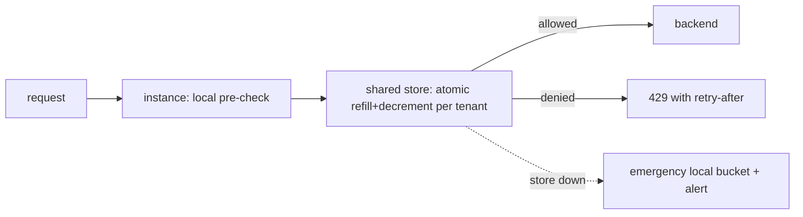
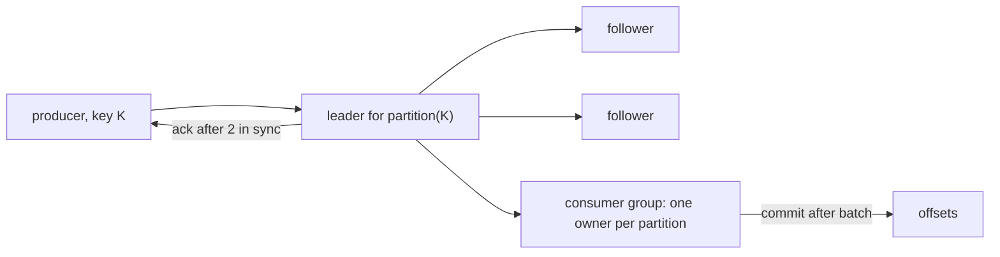
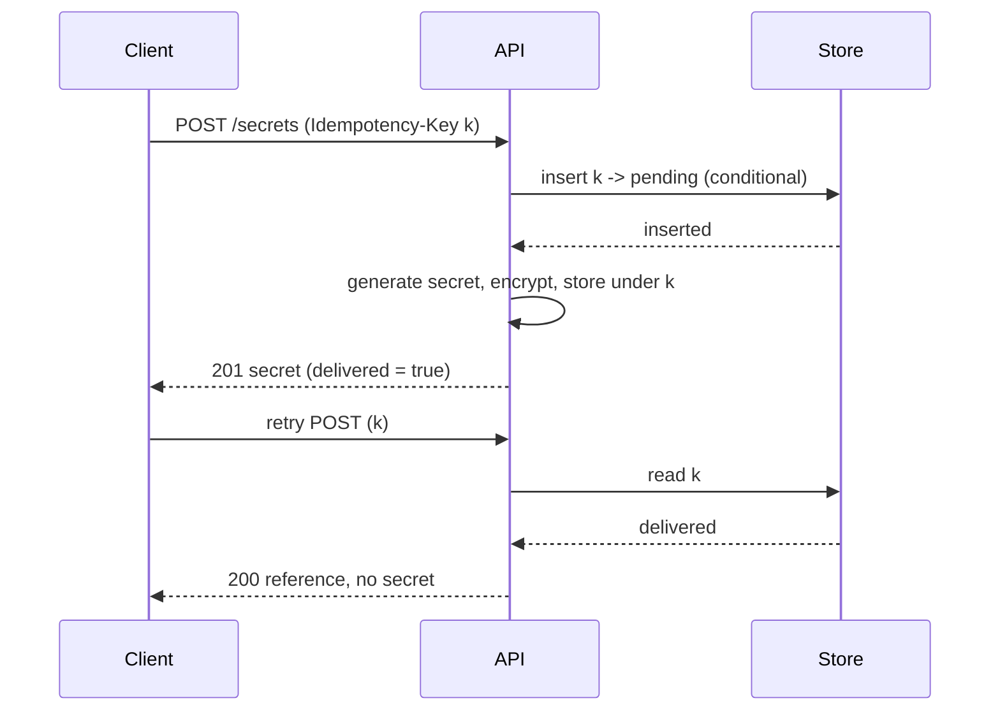

# Rate limiter and distributed queue as building blocks, with an idempotent endpoint

[Curriculum](../../../README.md) · [Architecture](../README.md) · [All system designs](../../../../indexes/system-designs.md)

`[Aggregator]` "Rate limiter or distributed queue: standard building blocks," and "idempotent API endpoint returning one-time secrets," both from CrowdStrike lists; the posting requires "rate limiting" and "authentication/authorization (JWT, OAuth)" on its APIs `[Official]`. These are the blocks interviewers reach for when a bigger case finishes early.

## Application background

Three small designs a senior candidate should be able to draw in ten minutes each: a rate limiter shared across API instances; a queue that survives node loss and delivers at least once with per-key order; and an endpoint that creates a one-time secret exactly once even when the client retries.

## Your assignment

**Deliver:** the three designs with their failure modes, sized for 200k requests/s at the gateway, 50 API instances, 10k tenants; a queue at 1M messages/s with 7-day retention; a secrets endpoint at 5k creates/s.

## Part 1 · Distributed rate limiter

| Requirement | Design |
|---|---|
| Per-tenant limit across 50 instances | Shared counters keyed by tenant in a fast store; token bucket updated atomically (one script per call) |
| Latency | One round trip per request; mitigate with a local pre-check and a small per-instance allowance |
| Burst versus sustained | Token bucket parameters ([bundle 49](../../02-coding-problems/problems/49-token-bucket/README.md)) |
| Store unavailable | Fail open for the front door with a local emergency bucket and an alert; fail closed in front of an expensive backend; say which |
| Hot tenant | Sharded keys per tenant if a single key's throughput becomes the limit |

## Part 2 · Distributed queue

| Requirement | Design |
|---|---|
| Durability | Append-only partitions replicated to 3 nodes; ack after 2 in sync |
| Per-key order | Partition by key; one consumer per partition per group |
| At-least-once | Consumer commits offset after processing; duplicates on crash; consumers idempotent |
| Retention and replay | Segment files with time-based retention; cold tier in blob |
| Backpressure | Producers get flow control when in-sync replicas lag; consumers scale on lag |
| Poison messages | Retry tiers then dead-letter, as CrowdStrike publishes `[Official]` |

## Part 3 · Idempotent endpoint that returns a one-time secret

| Requirement | Design |
|---|---|
| Client retries a create | Same idempotency key returns the same secret, once; the secret is stored encrypted until first successful delivery |
| "One-time" | The response is recorded as delivered when the client acknowledges (or after the first 2xx); a later retry with the same key gets a reference, not the secret |
| Concurrency | Conditional insert on the idempotency key; the loser waits for the winner's result |
| Expiry | Keys expire after 24 h; a retry after that is a new create |
| Audit | Every create and delivery recorded with actor and time |

## Failure modes across the three

| Failure | Detection | Containment | Recovery |
|---|---|---|---|
| Limiter store latency spike | p99 per call | Local allowance; timeouts fail open/closed per policy | — |
| Queue leader loss | ISR change | Election; producers retry with idempotent producer ids | — |
| Consumer rebalance | Group churn | Cooperative rebalancing; static membership | — |
| Idempotency store loses a pending row | Winner crashed | Row has a lease; next retry re-claims | Regenerate secret |
| Client never acknowledges the secret | Delivery flag never set | Retry returns the secret again until first 2xx; after that, reference only | — |

## Follow-ups

**Senior:** "Rate limit by tenant *and* by endpoint cost." Charge tokens per request weight; keep two buckets or one weighted bucket; say how weights are set. **Staff:** "The queue must survive a region loss." Cross-region replication of partitions with a defined RPO; producers fail over; consumers resume from replicated offsets; state the seconds of data at risk and who accepts it.

Next: [Design Redis, briefly](design-redis.md).
