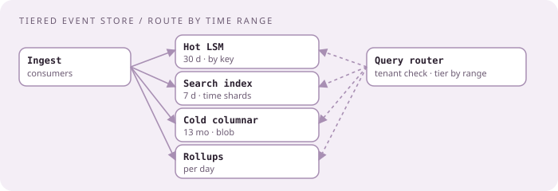
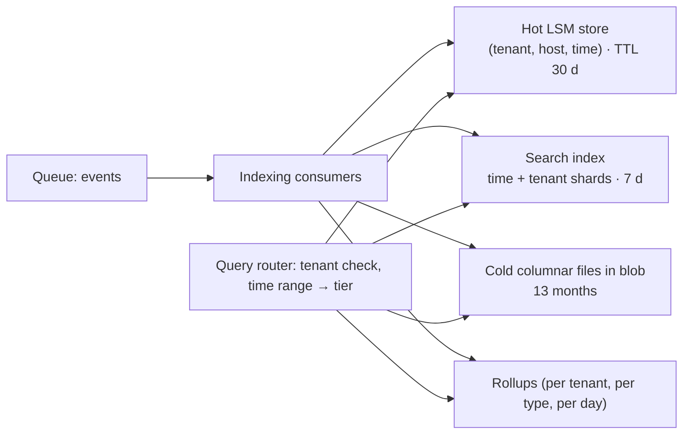

# Searchable event store with hot and cold tiers

[Curriculum](../../../README.md) · [Architecture](../README.md) · [All system designs](../../../../indexes/system-designs.md)

`[Aggregator]` "High-throughput logging service with real-time search indexing" and "searchable log and event store: storage layout, indexing, retention" appear on CrowdStrike design lists; the posting names ElasticSearch/OpenSearch "for full-text search, log aggregation, and real-time analytics" `[Official]`.

## Application background

Analysts search weeks of events by host, process, user, and free text, and expect recent data within seconds of arrival. Storage cost is the constraint: a trillion events a day cannot all live in a search index.

## Your assignment

**Deliver:** a design for ingest, indexing, tiering, and query routing, sized for 11.6 million events/s, 1 KB each, searchable within 10 s of arrival, 7 days full-text hot, 30 days queryable by key, 13 months cold.

**Required behavior:** exact lookup by (host, time range) in under 200 ms for hot data; full-text search over the last 7 days in under 2 s p95; a query over a year runs, slowly, without taking down hot queries; retention is enforced automatically; a tenant sees only its own events.

## Numbers first

| Quantity | Value | Consequence |
|---|---|---|
| Ingest | 11.6M/s ≈ 1 PB/day raw | Indexing everything full-text is 2–3× that; hot full-text tier must be short |
| Hot full-text | 7 days ≈ 7 PB raw, ~15 PB indexed | Large but bounded; shard by time and tenant |
| Key-queryable | 30 days | LSM store keyed by (tenant, host, time) |
| Cold | 13 months ≈ 400 PB raw | Columnar, compressed, in blob; scanned by batch engines |

## Expected behavior

| Query | Path | Latency target |
|---|---|---|
| Events for host H in the last hour | LSM store, partition (tenant, host) | < 200 ms |
| Free text "powershell -enc" last 3 days | Search index, time-sharded | < 2 s |
| Same text over 90 days | Cold scan, queued, results streamed | minutes |
| Count of events per tenant per day | Pre-aggregated rollups | < 1 s |
| Tenant A searching tenant B | Rejected at the router | — |

## Main path

## Stores, by category

| Data | Shape | Category | Product, and why |
|---|---|---|---|
| Recent events by key | write-heavy, point/range reads | LSM store with TTL | Cassandra-class; partition (tenant, host), cluster by time `[Official]` |
| Recent full text | write-heavy, text queries | inverted index | OpenSearch-class; index per (tenant group, day); retention by dropping whole indices |
| Older events | write once, rare scans | columnar in blob | Parquet-class files partitioned by tenant and day; scanned by a batch engine |
| Rollups | small appends, dashboard reads | OLTP or time-series | Cheap answers to common counts |

## Indexing choices that matter

| Choice | Why |
|---|---|
| Time-sharded indices | Retention is a delete of a whole shard, not per-document deletes; queries prune by time |
| Tenant in the shard key or as a routing value | Isolation and query locality; small tenants grouped, large tenants alone |
| Index only searchable fields | Raw payload stays in the LSM store or blob; the index holds terms and a pointer |
| Refresh interval ~5–10 s | The "searchable within 10 s" requirement is a knob, not an accident |

## Failure modes, volunteered

| Failure | Detection | Containment | Recovery |
|---|---|---|---|
| Indexing lag | Consumer lag | Autoscale indexers; hot LSM still serves key lookups | Catch up |
| A year-long query | Query cost estimate | Route to cold engine with a queue and a budget; never the hot cluster | — |
| Hot index shard too large (big tenant) | Shard size metrics | Dedicated shards for large tenants | Reindex |
| Search cluster down | Health | Key lookups keep working; search degraded, status shown | Rebuild from the log within retention |
| Retention job fails | Shards older than policy | Alert; storage grows, nothing lost | Run job |

## Follow-ups

**Senior:** "Make a 90-day full-text search fast." You cannot without paying for it; options: extend the hot tier for specific tenants, pre-build bloom-filter or term sketches per cold file to skip most of them, or accept minutes. Name the cost of each. **Staff:** "The cold tier needs erasure of one tenant's data." Columnar files partitioned by tenant make deletion a file drop; if files mix tenants, rewriting is required; say which you designed for and why (erasure requirements decide partitioning).

Next: [Rate limiter and distributed queue](rate-limiter-and-queue.md).
