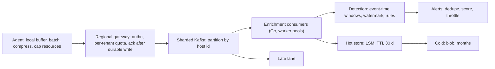
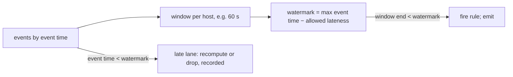

# Telemetry ingestion from millions of endpoints, with detections in seconds

[Curriculum](../../../README.md) · [Architecture](../README.md) · [All system designs](../../../../indexes/system-designs.md)

`[Aggregator]` ×3: "collect events from millions of endpoints," "real-time threat detection pipeline handling backpressure without data loss," "accept a very large stream of endpoint events and raise alerts within seconds." `[Official]` This is the shape of the R30109 team's work ("sensor telemetry and system debuggability") and of the company's published pipeline.

## Application background

An agent on every customer machine collects behavioral events, buffers them locally, and ships them in batches. The cloud must accept them under bursts, keep them in order per host, detect suspicious sequences within seconds, and keep the raw events queryable for weeks. Some agents are offline for days; some hosts produce a hundred times more than others.

## Your assignment

**Deliver:** a design for agent upload, ingestion, per-host ordering, detection, storage, and alerting, sized for 20 million endpoints, 1 trillion events per day (≈11.6 million/s average, 3× peaks), 1 KB per event, detections within 5 s p95, 30 days hot retention.

**Required behavior:** no event loss under a 3× burst; per-host order; an agent offline for a week can catch up without flooding; a detection rule sees events in event time, not arrival time; a noisy host or tenant cannot delay others' detections; the pipeline is observable end to end.

## Numbers first

| Quantity | Value | Consequence |
|---|---|---|
| Events | 11.6M/s average, 35M/s peak | Above one Kafka cluster's published ceiling; shard from day one |
| Bytes | ~12 GB/s average | Compression at the agent; batch uploads |
| Hot retention | 30 days × 1 PB/day = 30 PB | LSM store with TTL compaction; cold tier beyond |
| Endpoints | 20M | Per-host order needs partitioning by host id |
| Detection budget | 5 s | Stream processing, not batch |

## Expected behavior

| Action | Expected | Why |
|---|---|---|
| Agent sends a 1,000-event batch | Acknowledged after durable write to the log | No loss |
| Monday-morning 3× burst | Accepted; detection latency rises, nothing dropped | Backpressure to agents |
| Agent offline 7 days, reconnects | Uploads in paced batches; old events land in a late lane | Catch-up without flooding |
| Event arrives 2 minutes late | Counted in its event-time window if within lateness; else late lane | Event time |
| Host produces 100× normal | Its partition lags; others do not | Isolation |
| Detection rule matches | Alert within 5 s; raw events queryable | The product |

## Main path

## The agent is part of the design

| Concern | Design |
|---|---|
| Runs on a customer's laptop | Cap CPU, memory, and disk; batch and compress; upload on a schedule with jitter |
| Offline | Local ring buffer with a size cap; oldest non-critical events dropped first; critical events kept |
| Backpressure | Gateway returns retry-after; agent backs off exponentially with jitter |
| Catch-up | Paced upload rate per agent, so 100k reconnecting agents do not become a burst |

## Stores, by category

| Data | Shape | Category | Why |
|---|---|---|---|
| Raw events, hot | 11.6M appends/s, reads by host and time | LSM store, TTL by compaction | Their choice: Cassandra-class `[Official]` |
| Raw events, cold | write once, rare reads | blob | Months at low cost |
| Detection state | windows per host, updated per event | in-memory with checkpoints | Stream processor state store |
| Alerts | thousands/s, queried by analysts | OLTP + search index | Analyst workflow |
| Rules and configs | small, read-heavy | OLTP + cache | Pushed to processors on change |

## Event time, watermarks, lateness

Say the invariant: a window fires when the watermark passes its end; anything later goes to a late lane; detection latency equals allowed lateness plus processing, so lateness is a product decision.

## Failure modes, volunteered

| Failure | Detection | Containment | Recovery |
|---|---|---|---|
| Burst beyond consumer capacity | Consumer lag | Lag-based autoscale; bounded in-flight; agents back off | Drain |
| Hot host | Partition lag skew | Per-partition alert; sub-partition by (host, event type) if order allows | — |
| Enrichment dependency down | Failure-weighted throttle `[Official]` | Back off; halt at threshold | Resume from offset |
| Malformed events | Parse errors | Count separately; never treat as failure `[Official]` | — |
| Detection state lost | Processor crash | Checkpointed state; replay from offset | Re-derive windows |
| Region loss | Health | Agents fail over to another region's gateway; per-region shards | Replay cold tier |

## Observability, the debuggability half of the posting

| Signal | Source |
|---|---|
| Consumer lag per partition | Burrow-style, into Prometheus `[Official]` |
| End-to-end latency | Black-box probe: inject a synthetic event, time its alert `[Official]` |
| Data-loss rate | Compare agent sequence numbers to stored ranges |
| Traces | One trace id per batch from gateway to store; sample |

## Follow-ups

**Senior:** "A rule needs events from two hosts." Per-host partitioning cannot join them; add a second stage keyed by the correlation attribute (tenant, user), accept a second hop of latency, and bound the join window. **Staff:** "Cut hot storage cost by half." Tier by event type (keep behavioral events hot, move verbose ones cold at 7 days), compress with dictionary encoding per event type, and prove the detection rules do not read the moved types; state what analyst queries get slower.

Next: [Content rollout with rings and rollback](content-rollout-rings.md).
