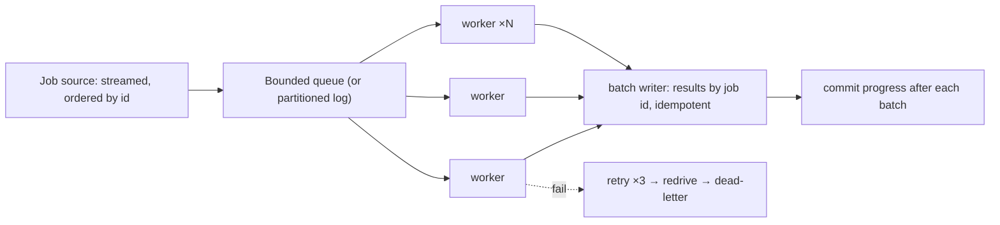

# Worker pool for template jobs at scale

[Curriculum](../../../README.md) · [Architecture](../README.md) · [All system designs](../../../../indexes/system-designs.md)

`[Aggregator]` PracHub, October 2025: "design a scalable worker pool for template jobs: you have implemented a function that takes template strings and replaces placeholders like `{{db_host}}`." `[Reported]` October 2025, the same problem as a live follow-up: "how would you handle large volumes, what mechanism for a worker pool, how would you assign work to workers." The coding half is [bundle 43](../../02-coding-problems/problems/43-string-templating/README.md) and [bundle 56](../../02-coding-problems/problems/56-worker-pool/README.md).

## Application background

A rendering function is correct and fast for one template. Now there are a hundred million templates and value sets to render per run, jobs vary in size, some fail, and the output must be complete and correct when the run ends.

## Your assignment

**Deliver:** a design for scheduling, executing, and completing 100 million template jobs per run with a bound on memory, idempotent output, retry and dead-letter handling, and a progress model that survives worker crashes.

## Numbers first

| Quantity | Value | Consequence |
|---|---|---|
| Jobs per run | 100M | Never materialize the job list in memory; stream it |
| Job cost | ~1 ms median, 100 ms p99 | ~28 CPU-hours of work; hundreds of workers finish in minutes |
| Output | 100M rendered strings | Batched writes; idempotent by job id |
| Failure rate | assume 0.1% | 100k retries per run; a dead-letter lane is required |

## Main path

## The four questions, answered in order

| Question | Answer |
|---|---|
| What mechanism for a worker pool? | A bounded queue between a streaming producer and N workers; N sized to CPU for a CPU-bound job; a results batcher; progress committed per batch. In one process: threads or goroutines on a channel. Across machines: a partitioned log and consumer groups |
| How to assign work? | Round-robin / whoever-is-free for stateless rendering; hash by key only if per-key order or locality matters; work stealing if job cost is very uneven |
| Why bounded? | A slow writer or a slow worker must slow the producer, not grow memory |
| What if a worker dies mid-batch? | The batch is uncommitted; another worker re-runs it; output is idempotent by job id, so the re-run overwrites identically |

## Stores and semantics

| Data | Shape | Category |
|---|---|---|
| Job source | sequential read | file or partitioned log |
| Results | 100M writes, later reads by job id | append-only or key-value, batched |
| Progress | small, frequent | offsets or a checkpoint row per partition |
| Dead letters | rare, inspected | append-only with the error |

Semantics: at-least-once execution, exactly-once *result* by idempotent write keyed on job id. Say it that way.

## Failure modes, volunteered

| Failure | Detection | Containment | Recovery |
|---|---|---|---|
| Producer outruns workers | Queue full | Producer blocks; memory flat | — |
| One worker stuck on a pathological template | Job age | Per-job timeout; job → retry lane | Continue |
| Results writer down | Write errors | Workers block on the bounded results buffer | Resume; batches re-sent are idempotent |
| Duplicate job ids in the source | Idempotent write | Last write wins identically | — |
| Run restarted from the middle | Checkpoint | Resume from committed progress; re-run uncommitted batches | — |

## Follow-ups

**Senior:** "Templates reference other templates." Resolve dependencies first ([bundle 53](../../02-coding-problems/problems/53-dependency-order/README.md)), run in topological waves, cache rendered sub-templates; reject cycles up front. **Staff:** "Make it a multi-tenant service." Per-tenant lanes with fair scheduling (weighted round-robin across tenant queues), per-tenant quotas, and isolation of a poison tenant's failures from others' throughput; say what "fair" means in numbers.

Back to the [chapter](../README.md). Next chapter in the book: [Company interview studio](../../../../companies/README.md).
