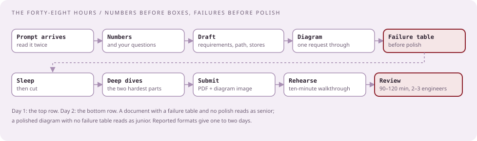

# The design take-home and the review

Write the document they grade, then defend it for two hours.

<section class="chapter-context" markdown="1">

## The two rounds that decide the level

Every senior report that reached an offer or a rejection at the design stage says the same thing: the take-home is where you show the design, and the review is where they decide whether you own it. One CrowdStrike employee's own advice for the loop was to be "passable" at coding and to show depth in design; a candidate who watched others go through it wrote that "design rounds are where most people get rejected or severely down-leveled" `[Reported]` Apr 2025. The January 2026 senior offer came from a two-hour review with two engineers, and the winner's words were about explaining and conceding, not about the diagram `[Reported]`.

This chapter is the practice half of T3. T3 works the systems. This chapter works the document you submit, the forty follow-ups they ask, the ninety minutes as a rehearsed conversation, and a week of drills that make the conversation automatic.

## What they ask, ranked by evidence

Sources were checked on 25 September 2026. Counts are independent first-person reports; aggregator sites copy each other and count once.

| Rank | Prompt | Evidence | Years | Case |
|---|---|---|---|---|
| 1 | Upload a file, hash it, scan it with many engines, report the result: the VirusTotal-like platform | `[Reported]` ×6, a Glassdoor question title, `[Aggregator]` | 2019, 2020, 2022, 2023, 2025 ×2, 2026 | [File-scanning platform](../03-architecture/problems/file-scanning-platform.md) |
| 2 | Real-time event message system, requirements supplied; two-hour review | `[Reported]` Jan 2026 offer; `[Aggregator]` ×3 | 2026 | [Event message system](../03-architecture/problems/event-message-system.md) |
| 3 | Worker pool for template jobs, from the templating coding question | `[Reported]` live follow-up Oct 2025; `[Aggregator]` | 2025 | [Worker pool](../03-architecture/problems/worker-pool-template-jobs.md) |
| 4 | Design Redis, briefly, after implementing the cache | `[Reported]` Jan 2026 | 2026 | [Design Redis](../03-architecture/problems/design-redis.md) |
| 5 | Endpoint telemetry ingestion that raises alerts within seconds; detection pipeline with backpressure and no data loss | `[Aggregator]` ×4 | 2026 | [Telemetry ingestion](../03-architecture/problems/telemetry-ingestion.md) |
| 6 | High-throughput logging service with real-time search | `[Aggregator]` | 2026 | [Searchable event store](../03-architecture/problems/searchable-event-store.md) |
| 7 | Idempotency across services on a message broker; an idempotent endpoint that returns one-time secrets; a rate limiter | `[Aggregator]` ×3 | 2026 | [Rate limiter and queue](../03-architecture/problems/rate-limiter-and-queue.md) |
| 8 | Multi-tier file parser extracting sub-file identifiers | `[Aggregator]` | 2026 | File-scanning follow-up |
| low | Generic staffing-site lists: news feed, unique ID generator, web crawler, typeahead, ticket booking, distributed cache | `[Aggregator]` | 2025–2026 | Not CrowdStrike-specific; treat as warm-up |

Rank 1 is the one prompt that is genuinely repeated across seven years, in London, Dublin, and the US. If you rehearse one document end to end, rehearse that one. Rank 2 is the shape of the most recent senior offer.

</section>

[Curriculum](../../README.md) · [About this track](../README.md) · [The ninety-minute review](../03-architecture/lessons/03-the-ninety-minute-review.md)

## Prerequisites

[The ninety-minute review](../03-architecture/lessons/03-the-ninety-minute-review.md) and one worked case from [T3](../03-architecture/README.md), ideally the [file-scanning platform](../03-architecture/problems/file-scanning-platform.md).

## Concepts and worked examples

| Step | Lesson | Basis |
|---|---|---|
| 1 | [What arrives, and what they grade](lessons/01-what-arrives-and-what-they-grade.md) | `[Reported]` 2019–2026 formats and reviewer words; `[Official]` posting |
| 2 | [The document, with a complete example](lessons/02-the-document.md) | `[Generated]` example in the rank-1 shape |
| 3 | [The follow-up bank](lessons/03-the-follow-up-bank.md) | Every reported follow-up, labeled, with the answer shape |
| 4 | [The review, rehearsed](lessons/04-the-review-rehearsed.md) | `[Generated]` two-hour transcript in the Jan 2026 shape |
| 5 | [Drills, and the week before](lessons/05-drills.md) | `[Generated]` timed drills with a self-grading rubric |

Read lesson 1 once. Then write the document in lesson 2's shape for the rank-1 prompt, with a timer. Then work the bank and the transcript aloud, and run the drills daily until the review.
