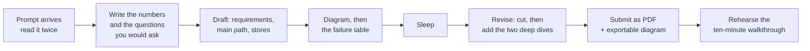

# What arrives, and what they grade

[Curriculum](../../../README.md) · [Take-home and review](../README.md)

> "What exactly will they send me, how long do I have, who reads it, and what are they looking for that I cannot see?"

Three formats exist. Ask the recruiter which one you are getting; every report that names the format got it from the recruiter, not from the prompt.

## The three formats, from reports

| Format | What arrives | Time | Reviewed how | Evidence |
|---|---|---|---|---|
| Design document take-home | A prompt with requirements: "a real-time event message system" with "various requirements provided"; "VirusTotal with requirements provided days in advance" | 1–2 days, sometimes a weekend | 90–120 minutes with two or three engineers who have read it | `[Reported]` 2022, 2023, Aug 2025, Nov 2025, Jan 2026 |
| Coding take-home | A small program with a production framing: gather file metadata into a CSV (name, SHA-256, size, word counts) inside a Docker container, "as if you were doing it in a production peer-reviewed setting"; a C++ producer–consumer over shared memory; a Python scraper with multithreading; cloud-misconfiguration scanners in boto3 | 2–7 days | Discussed in a later round: what you would change, how it scales | `[Reported]` 2019/2020 gist, 2023 GitHub, Jan 2024, Mar 2023, Jun 2025, two undated GitHub repos; `[Aggregator]` "a small API, log parser, or monitoring/alerting service" |
| Live design | A case study in the room: "billions of requests and big files"; a site for millions of visitors | 90 minutes | Same reviewers, no document | `[Reported]` May 2020 |

The senior cloud loop this track prepares for reported the first format in 2025 and 2026. The second format appears on other teams and at lower levels. If you receive the second, everything in [lesson 2](02-the-document.md) about the README and the decisions log still applies; graders "look for working code and a clear structure" and ask later "what you'd change and how it scales under higher traffic" `[Aggregator]` 2026.

## The forty-eight hours

The one thing that changes the outcome is the order: numbers before boxes, failure table before polish. A document with a beautiful diagram and no failure table reads as junior; a plain document with a failure table and a cost line reads as senior.

## Who reads it, and what each reader is looking for

| Reader | Reported role | Reads first | Grades |
|---|---|---|---|
| Engineer 1, usually the team's senior | "Two other engineers" `[Reported]` Jan 2026 | The main path and the stores | Whether the boxes are the right boxes and whether you know why |
| Engineer 2, often from a neighboring team | "2–3 engineers" `[Reported]` 2020, 2025 | The failure modes and the numbers | Whether it survives their scale and their outages |
| Hiring manager, sometimes present | Level is set here or in the manager call | The trade-offs and how you take pushback | Senior or Engineer III; "down-leveling happens at design" `[Reported]` 2025 |

Their own words about what they are looking for, in date order:

| Year | What they said or did | Source |
|---|---|---|
| 2020 | "Scale to billions of requests and big files"; "explain why you pick a particular system and the pros and cons" | `[Reported]` case study |
| 2023 | "Cassandra and consistent hashing came up" | `[Reported]` |
| 2024 | "Don't use technology names; say OLTP, queue, API, blob storage." "Be ready to explain how those AWS technologies work; don't rely on infinite scalability; explain cost." "Amazon people often fail because they rely on pre-built solutions like DynamoDB and SNS" | `[Reported]` a CrowdStrike engineer and a hiring manager, relayed on Blind |
| 2025 | "Failure modes, how to deal with concurrent uploads or users competing for the same resource" | `[Reported]` Aug 2025, the take-home's review |
| 2025 | "Positive demeanor, demonstrate design depth, incorporate feedback, maintain composure for 90 minutes" | `[Reported]` a CrowdStrike employee, Apr 2025 |
| 2025 | The design round "lasted nearly 2 hours and was comprehensive and in-depth" | `[Reported]` a candidate, Apr 2025 |
| 2026 | "Security and availability are the two priorities. Ensure that your systems address these use cases and examine the trade-offs in context of their users." "Learn to concede on possibly better options or changing requirements you didn't anticipate" | `[Reported]` Jan 2026 offer |
| 2026 | "Interviewers probe event ordering, deduplication, and data volume far more than they care about a tidy box-and-arrow diagram" | `[Aggregator]` |
| 2026 | "Hot versus cold storage"; "encryption at rest, customer isolation, audit logging" raised proactively | `[Aggregator]` |

## The posting's own words, turned into questions

The R30109 posting `[Official]` names what the team does. Each phrase is a question the review can ask about your design.

| Posting phrase | The question it becomes |
|---|---|
| "Design event driven systems using modern messaging patterns" | Which events, which topic keys, what ordering, what happens on redelivery |
| "Sensor telemetry and system debuggability" | How do you know it is working; which three signals page someone |
| "Conduct root cause analysis for critical issues" | Walk me through an outage in your design from symptom to cause |
| "Endpoint management platforms" at "millions of hosts" | Show the arithmetic at their number, not yours |
| Go, Python, AWS, Kafka | Say how the pieces work, not their names |

## Senior against staff, on the same document

Nothing in the reports states a rubric. This is the synthesis of what the reports reward and punish, and it is `[Generated]`.

| Signal | Senior | Staff |
|---|---|---|
| Scope | One system, end to end, every box justified | The system and its neighbors: who calls it, what it breaks when it breaks |
| Numbers | Correct arithmetic at the stated scale | Arithmetic at ten times the stated scale, and the first thing that changes |
| Storage | Category before product, with the read/write shape | Also the migration if the category was wrong |
| Failure | A table you volunteered | The table, plus the blast radius and the rollback |
| Trade-offs | Two you dislike, with the alternative | The same, plus the cost line and the operational burden |
| Pushback | Concede when they are right | Concede, then restate the requirement that the concession changes |
| Security | Tenant isolation and encryption at rest named | Threat model: who is the adversary, what do they get if a box is compromised |

The down-level signal in every negative report is the same: a working answer without the reasoning. "I came up with a working solution but failed because it was the wrong solution" was a coding round `[Reported]` May 2025; the design version is a diagram that works and a candidate who cannot say why each box is there.

## What to ask the recruiter before you start

| Ask | Why |
|---|---|
| Document take-home, coding take-home, or live? | Different weeks of preparation |
| How long, and is the deadline hard? | Reports range from two days to a week |
| Who attends the review, and does the hiring manager? | Level is decided by whoever is in the room |
| Is there a page limit or a template? | None reported; assume two to four pages |
| May I bring slides and a diagram export? | Screen sharing failed for at least one candidate |
| Will the coding take-home be run by them? | The 2019 prompt was: "we will run your program" |

## Check the mechanism

| Prompt | A strong answer contains |
|---|---|
| "Which format am I facing?" | The recruiter's answer, not a guess from a forum |
| "What do the reviewers read first?" | Main path and stores; then failure modes and numbers; then how you take pushback |
| "What is the down-level signal?" | A design that works without the reasons; caving or arguing under pushback |
| "What are the two priorities?" | Security and availability, in the reviewers' own words |

Next: [The document, with a complete example](02-the-document.md).
