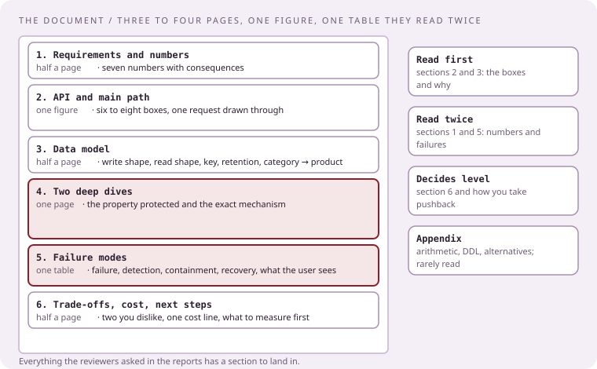
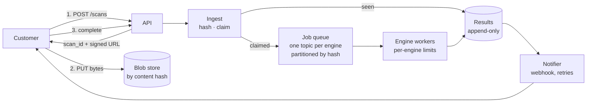

# The document, with a complete example

[Curriculum](../../../README.md) · [Take-home and review](../README.md)

> "They sent the prompt. What do I actually hand in, how long is it, and what does a finished one look like?"

The document is read before the review by people who will spend two hours on it. It is not a slide deck and not an essay. It is a page of numbers, one diagram, a data model, two deep dives, a failure table, and the trade-offs you dislike. Three to four pages. Everything else is an appendix.

## The shape

| Section | Length | What it must contain | What reviewers do with it |
|---|---|---|---|
| 1. Requirements and numbers | half a page | Functional list, non-functional list, the assumed rates and sizes, what is out of scope, the questions you would have asked | Check your arithmetic against theirs; the first interruption comes from here |
| 2. API and main path | one figure and a paragraph | Six to eight boxes; one request drawn through them; the API surface in a table | Ask "why this box" for each |
| 3. Data model | half a page | Each store: what is written, what is read, the key, the retention, the category, then the product | Ask "why this store", "what if it is down", "how big does it get" |
| 4. Deep dives | one page | The two hardest parts, worked; in this domain nearly always concurrency or dedupe, and the queue | Push on the exact mechanism |
| 5. Failure modes | one table | Failure, detection, containment, recovery, what the user sees | Add a failure you did not list |
| 6. Trade-offs and next steps | half a page | Two decisions you dislike and the alternative; the first thing you would measure; a cost line | Change a requirement and watch you move |
| Appendix | any length | Capacity arithmetic, schema DDL, alternatives considered | Rarely read; proves the work |

Rules from the reports, applied to the document:

- Name categories, then products: "an append-only store with TTL compaction; Cassandra fits because the write path is sequential and the read is by key and time." Never a product without its category `[Reported]` 2024.
- Say how the managed thing works. If a box says "SQS," the next sentence says what it guarantees and what it does not, because "Amazon people fail relying on DynamoDB and SNS" `[Reported]` 2024.
- One cost line per major store, even rough. "Explain cost" is a reported reviewer instruction `[Reported]` 2024.
- Security and availability get their own short section, because they "are the two priorities" `[Reported]` Jan 2026.
- Bring it as a PDF, and export the diagram as an image; keep both open before the call.

## A complete example, in the rank-1 shape

The prompt below is `[Generated]` in the shape of the most-reported take-home; the reported requirements were "uploads, hashing, blob storage, sharding, scaling, async flow" and "billions of requests and big files." The document that follows is what a strong submission looks like. Use it as a model of length and register, not as an answer to copy.

> **Prompt.** Design a service where customers upload files (up to 500 MB) to be scanned by several analysis engines. Uploads must be acknowledged quickly; scan results can take minutes. Customers poll or receive a webhook. The same file is often uploaded by many customers. Expect 2,000 uploads per second at peak and years of retained results. The system is multi-tenant and must be secure.

---

### File scanning platform: design

**1. Requirements and numbers**

Functional: upload a file and receive a `scan_id` immediately; run every enabled engine against the file; expose the result by `scan_id` and by content hash; notify by webhook when complete; retain results and allow re-scan when engines update.

Non-functional: upload acknowledgement under 200 ms at p99; result availability within minutes, no hard bound; no file scanned twice for the same engine version; tenant data isolated; no data loss once acknowledged.

| Number | Value | Consequence |
|---|---|---|
| Peak uploads | 2,000/s; assume 5× the average | Front door must absorb bursts without the engines |
| File size | median 2 MB, max 500 MB | Direct-to-blob uploads; the API never proxies bytes |
| Bytes per day at peak | 2,000 × 2 MB × 86,400 ≈ 350 TB | Blob storage is the cost center; dedupe pays for itself |
| Duplicate rate | assume 60% of uploads are previously seen hashes | 60% of engine work avoided; dedupe is a first-class path |
| Engines | 6, each 0.5–30 s per file | Per-engine queues and limits; the slowest engine must not block the rest |
| Results per year | 2,000 × 0.4 × 86,400 × 365 ≈ 25 billion engine results | Append-only, partitioned by hash; a row is small |
| Tenants | 10,000, with one at 30% of volume | Fairness by tenant is a design requirement, not a follow-up |

Out of scope: the engines' internals, billing, and the customer console. Questions I would ask: is a result per engine version required forever, and which engines are allowed to see plaintext.

**2. API and main path**

| Call | Behavior |
|---|---|
| `POST /scans` with size and optional client hash | Returns `scan_id` and a signed, single-use blob URL; idempotent on a client `request_id` |
| `PUT` to the blob URL | Bytes go to object storage; the API never sees them |
| `POST /scans/{id}/complete` | Client signals the upload finished; the platform verifies size and hash |
| `GET /scans/{id}` | Status and per-engine results; `GET /hashes/{sha256}` for the content view |
| Webhook | Signed payload on completion; retried with backoff; the customer may replay by `scan_id` |

One upload, end to end: the API issues `scan_id` and a signed URL in one round trip; the customer writes bytes straight to the blob store; on `complete`, Ingest hashes the object (streaming SHA-256, once), tries to claim the hash, and either enqueues one job per engine or links the `scan_id` to the existing results. The Notifier watches the results stream and calls the customer's webhook when the last engine lands.

**3. Data model**

| Store | Written | Read | Key | Retention | Category → product |
|---|---|---|---|---|---|
| Blob store | Once per unique file | By engines, once per engine version | `sha256` | 90 days for bytes, results forever | Object storage → S3 with per-tenant prefixes and SSE-KMS |
| Scan registry | Once per upload, status updates | By `scan_id`, by tenant listing | `scan_id`, secondary by `(tenant, created)` | 13 months | OLTP with row locks → Postgres, partitioned by month |
| Hash claims | One conditional insert per unique hash | On every complete | `sha256` | Same as results | OLTP with conditional writes → the same Postgres, or DynamoDB with a condition expression; the property is a unique constraint plus a lease |
| Job queue | One message per (hash, engine) | By engine workers | Partition by `sha256` | Until consumed | Log-structured queue → Kafka, one topic per engine |
| Results | One row per (hash, engine, version) | By hash, by scan | `(sha256, engine, version)` | Years | Append-only, write-heavy, read by key → Cassandra with TWCS, or an LSM store |
| Webhook outbox | One row per completed scan | By the notifier | `scan_id` | Until delivered + 7 days | Transactional outbox in Postgres |

**4. Deep dives**

*4a. Two customers upload the same new file at the same second.* Both `complete` calls hash to the same `sha256`. Ingest performs a conditional insert into hash claims: `INSERT ... WHERE NOT EXISTS` with a lease column (`claimed_by`, `expires_at`). One insert wins and enqueues jobs; the other reads the row, sees the claim, and links its `scan_id` to the pending results. If the winner dies before enqueueing, the lease expires and the next `complete` for that hash, or a sweeper, re-claims and enqueues. Engine results carry the claim's fencing token, so a late worker from an expired claim cannot overwrite a newer result. The property being protected is at-most-one scan per (hash, engine version), and it is protected by the database's uniqueness, not by application locks.

*4b. The slowest engine must not block the rest.* Each engine has its own topic and its own worker pool with a concurrency limit derived from its cost: a 30-second engine at 800 new files per second needs 24,000 concurrent scans, so it is either sharded across many workers or explicitly declared "best effort within an hour" in the API. Workers commit offsets after a batch of results is written, never per event; a failing file is redriven to a per-engine retry topic with a cap, then to a dead-letter topic with the reason attached. Backpressure is consumer lag per engine; the autoscaler reads lag, and the API sheds the noisy tenant first when lag on any engine crosses a threshold, using a per-tenant token bucket in front of Ingest.

**5. Failure modes**

| Failure | Detection | Containment | Recovery | The customer sees |
|---|---|---|---|---|
| Blob store region degraded | PUT error rate, complete-without-object | Signed URLs point at a second region | Replicate back; hashes are location-independent | Slower uploads |
| Kafka partition leader loss | Producer errors, lag spike | Producer retries with idempotence on | New leader; at-least-once, results idempotent by key | Minutes of delay |
| One engine down | Its lag grows alone | Its topic fills; others unaffected | Workers return; redrive cap protects the DLQ | Partial results, then complete |
| Postgres primary failover | Connection errors | API returns 503 for writes for seconds; reads from replica | Standby promoted; outbox replays | Brief upload failures, safe to retry by `request_id` |
| Duplicate webhook delivery | Customer reports; outbox retry log | Payload carries `scan_id` and an idempotency key | None needed | Same event twice, deduplicable |
| Poison file crashes a worker | Crash loop on one partition | Redrive cap; quarantine by hash | Fix the engine; re-scan by hash | One file stuck "processing" with a reason |
| Noisy tenant at 10× | Per-tenant rate and lag | Token bucket; lower priority topic lane | Raise their limit deliberately | 429 with a retry-after |

**6. Security and availability**

Bytes are encrypted at rest with a per-tenant key; engines that need plaintext run in an isolated network with no egress except the results write. Signed URLs are single-use and expire in minutes. Every `GET` is scoped by tenant at the API, and results are keyed by hash but authorized by the scan registry, so a tenant cannot read another tenant's verdicts by guessing a hash. Audit log: who uploaded, who read, when. Availability: the front door depends only on Postgres and the blob store; the engines can be down for an hour without losing an upload, which is the point of acknowledging before scanning.

**7. Trade-offs and next steps**

Two decisions I dislike: Postgres for the scan registry will need sharding by tenant within a year at this rate, and I chose it for the conditional insert and the outbox; the alternative is a key-value store with conditional writes and a separate outbox, at the cost of two systems. Second, results keyed by hash share verdicts across tenants, which is why dedupe works, but it means a malicious tenant can learn whether a hash was seen before by timing; the fix is a constant-time path for the "seen" case, which I would build before launch.

Cost, rough: 350 TB/day of blobs at 90-day retention is the largest line by an order of magnitude; dedupe at 60% is the single most valuable feature in the system. First thing to measure: the real duplicate rate and the engine time distribution, because both numbers drive the two largest costs.

---

That is the whole document. Everything the reviewers asked in the reports has a place to land: scale and big files in section 1, concurrent uploads in 4a, storage pros and cons in section 3, failure modes in section 5, cost in section 7, security and availability in section 6.

## Before you submit

| Check | Fix if not |
|---|---|
| Every box in the figure appears in the data model or the deep dives | Delete the box or write the row |
| Every store has a category before a product | Add the category sentence |
| Every number in section 1 is used somewhere later | Cut it, or use it |
| The failure table has a row for each store | Add the row |
| There is a cost line | Write one, even rough |
| A stranger can read it in ten minutes | Cut until they can |
| The diagram exports as an image | Export it now |

## Check the mechanism

| Prompt | A strong answer contains |
|---|---|
| "How long is it?" | Three to four pages plus an appendix nobody has to read |
| "What is in the deep dives?" | The two hardest mechanisms, usually dedupe or contention, and the queue |
| "Where do concurrent uploads land?" | A conditional insert with a lease and a fencing token, in a deep dive |
| "Where does cost land?" | One line per major store and the single number that drives it |

Next: [The follow-up bank](03-the-follow-up-bank.md).
