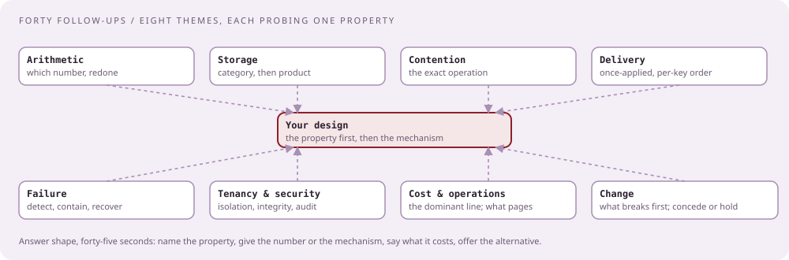

# The follow-up bank

[Curriculum](../../../README.md) · [Take-home and review](../README.md)

> "They always have follow-ups. Which ones, what are they testing, and what does a good answer sound like?"

Every follow-up reported for CrowdStrike design rounds, grouped by what it tests, with the answer shape and a model answer for the [file-scanning document](02-the-document.md). The label says where the question comes from; `[Generated]` rows are the follow-ups any reviewer of that design would ask next, in the reported style.

## How to answer any of them

| Step | Seconds | What you say |
|---|---|---|
| Name the property | 5 | "That is a question about ordering" |
| Give the number or the mechanism | 20 | The arithmetic, or the exact operation that protects the property |
| Say what it costs | 10 | Latency, money, or complexity you paid |
| Offer the alternative | 10 | "If the constraint were different, I would…" |

The reported failure mode is skipping to the mechanism and never naming the property, then defending the mechanism when the reviewer wanted the property.

## 1. Scale arithmetic

| Question | Evidence | Tests | Answer shape | Model answer for the file scanner |
|---|---|---|---|---|
| "Scale this to billions of requests and big files" | `[Reported]` 2020 | Whether you redo the numbers instead of saying "it scales" | New peak, new bytes per day, the first box that breaks | "Ten times is 20,000 uploads a second and 3.5 PB a day. The blob store absorbs it; the first thing that breaks is the Postgres registry at 20,000 inserts a second, so it shards by tenant, and the hash-claim table moves to a key-value store with conditional writes" |
| "Which number did you assume that changes the design?" | `[Generated]` | Whether you know your own assumptions | The one number, and what flips if it is wrong | "The 60% duplicate rate. At 10% duplicates the engines are the bottleneck and the dedupe path is not worth its complexity" |
| "How much storage per year?" | `[Generated]` | Arithmetic under pressure | Rows × bytes × retention | "25 billion results a year at about 200 bytes is 5 TB, trivial; the bytes are the 350 TB a day" |
| "How many workers for the slowest engine?" | `[Generated]` | Little's law | Arrival rate × service time | "800 new files a second times 30 seconds is 24,000 in flight; that engine is sharded or declared best-effort" |
| "Don't rely on infinite scalability" | `[Reported]` 2024 | Whether you know the ceiling of each box | The limit of the managed service, with a number | "One Kafka cluster at their published 15 million events a second; a Postgres primary at tens of thousands of writes a second; an S3 prefix at thousands of requests a second, which is why keys are hash-prefixed" |

## 2. Storage choices

| Question | Evidence | Tests | Answer shape | Model answer |
|---|---|---|---|---|
| "Explain why you pick a particular system and the pros and cons" | `[Reported]` 2020 | Category before product | Write shape, read shape, category, then product, then the con | "Results are write-heavy, append-only, read by key: an LSM store; Cassandra fits and its con is no ad-hoc queries, which the search tier covers" |
| "Why Cassandra? Talk about consistent hashing" | `[Reported]` 2023 | Whether you know how the product works | Ring, virtual nodes, replication factor, what happens when a node joins | "Keys hash onto a ring; each node owns ranges via virtual nodes; RF 3 with LOCAL_QUORUM gives one-node loss without downtime; a joining node streams its ranges, which is why we add nodes off-peak" |
| "Say it without technology names" | `[Reported]` 2024 | Whether you have the categories | OLTP, queue, blob, append-only store, cache | "An OLTP store with conditional writes for claims; a log-structured queue per engine; object storage for bytes; an append-only store for results; a cache in front of the hash lookup" |
| "Explain how that AWS service actually works" | `[Reported]` 2024 | Whether the managed box is a black box to you | Its guarantee, its failure, its limit | "SQS standard is at-least-once and unordered; FIFO gives ordering per group at 3,000 messages a second per group; visibility timeout is the lease, which is why a slow consumer sees duplicates" |
| "Hot versus cold storage: what moves, when?" | `[Aggregator]` 2026 | Tiering | The age at which reads drop, and the cost ratio | "Bytes older than 90 days are almost never re-scanned; they move to infrequent-access at about a fifth of the cost, and results stay hot because the by-hash lookup is the dedupe path" |
| "What if the registry database is down?" | `[Generated]` | Dependency map | Which path dies, which survives | "Uploads fail for seconds and are safe to retry by request id; scanning in progress continues because workers only touch the queue and the results store" |

## 3. Concurrency and contention

| Question | Evidence | Tests | Answer shape | Model answer |
|---|---|---|---|---|
| "Two users upload the same file at the same time" | `[Reported]` 2025 | The exact operation that prevents the double scan | Conditional insert, lease, fencing token | "A unique constraint on the hash with a conditional insert; the loser links to the winner's results; a lease with expiry covers the winner dying; a fencing token on the results write stops a late worker" |
| "Users competing for the same resource" | `[Reported]` 2025 | Whether you reach for a lock or a property | Idempotent write, compare-and-set, or a single writer | "Per-hash work is serialized by the partition key, so there is one consumer per hash at a time; no distributed lock" |
| "What if the claim holder crashes after enqueueing half the engines?" | `[Generated]` | Partial failure inside a claim | Make the enqueue idempotent and resumable | "Jobs are keyed by (hash, engine); re-enqueueing after the lease expires produces duplicates the workers ignore by key" |
| "How do you assign work to workers?" | `[Reported]` Oct 2025 | Distribution strategies | Round-robin, hash by key, work stealing, and when each | "Round-robin for stateless scans; hash by tenant when per-tenant order matters; work stealing when engine cost varies by file, which it does" |
| "Why hash on the key?" | `[Reported]` Oct 2025 | Whether you know what hashing buys | Ordering and locality, at the cost of hot keys | "It gives one consumer per key and preserves order per key; the cost is a hot key when one tenant is 30% of volume, so tenant is the partition key only for the ordered lane" |

## 4. Delivery semantics and ordering

| Question | Evidence | Tests | Answer shape | Model answer |
|---|---|---|---|---|
| "At-least-once or exactly-once, and why?" | `[Aggregator]` 2026 | Whether you know exactly-once is a property of the sink | Delivery is at-least-once; effects are idempotent by key | "At-least-once everywhere; results are idempotent by (hash, engine, version) and webhooks carry an idempotency key, so the effect is once" |
| "What about event ordering?" | `[Aggregator]` 2026 | Per-key order versus global order | Partition by the key that needs order; nothing else is ordered | "Order matters per scan, not across scans; partition by hash gives it; the notifier waits for all engines, so order among engines does not matter" |
| "Duplicate events: where do they come from and where do they die?" | `[Aggregator]` 2026 | The dedupe window | Producer retries, consumer redelivery, client retries; each has a key | "Client retries die at the request id; producer retries at idempotent produce; consumer redelivery at the results key" |
| "Now events must be delivered in order per customer, across regions" | `[Generated]` | Concession under a changed requirement | Name what breaks, then the smallest change | "Cross-region order needs a single sequencer per customer, which is a latency cost; I would give each customer a home region and sequence there, and I would say so in the API" |
| "Can a webhook fire before the result is readable?" | `[Generated]` | Read-your-writes across stores | Outbox after the write, or read-back before notify | "The outbox row is written in the same transaction as the status change; the notifier reads results before calling" |

## 5. Failure and recovery

| Question | Evidence | Tests | Answer shape | Model answer |
|---|---|---|---|---|
| "What breaks first?" | `[Reported]` 2025 | A named bottleneck with a number and a signal | Box, number, signal | "The registry at about 20,000 writes a second; the signal is write latency at p99, and the mitigation is sharding by tenant" |
| "Walk me through an outage" | `[Official]` root cause analysis | Symptom to cause | Signal, hypothesis, confirmation, containment, fix | "Webhooks late; lag on the slowest engine's topic is climbing; one engine version crashes on a file type; quarantine by hash and redrive cap contain it; fix the engine; re-scan by hash" |
| "What is lost, and for how long?" | `[Generated]` | Honesty about the loss window | Acknowledged means durable; what is acknowledged | "Nothing acknowledged is lost: the object is in the blob store and the claim is in the database before we return 202. Results are delayed, not lost" |
| "How does the system come back after Kafka is down for an hour?" | `[Generated]` | Recovery arithmetic | Backlog size, drain rate, time to catch up | "An hour of new files is about 3 million jobs per engine; at 2× steady-state capacity the drain is an hour; we scale workers first, then let lag fall" |
| "What does the customer see during each failure?" | `[Generated]` | Whether the API has a story for degradation | Status values and retry guidance | "202 with a status of queued; 429 with retry-after under shedding; a result with one engine marked pending" |

## 6. Tenancy, security, availability

| Question | Evidence | Tests | Answer shape | Model answer |
|---|---|---|---|---|
| "Security and availability are our priorities. Where are they in your design?" | `[Reported]` Jan 2026 | Whether they have a section | Isolation, encryption, audit; then what stays up when what is down | "Per-tenant keys, single-use signed URLs, tenant-scoped reads, an audit log; the front door depends only on the registry and the blob store" |
| "One very busy customer takes all the capacity" | `[Aggregator]` 2026 | Fairness | Per-tenant limits and lanes | "A token bucket per tenant at the API; a lower-priority topic lane for the tenant over its share; lag-based shedding starts with them" |
| "Customer isolation: could tenant A read tenant B's verdicts?" | `[Aggregator]` 2026 | Authorization by the right key | Results keyed by hash, authorized by scan ownership | "Reads go through the scan registry, which is tenant-scoped; the by-hash view is only reachable for hashes the tenant has uploaded" |
| "What is the adversary here?" | `[Generated]` | Threat model | Who, what they want, what a compromised box gives them | "A malicious tenant uploading a file to learn if others have seen it; a compromised engine exfiltrating plaintext; the first is a timing side channel, the second is why engines have no egress" |
| "Encryption at rest, audit logging: where?" | `[Aggregator]` 2026 | Whether it is designed in or bolted on | Keys per tenant, what is logged | "SSE-KMS per tenant on the bucket; every upload, read, and webhook delivery is an audit row with actor and time" |

## 7. Cost and operations

| Question | Evidence | Tests | Answer shape | Model answer |
|---|---|---|---|---|
| "What does this cost?" | `[Reported]` 2024 | Which line dominates | The largest line and the number that drives it | "Blob storage at 350 TB a day dominates everything; the duplicate rate is the number that halves it" |
| "What do you monitor? What pages someone?" | `[Official]` debuggability | Three signals | Lag per engine, upload error rate, webhook delivery age | "Lag per engine pages at ten minutes; upload 5xx pages at 1%; webhook age pages at fifteen minutes" |
| "How do you deploy a new engine version?" | `[Generated]` | Rollout | Ring by tenant, compare results, rollback | "New version scans a canary slice, results compared to the old version by hash, promoted in rings, rolled back by flipping the version pointer" |
| "What is the on-call burden of this design?" | `[Generated]` | Operational honesty | The runbooks you would need | "Redrive a DLQ, rotate a tenant key, drain a hot partition; three runbooks before launch" |
| "Batching and caching: where?" | `[Aggregator]` Oct 2025 | Whether you batch the expensive step | Batch writes, cache the lookup | "Results are written in batches per worker; the hash-seen lookup is cached because it is the hottest read" |

## 8. Change and concession

| Question | Evidence | Tests | Answer shape | Model answer |
|---|---|---|---|---|
| "What would you change with one more week?" | `[Reported]` 2020; `[Aggregator]` 2026 | A real trade-off | The thing you dislike most and why you shipped it | "The registry on Postgres; I would move claims to a key-value store with conditional writes before sharding forced it" |
| "We do it differently here" | `[Reported]` Jan 2026 | Concession without collapse | Ask how, find the property, say the trade | "How do you do it? … So you protect ordering with a single consumer per tenant; mine trades that for throughput on the unordered lane. If per-tenant order is a requirement, yours is right" |
| "That won't work at our scale" | `[Reported]` 2024 | Composure | Which number, redo it | "Which number are you using? Let me redo it with yours" |
| "Requirements change: files up to 50 GB" | `[Generated]` | Recomputing under a changed requirement | What breaks, the smallest change | "Streaming hash still works; engines that load files in memory do not; multipart upload and engines declared per size class" |
| "Requirements change: results must be deleted on request, everywhere" | `[Generated]` | Deletion in append-only stores | Tombstones, crypto-shredding, retention | "Per-tenant keys make deletion a key destruction; results by hash are shared, so tenant-scoped rows are tombstoned and the shared verdict stays" |

## Check the mechanism

| Prompt | A strong answer contains |
|---|---|
| "Name the three follow-ups you are most likely to get" | Concurrent uploads, why this store with pros and cons, and scale it ten times |
| "What do you say first to any follow-up?" | The property being asked about |
| "What does conceding sound like?" | "You are right if the requirement is X; here is what changes" |
| "Where does security live?" | Its own section, with tenant keys, scoped reads, and an audit log |

Next: [The review, rehearsed](04-the-review-rehearsed.md).
