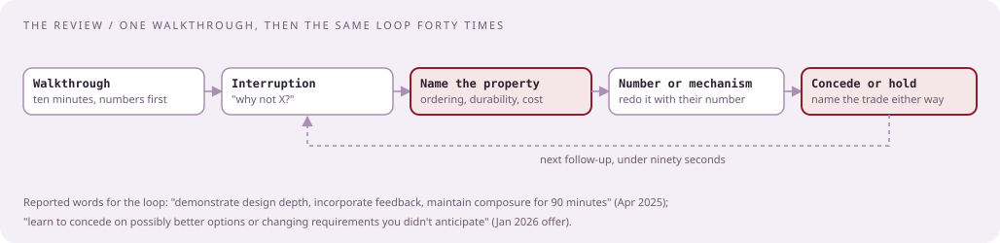

# The review, rehearsed

[Curriculum](../../../README.md) · [Take-home and review](../README.md)

> "What do two hours with two engineers actually sound like, minute by minute?"

A transcript in the shape of the January 2026 senior loop: a take-home on a real-time event message system, then "a 2 hour long meeting with two other engineers to discuss the entire design" `[Reported]`. The transcript is `[Generated]`. The questions are the reported ones from the [bank](03-the-follow-up-bank.md); the design is the [event message system case](../../03-architecture/problems/event-message-system.md). Read it aloud with a partner playing both reviewers, then swap.

## The design under review, in one paragraph

Producers publish events for customers; consumers subscribe by customer and topic; each customer's events are delivered in order; a consumer that falls behind or dies can replay from a position; delivery is at-least-once and consumer effects are idempotent by event id; the two priorities are security (tenant isolation, signed payloads, audit) and availability (the write path depends on one durable log). Stores: a partitioned log keyed by customer, a cursor store for consumer positions, a small OLTP registry for subscriptions and keys.

## The transcript

**0:00. Reviewer A:** Thanks for the document. Walk us through it in ten minutes; we will interrupt.

**You:** Three numbers first, because they decided the design: 2 million events a second at peak across 10,000 customers, with the largest customer at a quarter of that; a p99 publish-to-deliver budget of two seconds; and seven days of replayable history, which at 500 bytes an event is about 600 TB. So: a partitioned, replicated log is the only store on the write path; ordering is per customer, so the partition key is the customer id with a sub-key for the biggest customers; positions live in a separate cursor store because they are updated a thousand times more often than they are read. One event: the producer signs and posts it; the gateway validates the tenant and the schema and appends it to the customer's partition; the append is acknowledged after two replicas; consumers pull from their cursor, apply, and commit the cursor after a batch. That is the main path. [Continues through stores, then failure modes, then the two trade-offs, at 9:40.]

**0:10. Reviewer B:** You said the largest customer is a quarter of the traffic. One partition cannot take 500,000 events a second. What happens to per-customer ordering when you split them?

**You:** That is the ordering question, and it is the one place I gave something up. The largest customers are split by a sub-key the customer chooses, an entity id, so order is per customer-and-entity rather than per customer. Global order for one customer at 500,000 events a second would need a single sequencer, which is the latency and availability cost I did not want on the write path. If a customer genuinely needs total order, they get one partition and a documented ceiling of about 50,000 events a second.

**0:14. Reviewer A:** Say that without product names. What is the log?

**You:** An append-only, partitioned, replicated log with offsets: sequential writes, reads by offset range, retention by time. Kafka is the product; the category is what matters, and a cloud stream service would have the same properties with a lower per-partition ceiling.

**0:16. Reviewer B:** Explain how the replication actually works in the product you named. What do you lose when a broker dies?

**You:** Each partition has a leader and followers; a write is acknowledged when the in-sync replicas have it, which I set to two of three. A leader dying means the controller elects an in-sync follower; producers retry with idempotence on, so the retry does not duplicate. What I lose is seconds of availability for that partition, not data, as long as I refuse to elect an out-of-sync replica. If I allowed unclean election, I would trade those seconds for possible loss, and I would not, because availability here means "no acknowledged event disappears," not "every write succeeds instantly."

**0:21. Reviewer A:** Duplicates. Where do they come from and where do they die?

**You:** Three sources: the producer retrying after a lost acknowledgement, which idempotent produce absorbs; the consumer re-reading after a crash before the cursor commit, which is the at-least-once window; and a customer's own client retrying a publish, which the event id on the API absorbs at the gateway with a short dedupe window. The middle one is the one that matters; it dies at the consumer, whose effects are idempotent by event id. I do not claim exactly-once delivery anywhere; I claim once-applied effects.

**0:25. Reviewer B:** A consumer is dead for six hours. Then it comes back. What does it see?

**You:** Its cursor, unchanged, and six hours of backlog behind it. It drains at whatever rate it can; nothing was lost because retention is seven days. The signal I watch is cursor age, not queue depth, because age is what the customer feels. If the consumer cannot drain faster than events arrive, the customer needs more consumers on more sub-keys, which is the ordering trade again.

**0:29. Reviewer A:** What if it is dead for eight days?

**You:** Then it has fallen off retention and the honest answer is that it lost a day. I would rather the API say so: the cursor read returns "position expired, earliest available is X," and the customer chooses to resume from earliest or from now. Silently resuming from now is how customers discover data loss in production.

**0:32. Reviewer B:** Scale this ten times.

**You:** Twenty million events a second, six petabytes of retention. The log scales by partitions and brokers; their published figure for one cluster is around fifteen million a second, so at ten times I need at least two clusters, and the question becomes how a customer maps to a cluster. Consistent hashing of customer id to cluster, with the largest customers pinned, and a routing table in the registry. The first thing that actually breaks is the cursor store: at ten times, cursor commits are the hottest write in the system, so they batch harder or move to a per-partition compacted topic.

**0:37. Reviewer A:** You put cursors in a separate store. Why not in the log itself?

**You:** That is exactly the alternative I would take if you told me the cursor store was the thing you did not want to operate. A compacted topic keyed by consumer group holds the latest position per group and lives in the same system. I chose the separate store because reads by group are a point lookup, and I wanted to answer "where is every consumer" for the operator without scanning a topic. If the operator question is not needed, yours is simpler. I would switch.

**0:40. Reviewer B:** Security. Where is it?

**You:** Three places. Tenant isolation: every partition belongs to one customer, the gateway authorizes by tenant on both publish and subscribe, and there is no cross-tenant read path at all. Payload integrity: producers sign events with a per-customer key, the gateway verifies, and consumers can verify again, so a compromised gateway cannot forge events. Audit: every subscription creation, key rotation, and replay-from-earliest is an audit row. Encryption at rest on the log with per-cluster keys; per-customer keys would be nicer and I did not do it because key management per partition is an operational cost I would pay only if a customer required it.

**0:45. Reviewer A:** What is the adversary?

**You:** Two. A tenant trying to read another tenant's events: blocked by authorization at the gateway and by physical separation of partitions, and I would test it with a tenant that only holds a foreign partition id. And an insider or a compromised consumer host replaying old events into a downstream system: bounded by the idempotency key and by the audit trail on replay-from-earliest, which is a privileged operation.

**0:50. Reviewer B:** Cost.

**You:** Retention dominates. Six hundred terabytes on replicated disks, times three, at cloud block storage prices is the largest line by far; tiering segments older than a day to object storage cuts it by about two thirds and is the first cost project. Compute is the gateway and the brokers; the gateway is stateless and cheap. The number that drives cost is retention days times bytes per event, so the product decision "seven days" is the cost decision.

**0:54. Reviewer A:** New requirement. Events for a customer must be delivered in order across two regions, and the customer publishes in both.

**You:** [Pause.] That changes the design, and I want to say what it breaks before I fix it. Order across regions needs a single point that decides sequence, which means either one region is the home for that customer's sequencing and the other forwards to it, with the cross-region latency on every publish, or both regions accept writes and consumers merge by a logical clock, which is not total order. I would give each customer a home region, forward from the other, and document the added latency; the alternative is to redefine order as per-region, which most customers accept once they see the latency. I would push back on the requirement before building the first version.

**1:00. Reviewer B:** We do it the second way. Both regions accept, consumers merge.

**You:** Then you have chosen availability over total order, which fits the stated priorities better than my answer did, and the merge needs a hybrid logical clock so that consumers see a consistent order that is not wall-clock order. The cost you paid is that a customer cannot assume the order they published in; I would want that sentence in the API documentation. If that is acceptable to your customers, yours is the better design for this system.

**1:04. Reviewer A:** What would you change with one more week?

**You:** Two things I dislike. The gateway does schema validation synchronously on the publish path, which is where p99 latency hides; I would move validation to a sidecar with a cached schema registry. And I under-designed the replay API: "resume from earliest" is a privileged, expensive operation and it needs rate limits and an audit reason, which I mention but did not design.

**1:08. Reviewer B:** Walk me through an outage. Customers say events are late.

**You:** Cursor age is rising for many customers at once, so it is not one consumer. Broker lag is flat, so the log is fine. Gateway p99 is up: the schema registry cache is missing and every publish is hitting the registry. Contain by serving the last known schema from the sidecar and rejecting only unknown schemas; fix by warming the cache on deploy; the root cause is the deploy that cleared it, and the follow-up is a canary that measures gateway p99 before the ring advances.

**1:15. Reviewer A:** What do you monitor and what pages?

**You:** Three signals: cursor age per consumer group, which pages at two minutes for the two-second-budget customers; gateway 5xx and p99, which page at one percent and three seconds; under-replicated partitions, which page at any nonzero count because it means the next failure loses data.

**1:20 to 1:50.** [The reviewers take turns on smaller follow-ups from the bank: hot partitions, poison events, schema evolution, retention as a per-customer setting, how a consumer proves it is authorized, the cost of encryption per customer, what a Go consumer's worker pool looks like, how offsets are committed after a batch, what happens when a batch is half-applied. Each answer is under a minute, in the same shape: property, mechanism or number, cost, alternative.]

**1:50. Reviewer B:** Questions for us?

**You:** Which part of this would your team push back on hardest in a real design review? And which of my scale numbers is furthest from yours?

**1:55. Reviewer A:** Thanks. We will get back to the recruiter.

## What the reviewers wrote down, probably

| Moment | Strong signal | Weak version of the same moment |
|---|---|---|
| The walkthrough | Numbers first; one event end to end in under ten minutes | Boxes first; ten minutes on the diagram, no numbers |
| "Say it without product names" | Categories, then the product as one instance | Repeats the product name with more features |
| "Explain how replication works" | Leader, in-sync replicas, what unclean election trades | "It's managed, it just replicates" |
| "Scale ten times" | Redoes the arithmetic; names the first box that breaks | "Add more partitions" |
| "Why not cursors in the log?" | Finds the property the reviewer's way protects; offers to switch | Defends the separate store harder |
| The changed requirement | Says what breaks first, then the smallest change, then pushes back on the requirement | Redesigns silently, or says it cannot be done |
| "We do it differently" | Concedes on the merits and states the trade the reviewer's design made | Caves with no reason, or argues |
| Security | Three named places, and the adversary | "We'd add auth" |
| Cost | The dominant line and the number that drives it | "Cloud costs would need to be estimated" |
| The outage | Signal to cause to containment to fix to prevention | Lists things that could go wrong |

## Run it three times

| Run | Who plays the reviewers | Rule |
|---|---|---|
| 1 | You, reading both parts aloud | Notice which answers you cannot say without the document |
| 2 | A friend with the bank, asking out of order | They interrupt within thirty seconds of every answer |
| 3 | A friend who disagrees with everything | You must concede twice and hold twice, and say why each time |

Next: [Drills, and the week before](05-drills.md).
