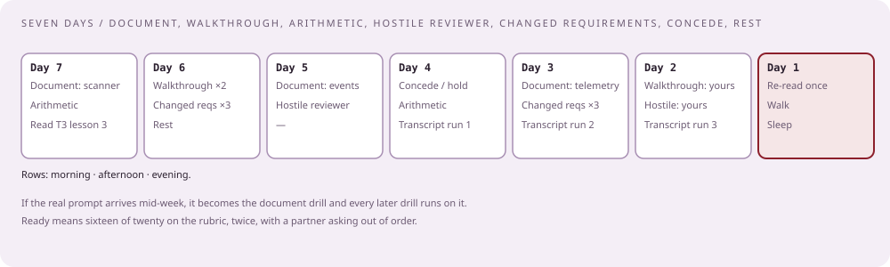

# Drills, and the week before

[Curriculum](../../../README.md) · [Take-home and review](../README.md)

> "How do I practice a two-hour conversation so that it is automatic on the day?"

Six drills, each with a timer and a way to grade yourself, and a seven-day schedule that uses them. All `[Generated]`; the shapes come from the reported rounds.

## Drill 1. The four-hour document

Write the [document](02-the-document.md) for a prompt you have not written before, in four hours, with this clock.

| Clock | Section | Done when |
|---|---|---|
| 0:00–0:30 | Requirements and numbers | Seven numbers with consequences; three questions you would have asked |
| 0:30–1:15 | API and main path | Six to eight boxes; one request drawn through; API table |
| 1:15–2:00 | Data model | Every store has write shape, read shape, key, retention, category, product |
| 2:00–3:00 | Two deep dives | Each names the property protected and the exact mechanism |
| 3:00–3:30 | Failure table | One row per store, plus the noisy tenant and the poison input |
| 3:30–4:00 | Trade-offs, cost, read-through | Two dislikes; one cost line; a stranger could read it in ten minutes |

Prompts to rotate: the [file-scanning platform](../../03-architecture/problems/file-scanning-platform.md), the [event message system](../../03-architecture/problems/event-message-system.md), [telemetry ingestion](../../03-architecture/problems/telemetry-ingestion.md), the [searchable event store](../../03-architecture/problems/searchable-event-store.md), the [worker pool](../../03-architecture/problems/worker-pool-template-jobs.md). Do the file scanner first and last.

## Drill 2. The ten-minute walkthrough

Record yourself presenting the document with a timer visible. Play it back with the checklist.

| Check | Yes or no |
|---|---|
| The first sentence is a number |  |
| One request is walked end to end before any store is discussed |  |
| Every box is named by category before product |  |
| The failure table is mentioned before minute eight |  |
| You stopped at ten minutes without being cut off |  |
| You said "I would have asked" at least once |  |

Under five yes: do it again tomorrow. Six: move to drill 4.

## Drill 3. Arithmetic, cold

Ten numbers to compute out loud, in under a minute each, with no notes. Write your own for each prompt; these are for the file scanner.

| Ask | Working |
|---|---|
| Bytes per day at 2,000 uploads/s and 2 MB median | 2,000 × 2 MB × 86,400 ≈ 350 TB |
| Results rows per year at 40% new and 6 engines | 2,000 × 0.4 × 6 × 86,400 × 365 ≈ 150 billion |
| In-flight scans for a 30-second engine at 800 new files/s | 24,000 |
| Drain time for a one-hour backlog at 2× capacity | one hour |
| Partitions needed at 2,000 jobs/s if one partition sustains 5,000/s with headroom of half | one; use twelve for parallelism |
| Storage for 25 billion 200-byte rows | 5 TB |
| Cost ratio of standard to infrequent-access object storage | about 5 to 1 |
| Webhooks per second at 2,000 uploads/s | 2,000, bursting on engine completion |
| Cache size for a hash-seen lookup of one day of unique hashes | 800 × 86,400 × 40 bytes ≈ 3 GB |
| Ten times everything: the first box that breaks | the registry at 20,000 writes/s |

The point is not the numbers; it is that "which number?" gets an answer in the room without a pause.

## Drill 4. The hostile reviewer

A partner takes twelve cards from the [bank](03-the-follow-up-bank.md), at least one from each theme, and asks them out of order, interrupting within thirty seconds of each answer. Rules for you:

| Rule | Why |
|---|---|
| Name the property before the mechanism, every time | The reported failure is defending a mechanism they did not ask about |
| Every answer under ninety seconds | The review has forty follow-ups in it |
| Say "which number?" when challenged on scale | `[Reported]` 2024: "don't rely on infinite scalability" |
| Concede at least twice, with the trade named | `[Reported]` Jan 2026: "learn to concede" |
| Hold at least twice, with the constraint named | Caving on everything reads as no ownership |

Grade with the partner afterwards: for each card, did you name the property, give a number or mechanism, state a cost, offer an alternative? Score 0–4 per card; under 36 of 48, repeat in two days.

## Drill 5. Changed requirements

Ten cards. Draw three per session. For each: say what breaks first, the smallest change, and whether you would push back on the requirement.

| Card | Applies to |
|---|---|
| Ten times the volume | any design |
| Add a second region; customers publish in both | event system, telemetry |
| Files up to 50 GB | file scanner |
| Results must be deleted on request, everywhere, within 24 hours | file scanner, event store |
| Retention goes from 7 days to 13 months | event system, telemetry, event store |
| Exactly-once is now a contractual requirement | event system, worker pool |
| Budget cut in half | any design |
| One customer is now 60% of traffic | any design |
| Remove the queue; the CEO read that queues are slow | any design |
| Every engine must be able to be rolled back within five minutes | file scanner, rollout |

The shape of a good answer, in forty seconds: "That breaks X first, because Y. The smallest change is Z, which costs W. I would ask whether the requirement is really R, because most customers accept R′."

## Drill 6. Conceding and holding

Six statements a reviewer might make. Practice two responses to each: one where you concede, one where you hold. Both must name the property and the trade.

| Statement | Concede when | Hold when |
|---|---|---|
| "We would use a single consumer per tenant" | Per-tenant order is a real requirement | Throughput per tenant exceeds one consumer |
| "Cursors belong in the log" | Nobody needs the operator's view of every cursor | The operator's view is a stated requirement |
| "Postgres will not survive this" | Their number is above your sharding threshold | Their number is your number, and you already sharded |
| "You do not need a cache here" | The lookup rate is below the store's ceiling | The lookup is the hottest read and the store's p99 shows it |
| "Exactly-once is possible with transactions" | Within one system, with the cost of its transactional mode named | Across the boundary to the customer's webhook |
| "Encrypt per customer, not per cluster" | A customer requires it and the key operations are budgeted | No such requirement and the key count is in the millions |

## The seven days

| Day | Morning | Afternoon | Evening |
|---|---|---|---|
| 7 | Drill 1: file scanner document | Drill 3 | Read [T3 lesson 3](../../03-architecture/lessons/03-the-ninety-minute-review.md) |
| 6 | Drill 2, twice | Drill 5, three cards | Rest |
| 5 | Drill 1: event system document | Drill 4 with a partner | — |
| 4 | Drill 6 | Drill 3 | [Transcript](04-the-review-rehearsed.md), run 1 |
| 3 | Drill 1: telemetry document, three hours | Drill 5, three cards | Transcript, run 2 with a partner |
| 2 | Drill 2 on your real take-home | Drill 4 on your real take-home | Transcript, run 3 |
| 1 | Re-read your take-home once; export the diagram | Walk; no drills | Sleep |

If the take-home prompt arrives during this week, day 7's drill becomes the real document, with the clock from drill 1 extended to the time you are given, and every later drill runs against it.

## The self-grading rubric

Score each line 0, 1, or 2 after any drill or the real review.

| Line | 2 means |
|---|---|
| Numbers first | The first sentence of the walkthrough was a number |
| One request end to end | Before any store was discussed |
| Category before product | Every time, without being asked |
| Failure table volunteered | Before anyone asked "what breaks" |
| Property named first | On every follow-up |
| Arithmetic in the room | "Which number?" answered without a pause |
| Two concessions | Each with the trade named |
| Two holds | Each with the constraint named |
| Security section | Isolation, integrity, audit, and the adversary |
| Cost line | The dominant line and the number that drives it |

Sixteen or more of twenty is review-ready. Under twelve, the next two days are drills 4 and 6.

## Check the mechanism

| Prompt | A strong answer contains |
|---|---|
| "Which drill matters most?" | Drill 4; the review is forty follow-ups, not a presentation |
| "How do I know I am ready?" | Sixteen of twenty on the rubric, twice, with a partner |
| "What if the prompt arrives mid-week?" | It becomes drill 1, and every later drill runs on it |
| "What do I do the day before?" | Read it once, export the diagram, walk, sleep |

Next: [Architecture: their systems and their design cases](../../03-architecture/README.md) if you have not worked the cases; otherwise return to [the study plan](../../01-preparation/lessons/06-study-plan.md).
