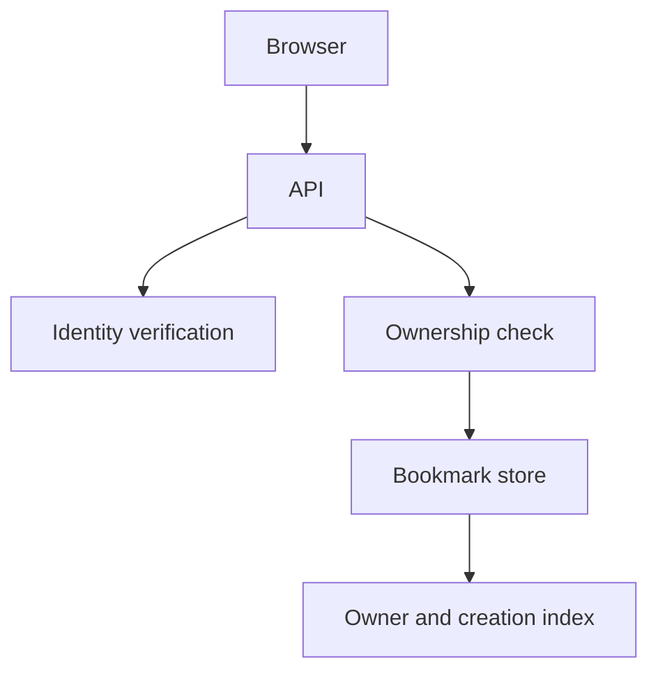
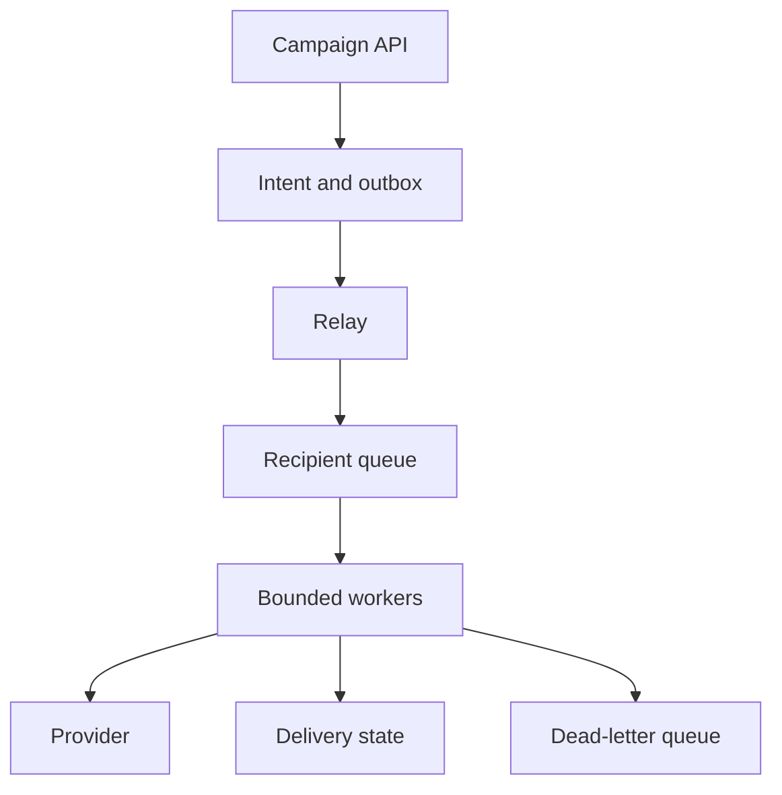
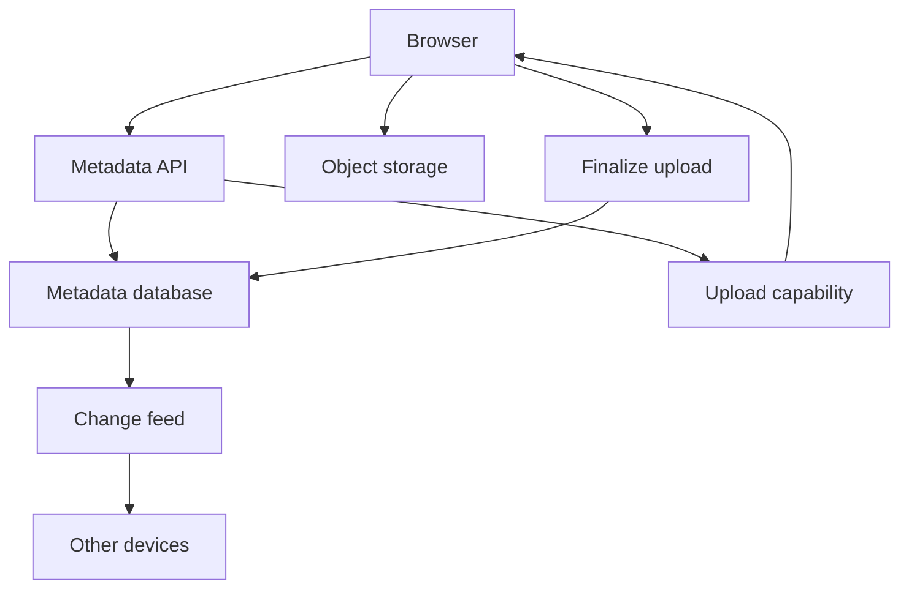
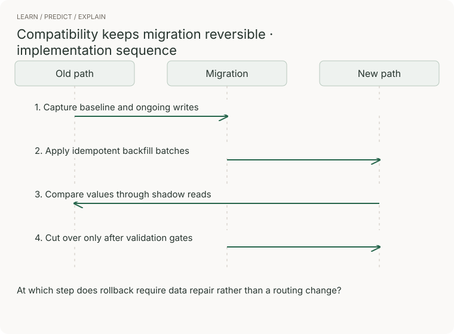

# System design · worked examples and changing constraints

These are original practice prompts chosen to exercise the concepts. They are not a ranked list of current company questions. Recent reported question families and their limits are in [research](../research/README.md).

## A 45-minute practice structure

| Minutes | Produce | Check before moving on |
|---|---|---|
| 0–5 | Users, top two use cases, non-goals | Are you solving the asked product? |
| 5–10 | Scale, latency, durability, consistency | Which numbers change a decision? |
| 10–18 | API, data ownership, minimal end-to-end flow | Can one real request succeed? |
| 18–32 | One or two deep dives | Which bottleneck or failure matters most? |
| 32–40 | Recovery, operations, security, cost | What happens when a dependency is slow? |
| 40–45 | Tradeoffs and next experiment | What uncertainty would you resolve first? |

This is a practice timebox; follow an interviewer's direction. In LLD, leave enough time for classes and executable methods. Do not spend the whole round on HLD when implementation was requested.

## 1 · Bookmark service · junior foundation

**Prompt:** save, list, and edit private bookmarks. Start with 10,000 users, 20 bookmarks each, and 100 peak reads/s; these are exercise assumptions. Require read-your-writes and owner-only access. Exclude sharing and search initially.

API: POST bookmark, GET own bookmarks with cursor, PATCH by id plus expected version. Data: id, owner, url, title, created_at, version. Enforce URL scheme rules; do not fetch arbitrary submitted URLs in the API process.

**AWS choice:** API Gateway and Lambda for a small intermittent API; DynamoDB with owner partition and ordered keys for fixed queries. RDS PostgreSQL is a reasonable alternative for relational needs. Cognito or another identity provider authenticates; ownership checks still live in your application. For TypeScript UI delivery, S3 and CloudFront can serve static assets.

**Worked decision:** do not cache private reads initially at this scale. First measure the actual query. A cache adds invalidation and tenant-isolation obligations before there is evidence it is necessary.

**Implement:** [full-stack exercise](../full-stack/README.md), then AWS lab 1. **Break:** read another owner's id; concurrently PATCH version 3 twice. **Expected:** access denied and exactly one conditional write succeeds. **Senior extension:** add sharing with revocation. **Staff extension:** roll out a new authorization model across old clients and background jobs.

## 2 · Notification platform · senior core

**Prompt:** accept a campaign, fan it out to users, deliver email/push, and display status. Exercise load: 1 million recipients over 10 minutes ≈1,667 recipient jobs/s before retries. Do not promise exact external delivery if a provider lacks idempotency.

API: POST campaign returns campaign id and accepted state; GET campaign returns accepted/processed/failed counts. Model campaign intent, per-recipient job id, channel, payload version, attempt state, and provider receipt. A campaign accepted is not a campaign delivered.

**AWS mapping:** a transactional database plus outbox, SQS standard for independent recipient jobs, Lambda or ECS workers, DynamoDB for status keyed by job, CloudWatch for completion age and failure rate. SNS/EventBridge can route events; they do not replace your per-recipient delivery-state model. Choose FIFO only for a demonstrated ordering requirement and design message groups deliberately.

**Deep dive:** if a provider accepts 200 requests/s, more workers cannot make 1,667/s delivery possible. Negotiate deadline, batch with provider support, or distribute channels/providers. Queueing only delays the failure. A timeout after provider success is uncertain; retry with the provider's idempotency key or reconcile receipts.

**Implement:** queue lab's conditional result write, then add a fake provider with a controllable timeout. **Break:** success then lost acknowledgement; poison message; slow provider; tenant flooding. **Junior:** trace acceptance and retry. **Senior:** define retry/expiry/deduplication and queue-age SLO. **Staff:** specify provider failover, quotas, consent ownership, and backfill/replay contracts across teams.

## 3 · File synchronization · senior full stack

**Prompt:** upload files, list folders, download, and propagate edits across devices. Assume 100,000 daily uploaders × 10 MB/day = about 1 TB/day of new payload. Metadata operations and bytes are separate capacity dimensions. Start with versioned files; exclude collaborative character-level editing.

API issues an upload session containing object key, expected version, and short-lived upload capability. Browser uploads bytes directly to object storage. Finalization checks the object and conditionally updates metadata. Store file id, owner, parent id, object version/key, checksum, size, and metadata version. Upload completion and application visibility are separate transitions.

**AWS mapping:** S3 for bytes, API Gateway/Lambda for metadata, DynamoDB or RDS for ownership and versions, SQS for asynchronous processing, CloudFront for authorized downloads where justified. S3 events can be duplicated or arrive out of order; treat them as triggers to validate state, not unquestionable proof of the newest version.

**Before/after:** proxying large uploads through the API holds application capacity and adds a bandwidth hop. Direct upload reduces that pressure but introduces abandoned sessions, multipart cleanup, and capability security. Version conflicts need an explicit user-visible resolution policy.

**Implement:** AWS lab 2; two clients upload from the same metadata version. **Expected:** one finalize wins; the other gets a conflict, not silent overwrite. **Senior:** resume interrupted multipart uploads and recover missed change-feed updates. **Staff:** region/data residency, account deletion, retention, and compatibility for old clients.

## 4 · Multi-tenant migration · staff core

**Prompt:** move from a shared relational schema to tenant-isolated storage while teams release independently. Define why: contractual isolation, noisy neighbors, or operating limits. “New technology” alone is not a benefit. Assume 10 TB to backfill and a 100 MB/s safe copy budget: about 28 hours of ideal transfer, before verification, ongoing writes, retries, and throttling.

Choose a routing registry with tenant migration state. Expand client contracts first. Capture changes with an outbox or CDC; backfill a consistent baseline and apply ordered updates. Shadow reads compare meaningful values. Move a small tenant only when reconciliation and latency pass. Keep rollback routing and change capture until a stated point of no return.

[Before/after](../../../assets/learning/migration-compare.svg) · [Still](../../../assets/learning/migration-still.svg)

**AWS mapping:** RDS source, a target selected by access pattern, DMS/CDC where the supported source/target behavior fits, S3 for checkpoints/export artifacts, CloudWatch for lag and mismatch rate. Validate CDC ordering, schema-change handling, and transaction boundaries before committing to the mechanism.

**Decision memo:** source and target owners; acceptance metric; customer cohorts; capacity/cost budget; rollback trigger; data repair procedure; old-path retirement owner. **Failure drill:** change a record during backfill, crash the worker, then resume. Row-count equality alone does not prove correctness.

**Junior:** explain old/new compatibility. **Senior:** implement resumable copy and reconciliation. **Staff:** negotiate sequencing, avoid two years of dual operation, and identify what would make you cancel the migration.

## 5 · AI support assistant · optional specialization

**Prompt:** answer questions from a company's authorized documents and escalate uncertainty. Start with read-only answers. Model ingestion version, document permissions, retrieval results, citations, and evaluation outcomes. Keep tool execution separate from text generation.

Compare keyword search with retrieval+generation on a fixed test set. Add a model only when it improves a measured user task. Cache carefully: permissions and document version belong in the validity policy. Plan for empty retrieval, contradictory documents, model outage, prompt injection, and cost spikes.

**AWS mapping:** S3 for documents, a retrieval store suited to the workload, Bedrock or another model endpoint, Lambda/ECS orchestration, and application-layer authorization. No service choice guarantees correct or permitted output.

**Implement:** use local fake retrieval/model functions first; record accuracy, refusal/escalation, latency, and cost estimates. **Junior:** connect inputs/outputs and error states. **Senior:** isolate retrieval from generation failures and implement fallback. **Staff:** governance of evaluation changes, ownership of tools, data boundaries, and rollout criteria.

## Explain alternatives sympathetically

For each design, defend an alternative before rejecting it: synchronous versus queued, SQL versus key-value, managed function versus container, strong versus eventual reads, regional versus multi-region. State the constraint that changes your answer. “X scales” is not enough.

[Concepts](concepts.md) · [AWS implementation](../aws/README.md) · [Practice rubric](../practice/README.md)
