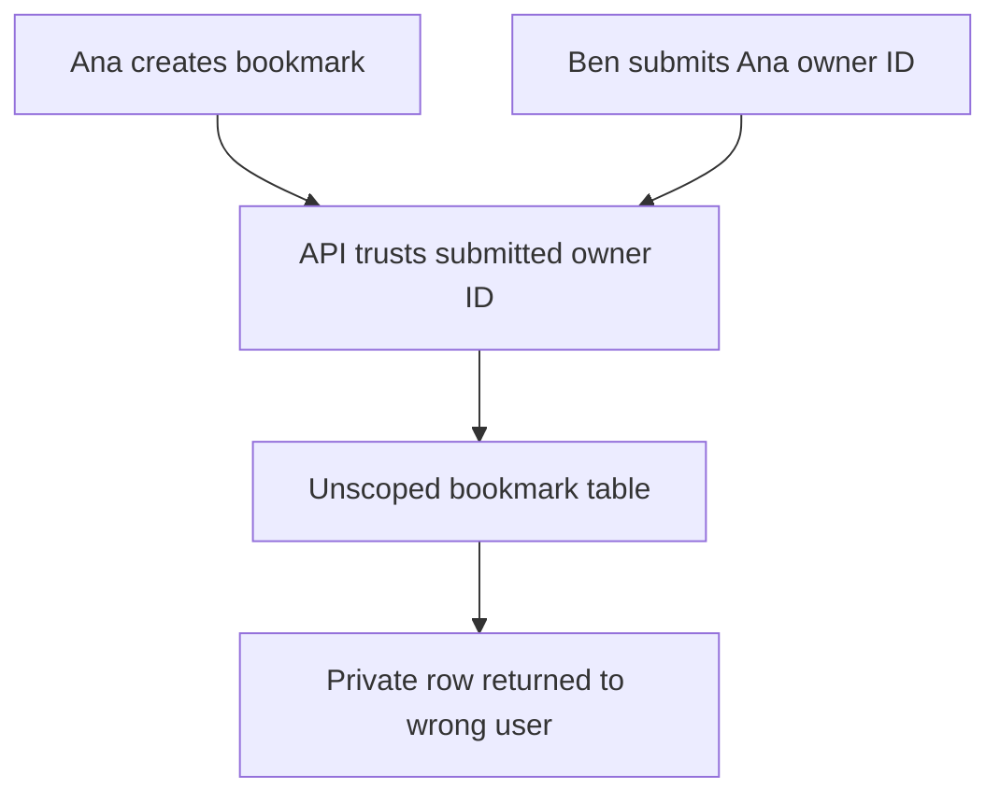
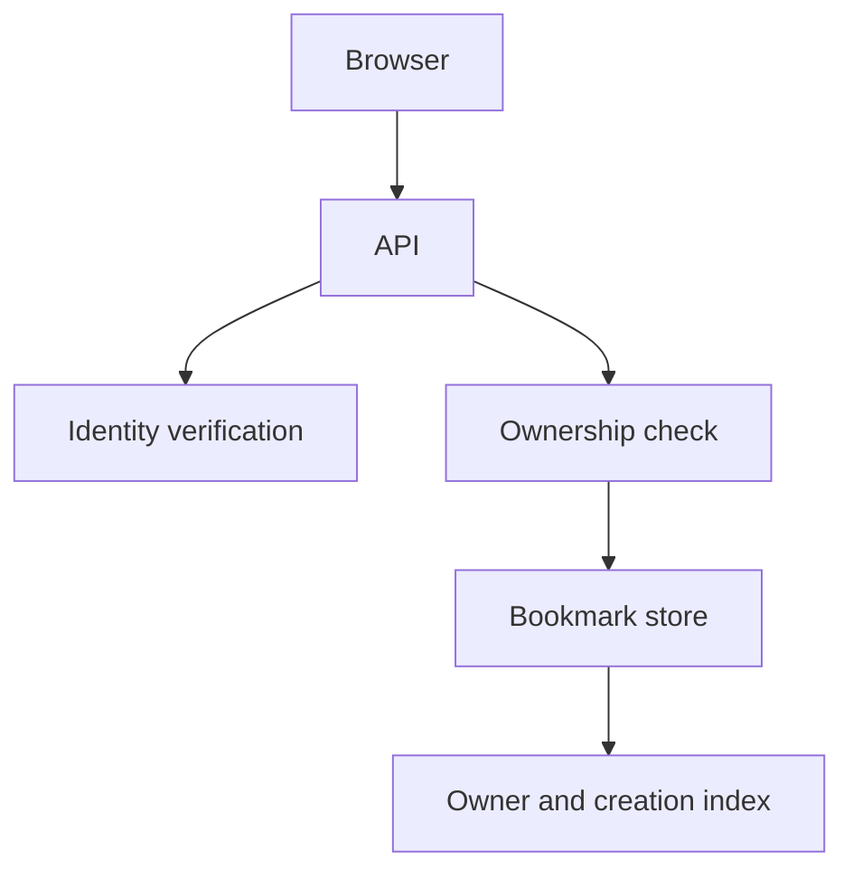
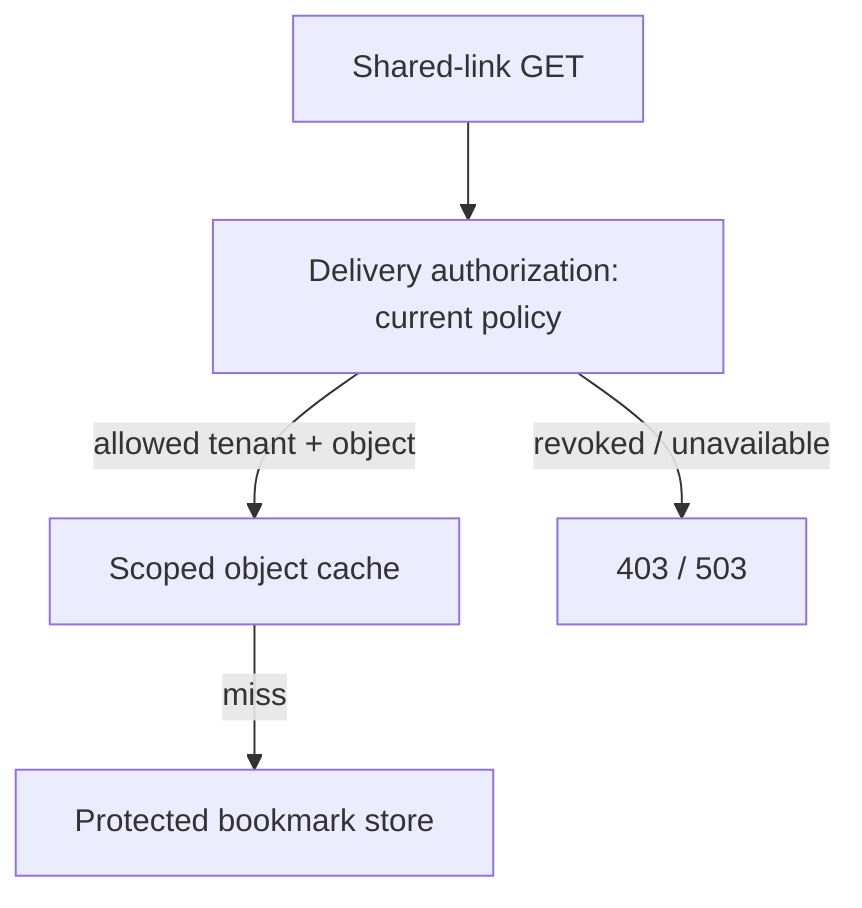

# Bookmark service

All prompts here are constructed practice, without company attribution.

> **Candidate opening:** “Ana saves a private bookmark and immediately lists her
bookmarks. Ben must not see it. Both of Ana's devices try to edit version 3.
Preserve ownership and show one conflict without losing either device's draft.”

| Input | Expected behavior | Scope |
|---|---|---|
| Ana creates URL, then lists | New ID appears in Ana's list | Read-your-writes required |
| Ben reads Ana's ID | Denied | Derive owner from authenticated identity |
| Two PATCH requests expect v3 | One v4; one 409 | No silent overwrite |

Prerequisites: [API/transaction concepts](../concepts.md). This is a build brief;
start from the [full-stack exercise](../../full-stack/README.md). First deliver
one owner-scoped create/list, then conditional edits, then a retained conflict
state. Run that exercise's commands and record visible behavior.

Before the worked design, name the invariant and move authority out of the
submitted payload. Then trace a commit whose HTTP response disappears; operation
identity must survive a retry.

Worked approach and AWS mapping — open after your attempt

**Prompt:** save, list, and edit private bookmarks. Start with 10,000 users, 20 bookmarks each, and 100 peak reads/s; these are exercise assumptions. Require read-your-writes and owner-only access. Exclude sharing and search initially.

API: POST bookmark, GET own bookmarks with cursor, PATCH by id plus expected version. Data: id, owner, url, title, created_at, version. Enforce URL scheme rules; do not fetch arbitrary submitted URLs in the API process.

**AWS choice:** API Gateway and Lambda for a small intermittent API; DynamoDB with owner partition and ordered keys for fixed queries. RDS PostgreSQL is a reasonable alternative for relational needs. Cognito or another identity provider authenticates; ownership checks still live in your application. For TypeScript UI delivery, S3 and CloudFront can serve static assets.

**Worked decision:** do not cache private reads initially at this scale. First measure the actual query. A cache adds invalidation and tenant-isolation obligations before there is evidence it is necessary.

**Implement:** [full-stack exercise](../../full-stack/README.md), then AWS lab 1. **Break:** read another owner's id; concurrently PATCH version 3 twice. **Expected:** access denied and exactly one conditional write succeeds. **Senior extension:** add sharing with revocation. **Staff extension:** roll out a new authorization model across old clients and background jobs.

## Follow-up: sharing becomes revocable

Predict the warm-cache path before adding a CDN. A token-specific cache key
alone does not recheck a revoked token.

Use the [warm/cold revocation fixture](../labs/cache-consistency/revocation.md)
for immediate or explicitly bounded authorization. **Senior:** test a repeated
warmed token after revocation and a version conflict. **Lead follow-up:** old
clients do not send the new version field; stage compatibility and a rollout
stop criterion instead of silently accepting blind overwrites. Assessor evidence
is the denied cross-owner request, one winner/one conflict, and a stated revocation
bound—not merely a diagram containing “auth.”

[Design route](../designs.md) · [Practice rubric](../../practice/README.md)
