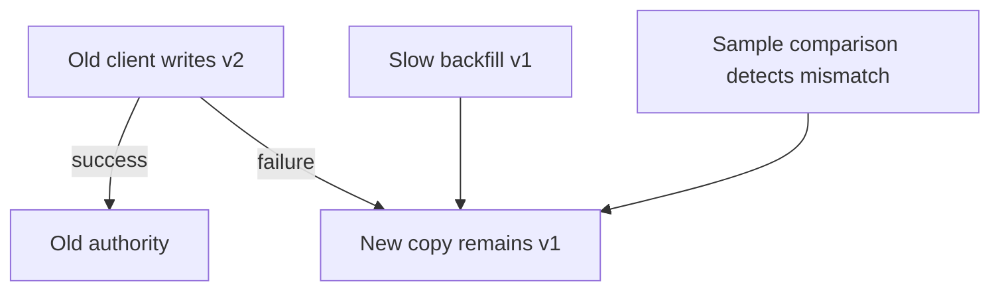
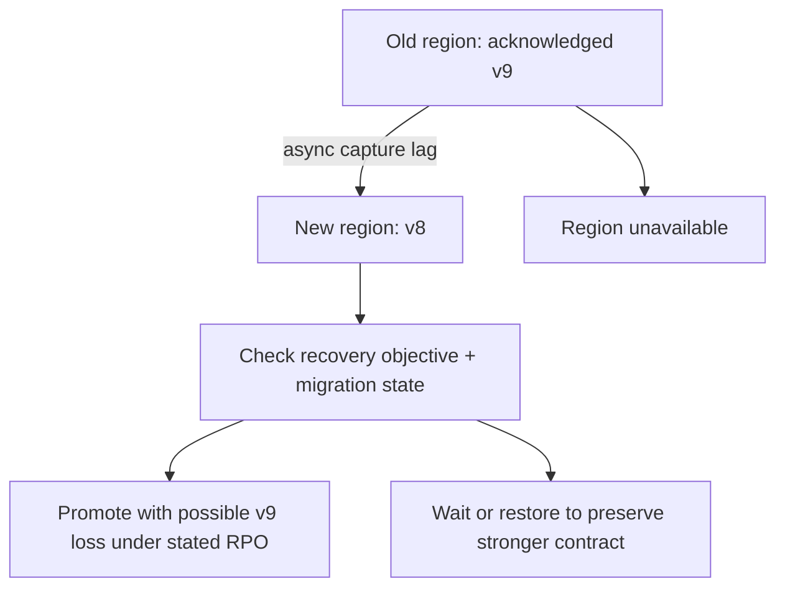

# Multi-tenant migration

All prompts here are constructed practice, without company attribution.

> **Candidate opening:** “Security needs tenant isolation in four weeks; mobile
clients will write the old schema for twelve weeks. Copy live data without losing
edits or resurrecting deletes, and choose a rollback boundary the teams can use.”

| Input | Expected behavior | Scope |
|---|---|---|
| Old v2 commits; target write fails | Durable replay repairs target | Independent dual writes are not atomic |
| Live delete v2 followed by backfill v1 | Tombstone v2 survives | Versioned apply, explicit delete retention |
| New-only write after cutover | Rollback waits for reverse repair | Routing alone cannot restore data compatibility |

Prerequisites: [migration concepts](../concepts.md) and [transaction lab](../labs/postgresql/README.md).
Start with the [runnable migration fixture](../labs/recovery-migration/migration.md).
Deliver compatibility/authority first, then snapshot plus replay, then full
reconciliation and a rehearsed writer/reader rollback.

Name source authority and the durable change record before designing traffic
percentages. Enforce versions and tombstones at apply, and advance checkpoints
only after durable writes. Then separate reader routing from writer authority.

Worked approach and AWS mapping — open after your attempt

**Prompt:** move from a shared relational schema to tenant-isolated storage while teams release independently. Define why: contractual isolation, noisy neighbors, or operating limits. “New technology” alone is not a benefit. Assume 10 TB to backfill and a 100 MB/s safe copy budget: about 28 hours of ideal transfer, before verification, ongoing writes, retries, and throttling.

Choose a routing registry with tenant migration state. Expand client contracts first. Capture changes with an outbox or CDC; backfill a consistent baseline and apply ordered updates. Shadow reads compare meaningful values. Move a small tenant only when reconciliation and latency pass. Keep rollback routing and change capture until a stated point of no return.

**AWS mapping:** RDS source, a target selected by access pattern, DMS/CDC where the supported source/target behavior fits, S3 for checkpoints/export artifacts, CloudWatch for lag and mismatch rate. Validate CDC ordering, schema-change handling, and transaction boundaries before committing to the mechanism.

**Decision memo:** source and target owners; acceptance metric; customer cohorts; capacity/cost budget; rollback trigger; data repair procedure; old-path retirement owner. **Failure drill:** change a record during backfill, crash the worker, then resume. Row-count equality alone does not prove correctness.

**Junior:** explain old/new compatibility. **Senior:** implement resumable copy and reconciliation. **Staff:** negotiate sequencing, avoid two years of dual operation, and identify what would make you cancel the migration.

## Follow-up: region failover during migration

**Senior:** run partial-write, stale-backfill, delete, replay and rollback tests.
**Lead follow-up:** negotiate the mobile/retention/capacity conflict in the
[three-team memo](../labs/recovery-migration/migration.md), then explain why DNS
TTL and connection drain prevent an instantaneous universal rollback. Assessor
checks include zero value/version/tombstone mismatches, old-writer fencing, a
point of no return, and partial benefits versus retirement-only benefits.

[Design route](../designs.md) · [Practice rubric](../../practice/README.md)
