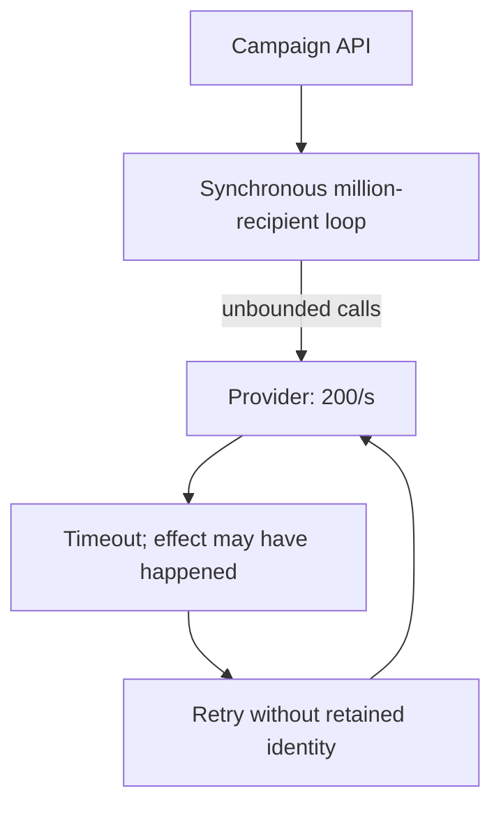
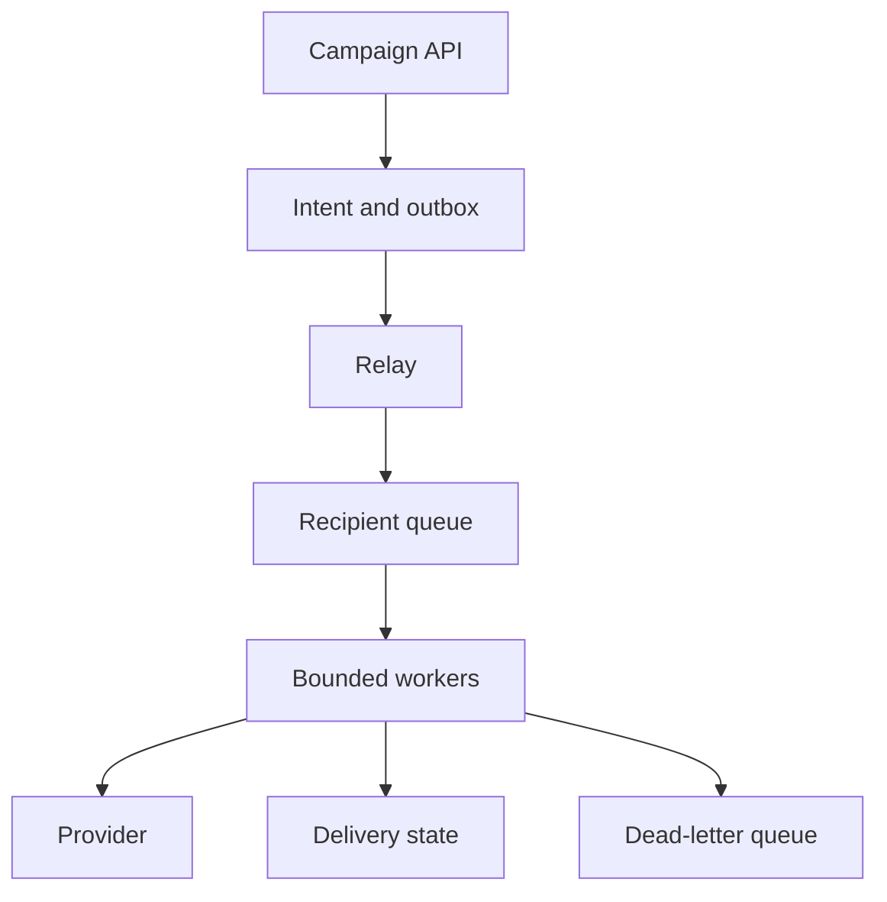
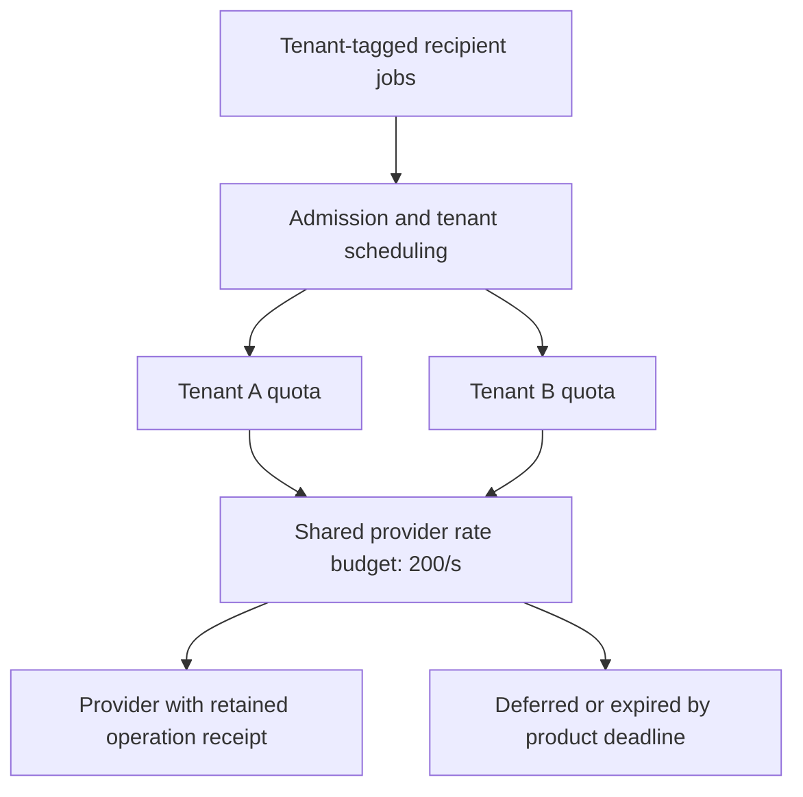

# Notification platform

All prompts here are constructed practice, without company attribution.

> **Candidate opening:** “A campaign is accepted, but its provider can deliver
only 200 messages/s. A recipient send succeeds just before the response is lost.
Show users truthful status while bounding retries and duplicate effects.”

| Input | Expected behavior | Scope |
|---|---|---|
| 1,000,000 recipients in 600 seconds | About 1,667 jobs/s arrive | Provider 200/s cannot meet this deadline |
| Provider success, lost response | Uncertain until receipt/replay resolves | Provider idempotency required for one effect |
| Same recipient operation ID, changed body | Conflict/quarantine | Intent identity must not mutate |

Prerequisites: [queue and outbox concepts](../concepts.md). Build brief with a
runnable starting point: [atomic-result worker](../../aws/labs/job-pipeline/README.md),
then [external-provider extension](../labs/recovery-migration/README.md). Deliver
accepted intent, bounded fan-out, and truthful per-recipient state in that order.

Decide the deadline and provider capacity before worker count. Separate accepted,
processed, provider-accepted, and delivered states; choose which the product can
actually observe. Draw every crash around the provider call before promising an
effect count.

Worked approach and AWS mapping — open after your attempt

**Prompt:** accept a campaign, fan it out to users, deliver email/push, and display status. Exercise load: 1 million recipients over 10 minutes ≈1,667 recipient jobs/s before retries. Do not promise exact external delivery if a provider lacks idempotency.

API: POST campaign returns campaign id and accepted state; GET campaign returns accepted/processed/failed counts. Model campaign intent, per-recipient job id, channel, payload version, attempt state, and provider receipt. A campaign accepted is not a campaign delivered.

**AWS mapping:** a transactional database plus outbox, SQS standard for independent recipient jobs, Lambda or ECS workers, DynamoDB for status keyed by job, CloudWatch for completion age and failure rate. SNS/EventBridge can route events; they do not replace your per-recipient delivery-state model. Choose FIFO only for a demonstrated ordering requirement and design message groups deliberately.

**Deep dive:** if a provider accepts 200 requests/s, more workers cannot make 1,667/s delivery possible. Negotiate deadline, batch with provider support, or distribute channels/providers. Queueing only delays the failure. A timeout after provider success is uncertain; retry with the provider's idempotency key or reconcile receipts.

**Implement:** queue lab's conditional result write, then add a fake provider with a controllable timeout. **Break:** success then lost acknowledgement; poison message; slow provider; tenant flooding. **Junior:** trace acceptance and retry. **Senior:** define retry/expiry/deduplication and queue-age SLO. **Staff:** specify provider failover, quotas, consent ownership, and backfill/replay contracts across teams.

## Follow-up: one tenant monopolizes the queue

**Senior:** supply the lost-response test, oldest-job age, and bounded retry/expiry
policy. **Lead follow-up:** fail over to a second provider; does the first
provider's idempotency key protect the second provider's effect? Usually it does
not. Reconcile uncertain sends before failover or explicitly accept a business
risk. Assessor evidence names the first provider's uncertainty, consent owner,
quota allocation, and backlog drain arithmetic; queueing does not manufacture
capacity.

[Design route](../designs.md) · [Practice rubric](../../practice/README.md)
