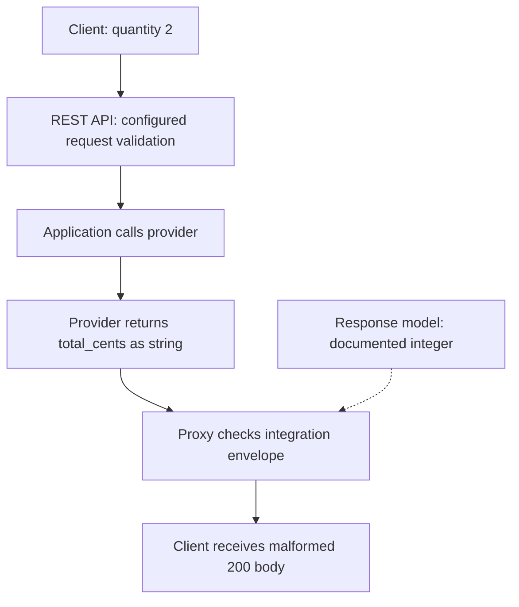
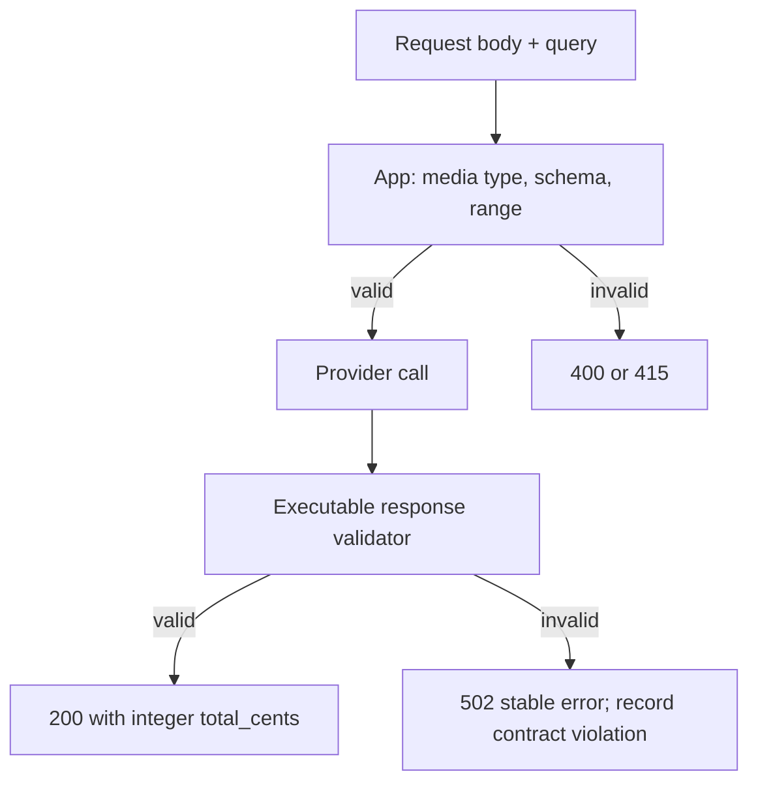
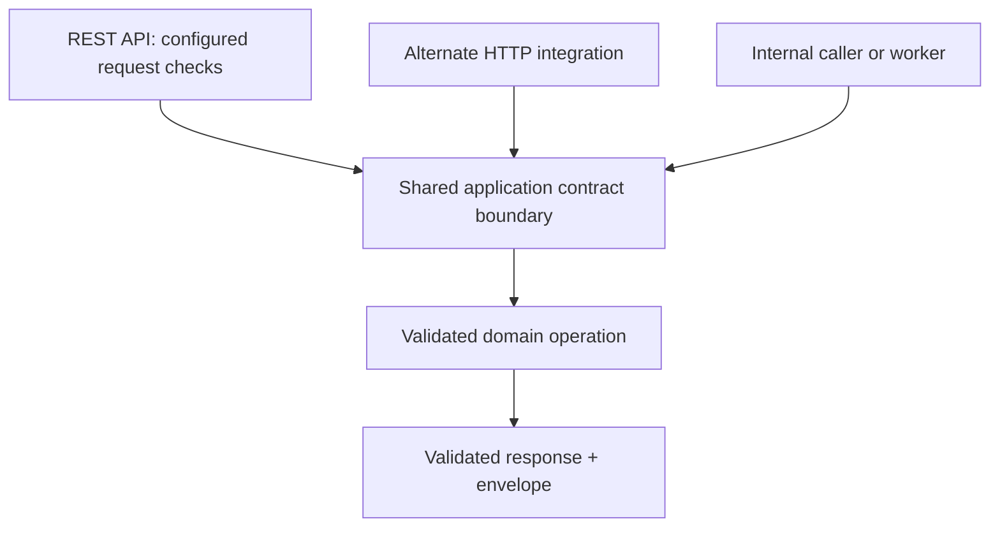

# A valid HTTP 200 with an invalid body

**Constructed candidate brief:** “Our quote API accepts quantity 2 and should
return integer `total_cents: 200`. The provider changes its response to string
`\"200\"`. An API Gateway response model exists, but the client still receives
the string. Where will you enforce the contract, and how will you prove it?”

Prerequisites: JSON, HTTP status codes, and [API ownership](../../../architecture/concepts.md).
Attempt the boundary diagram before opening [boundary.py](boundary.py). This lab
uses Python 3.11+ and no cloud resources or external dependencies.

| Input | Expected application result | Enforcement |
|---|---|---|
| quantity 2, limit `20`; provider integer 200 | 200, `{"total_cents":200}` | Request and response validators |
| Same request; provider string `"200"` | 502, stable error body | Application response boundary |
| limit `banana` present | 400 | App checks format/range; basic edge check only tests presence |
| Invalid JSON, matching model | 400 before provider | Configured request validation and application checks |
| `text/plain`, no matching model | Gateway body validation may be skipped; app 415 | Explicit media type policy |

Scope is **REST API Gateway basic request validation and Lambda proxy response
format**, not HTTP API feature parity. The local gateway functions model only
the listed distinctions; they are not an AWS emulator or a complete JSON Schema
implementation. The application's typed validators execute real negative cases.

## Baseline: a schema declaration does not execute a check



The model describes the body and can support SDK generation. With a proxy
integration, a valid Lambda output envelope is passed through; declaring a
method response model does not automatically validate the backend body.
See [method responses](https://docs.aws.amazon.com/apigateway/latest/developerguide/api-gateway-method-settings-method-response.html)
and [Lambda proxy format](https://docs.aws.amazon.com/apigateway/latest/developerguide/set-up-lambda-proxy-integrations.html).

## Put an executable validator at the application boundary

1. Separate request, provider response, application response, and integration
   envelope. Each may be structurally valid while the next contract is violated.
2. Keep domain types explicit: integer minor units, not strings, floats, booleans,
   or an unbounded numeric coercion. Decide whether additional fields are allowed.
3. Validate requests even when a caller reaches the backend through a different
   integration. Validate provider results before mapping them to success bodies.
4. Return a stable 502 for malformed upstream data; do not label the customer's
   request invalid. Contract tests must fail on an injected malformed 200.



Run from the repository root:

```bash
python -m unittest discover -s paths/interviews/aws/labs/api-contract -p 'test_*.py' -v
```

Five tests exercise the baseline malformed pass-through, corrected 502, valid
200, invalid/extra response fields, request schema, required parameter format,
unmatched content type, `$default` behavior, and malformed proxy envelope. No AWS
deployment is necessary to establish where the application's check lives.

## Follow-up: another API flavor or integration path

Basic REST parameter validation checks presence/nonblank values, not parameter
type or format. Body validation needs a matching content-type model or `$default`;
passthrough settings are a separate choice. HTTP APIs have a different feature
set, so moving the same diagram to that flavor requires a fresh capability
review. See [REST request validation](https://docs.aws.amazon.com/apigateway/latest/developerguide/api-gateway-method-request-validation.html).



**Senior assessor checks:** ask the candidate to locate the exact rejecting
function, then inject `total_cents=true`, an extra internal field, and malformed
limit. Require the provider call count to stay zero for invalid requests.
**Lead:** retain compatible consumers across contract versions; choose a rollout
gate and owner for provider violations. A response validator that silently
coerces everything into success hides a compatibility regression.

## Follow-up: choose supported dependency infrastructure

As checked **2026-09-22**, the [App Mesh lifecycle notice](https://docs.aws.amazon.com/app-mesh/latest/userguide/what-is-app-mesh.html)
announces support ending **September 30, 2026**. Treat it as a retirement/migration
exercise, not a new-build recommendation. For an ECS deployment, evaluate
[Service Connect](https://docs.aws.amazon.com/AmazonECS/latest/developerguide/service-connect.html)
for its supported service discovery and connectivity behavior. Independently
keep per-call deadlines, bounded retries, circuit breaking, and response
validation explicit in the application; a healthy load-balancer target does not
prove each downstream request meets its deadline or schema. Record behavior and
compatibility gaps before a replacement, rather than assuming feature parity.

All linked pages are live official technical documentation with unverified
publication age, accessed 2026-09-22. The lifecycle deadline is the announced
fact; the access date is not a publication date or evidence of interview recency.

[AWS route](../../README.md) · [Recovery extension](../../../architecture/labs/recovery-migration/README.md)
