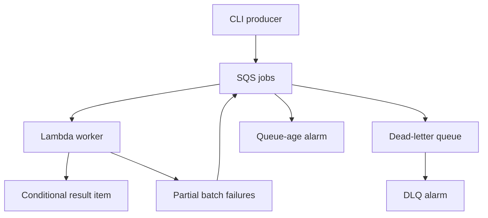

# Lab 3 · a job may be delivered twice; its result is stored once

Build a queue worker whose *entire effect* is one conditional DynamoDB result item. Then demonstrate where that guarantee ends. No email, payment, or external side effect is hidden behind the word “idempotent.”


[Static diagram](../../../../../assets/learning/conditional-result-still.svg)


## The implementation



Job payload: `{"operation_id":"demo-1","numbers":[1,2,3]}`. The effect is the sum, payload digest, and key stored together. A repeated key with the same digest is a duplicate success. A different digest is a conflict and remains failed for DLQ inspection. This uses a standard queue; no ordering requirement exists.

The worker has a 30-second timeout; the queue has 180-second visibility. Partial-batch failure reporting is enabled in both code and the event mapping. Max event concurrency and reserved concurrency are both 2. Two alarms record excessive queue age and visible dead letters; notification destinations are intentionally a learner configuration step, so these alarms do not page anybody by themselves.

DynamoDB keys do not expire in this lab. Adding TTL changes the guarantee: an old retry after deletion can execute again. The fake-store tests check our application protocol; they do not prove AWS service behavior or deployed permissions.

## Run locally

From the repository root:

```bash
python -m unittest discover -s paths/interviews/aws/labs/job-pipeline -p 'test_*.py' -v
```

Tests cover concurrent duplicates, a committed write with lost response, conflicting payloads, invalid data, transient store failure, and mixed success/failure batches.

## Build and deploy when you choose

Prerequisites: AWS CLI and SAM CLI, Python 3.13 for the function build (or Docker with `sam build --use-container`), and credentials for a disposable learning account. `boto3` is supplied by the Lambda Python runtime; production packaging should pin SDK dependencies explicitly.

```bash
cd paths/interviews/aws/labs/job-pipeline
aws sts get-caller-identity
sam validate --lint
sam build
sam deploy --guided --stack-name interview-job-lab
```

Review generated IAM changes. SAM adds SQS polling and logging permissions; the explicit DynamoDB statement permits only GetItem/PutItem on the result table. Region quotas may prevent reserving concurrency; inspect rather than blindly raising limits. JSON is used inside `template.yaml`, which is valid YAML and keeps the infrastructure readable without custom YAML tags.

## Observe a duplicate

After deploying, use your selected region/profile consistently:

```bash
LAB_QUEUE_URL=$(aws cloudformation describe-stacks --stack-name interview-job-lab --query 'Stacks[0].Outputs[?OutputKey==`QueueUrl`].OutputValue' --output text)
LAB_TABLE_NAME=$(aws cloudformation describe-stacks --stack-name interview-job-lab --query 'Stacks[0].Outputs[?OutputKey==`TableName`].OutputValue' --output text)
aws sqs send-message --queue-url "$LAB_QUEUE_URL" --message-body '{"operation_id":"demo-1","numbers":[1,2,3]}'
aws sqs send-message --queue-url "$LAB_QUEUE_URL" --message-body '{"operation_id":"demo-1","numbers":[1,2,3]}'
aws dynamodb get-item --table-name "$LAB_TABLE_NAME" --key '{"operation_id":{"S":"demo-1"}}' --consistent-read
```

Poll the final read until processed. Expect **one item with result 6**. SQS queue metrics are approximate and eventually updated; instantaneous emptiness is not your correctness assertion.

## Failure experiments and expected evidence

| Experiment | Action | Expected | What it teaches |
|---|---|---|---|
| Same key, different body | Send demo-1 with numbers [9] | Original result remains 6; conflicting message retries, then DLQ | An idempotency key does not permit changed intent |
| Poison input | Send body `not-json` | Only that message fails; DLQ after retry policy | Partial batches preserve successful progress |
| Store unavailable | Remove permission only in a disposable variant, then restore | Messages remain retryable; queue age rises | A write error must not be acknowledged as success |
| Lost acknowledgement | Local test commits then throws | Retry returns duplicate; one committed effect | Timeout is an uncertain outcome |
| Burst | Send more jobs than two workers can finish immediately | Concurrency stays bounded; backlog increases | A queue moves waiting; it does not erase it |

Do not automatically redrive a DLQ without fixing the cause. Keep original operation IDs when replaying. Generating fresh IDs can duplicate logical work.

## Extend by level

**Junior:** trace one valid and one invalid job; identify persisted versus transient state. **Senior:** add a fake external provider and show why placing it before/after the put creates a crash gap. Add an actual destination idempotency protocol or explicit reconciliation. **Staff:** design tenant quotas, rollout compatibility, replay ownership, recovery objectives, and an admission policy. Label proposed extensions separately from implemented guarantees.

## Clean up

```bash
sam delete --stack-name interview-job-lab
```

Confirm that the stack and its queues/table/log group are gone. SAM may use a shared managed artifact bucket; inspect residual build artifacts and delete only those you own and no longer need. Export anything you want before deleting the lab: the result table is disposable.

[Other labs](../../README.md)
