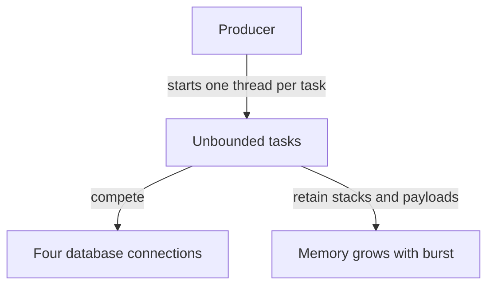
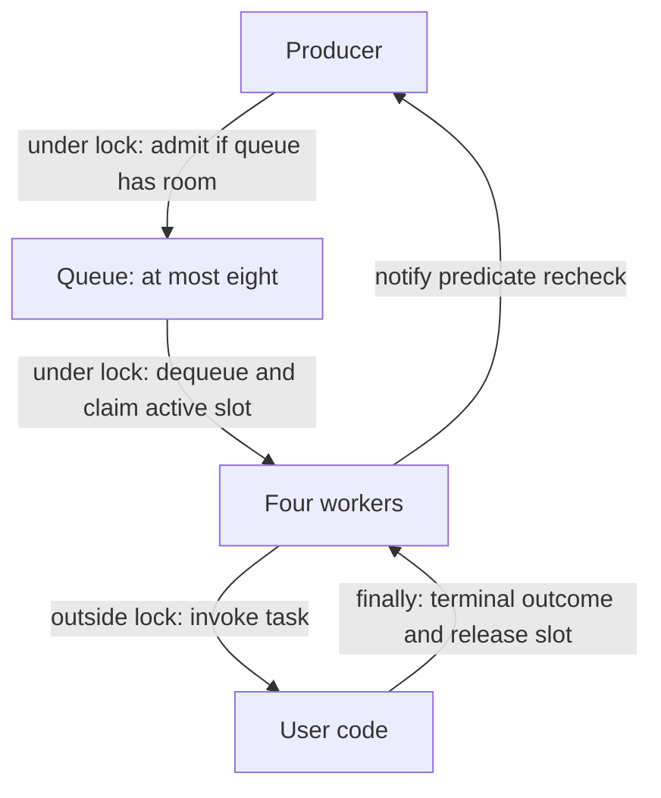
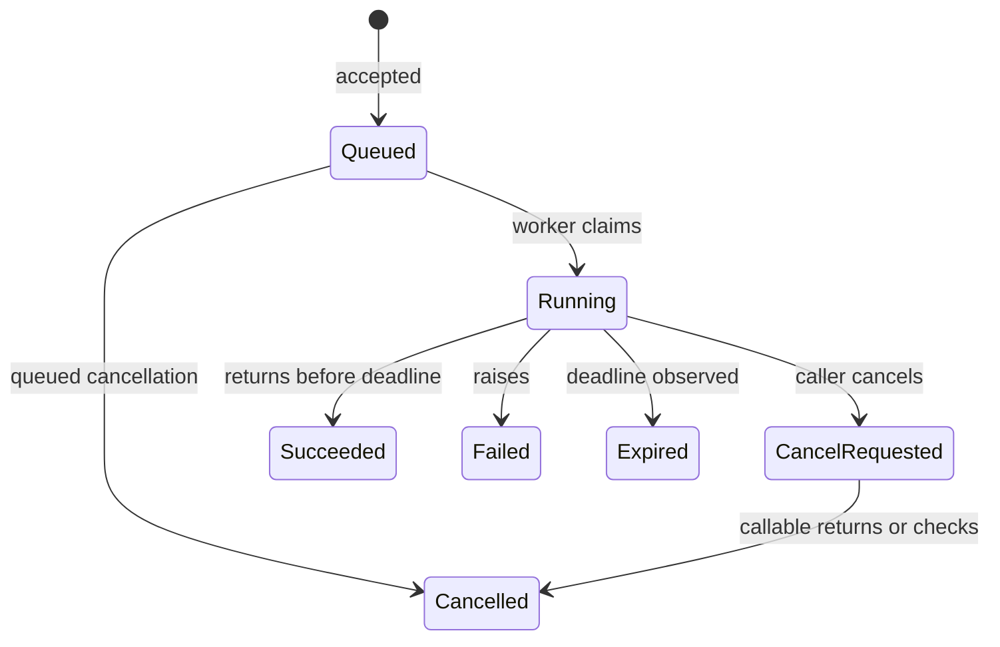

# Bounded executor · four workers, eight queued tasks

> “A report service accepts bursts faster than its four database connections can
> work. Today every request starts a thread. Build an executor with four workers
> and room for eight waiting tasks. A blocked caller must be released when shutdown
> starts. Which tasks have we promised to finish?”

This **constructed backend/infra extension** assumes
[runtime fundamentals](runtime.md) and [basic maps/queues](../../lessons/01-maps.md).
Read [the infra candidate brief](../../../practice/candidate/infra.md) before opening
[the implementation](executor.py) or [assessor notes](../../../practice/assessor/infra.md).

| Contract | Observable result |
|---|---|
| Capacity | At most 4 active tasks and 8 accepted waiting tasks; a 13th submit blocks while all slots are occupied |
| Task interface | Callable receives a context with `check()`, cancellation event and optional absolute monotonic deadline |
| Accepted task | Exactly one terminal outcome: succeeded, failed, cancelled or expired |
| Shutdown | Stop admission; either drain queued work or cancel it; let running work finish cooperatively |
| Deadline | Admission and execution share one absolute task deadline; a wait timeout alone does not stop a task |
| Nested work | A worker submitting into this same pool fails immediately; worker joining this pool is also rejected |
| Excluded | Forced thread termination, FIFO fairness among blocked producers, process-crash durability and fleet-wide limits |

Worked trace: hold four tasks at a barrier, submit eight more, then start a producer.
The producer waits and `accepted == 12`. Shutdown with `cancel_queued=True` releases
that producer with `Closed`, gives eight queued tasks `Cancelled`, and allows four
running tasks to finish. A refused submission is not an accepted task and receives no
task handle. A task raising `ValueError` still frees its worker slot.

## Run the supplied checks

From the repository root, Python 3.10+ / standard library:

```sh
python -m unittest discover -s paths/interviews/coding/labs/bounded-executor -v
```

The tests use barriers/events and a logical clock to control ordering. Real timeouts
are watchdogs preventing a broken implementation from hanging the test runner; there
are no sleep-only scheduling assertions. One subprocess intentionally deadlocks and
is killed only after all four parents report they are waiting for queued children.
Do not run [that deliberately broken demo](deadlock_demo.py) directly.

## Derive the synchronization before adding features

Start with a single queue and one condition variable: a condition coordinates
waiting for a predicate under a mutex. A notification means “recheck”; it does not
transfer ownership or reserve a slot. A task itself is arbitrary user code, so it
must execute outside the lock.



Write safety properties before implementation: `0 ≤ active ≤ 4`, `0 ≤ queued ≤ 8`,
and `accepted = queued + active + completed`. Each terminal transition occurs once
under the condition lock. The exception path and cancellation path must preserve the
same accounting. Here there is no separate semaphore permit: active slots and queue
slots are the counted permits, released in `finally` or queued cancellation.



Liveness needs assumptions: workers are scheduled and running callables eventually
return or check cancellation. It does **not** follow from bounded memory alone.
The producer loop waits while the queue is full **and** admission remains open;
after waking it rechecks shutdown and deadline before admission. The worker loop
waits while the queue is empty and the executor is open; closed plus empty terminates.

## Follow-ups that change the schedule

**Question 1:** Cancel a running task blocked in a library that ignores cancellation.
Can its slot be handed to another task immediately? **Expected answer:** no. Signal
cancellation, retain active accounting, wait for actual return, then record a terminal
outcome. A shutdown timeout reports that work still owns resources. It must not
pretend to release a socket or thread. `Context.check()` after return discards a
cancelled/expired result but cannot undo an external effect already performed.



**Question 2:** Four running parents each submit a child and wait for it. More queue
space is proposed. **Expected answer:** the children can queue but no worker is free
to run them. More queue capacity does not break the wait cycle. This implementation
rejects same-pool submission from workers; alternatives require explicit semantics
(inline execution/reentrancy, separate dependency pools, or nonblocking composition).
Predict the [deadlock demo](deadlock_demo.py) output before reading its watchdog test.

**Question 3:** A deadline expires while the producer is blocked on a full queue.
**Expected answer:** wake/recheck the remaining budget, refuse admission, and do not
create a terminal task for a promise never accepted. The test advances an injected
clock and calls `wake()`; it does not sleep until a wall-clock deadline.

Queue operations are O(1) except cancelling an arbitrary queued task, O(q), and retained
memory is O(workers + capacity) plus payloads/future handles held by callers. Output
history is not retained by the executor. Local limits multiply across replicas: 20
instances can run 80 tasks and queue 160. Lead follow-up: allocate dependency and
tenant budgets, choose overload responses, and state whether waiting producers can
starve. This implementation promises bounds and eventual progress under its assumptions,
not strict fairness or a fleet-wide concurrency cap.
