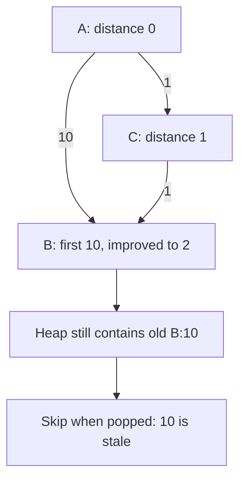

# 06 · Heaps: keep the next best candidate

**Build:** Return K frequent values; then compute shortest distances with nonnegative edge weights.

**The idea:** A heap orders the next candidate, not every element. Dijkstra skips stale entries whose distance is no longer current.

## Your 45-minute session

1. **5 min:** draw one example and a simple solution.
2. **25 min:** implement `top_k_frequent, shortest_paths` without the reference.
3. **10 min:** test Ties; K=0; K larger than unique count; unreachable vertices; a stale heap entry; negative edge rejection.
4. **5 min:** explain the cost and answer the changed requirement.

**Cost:** Top K: O(n + u log(k+1)) for 0<k<u. Lazy-heap Dijkstra: O(V + E log(E+1)) time, O(V+E) space.

**Pass before moving on:** Explain what the root guarantees and why FIFO BFS cannot replace Dijkstra for weighted edges.

**Changed requirement:** Your K is almost the number of unique values. Compare sorting with a heap.

After attempting: reference and explanation

Compare `top_k_frequent, shortest_paths` in [algorithms.py](../algorithms.py). Use [pattern notes](../pattern-notes.md) for the invariant and [contracts](../reference.md) for complexity edge cases. Reimplement tomorrow without copying.

[Previous](05-graphs.md) · [Next: Stacks: keep unresolved work](07-stack.md)
