# 07 · Stacks: keep unresolved work

> “For [73,74,71,75], return how long each day waits for a strictly warmer one.”

The output is [1,2,1,0]. Equal temperatures do not qualify. Identify the unresolved days before trying to optimize repeated forward scans.

This is a short prerequisite lesson. Attempt the complete [daily temperatures problem](../problems/37-daily-temperatures/README.md), then [largest histogram rectangle](../problems/38-largest-histogram-rectangle/README.md), with their contracts, tests and changed requirements.

**Build:** For each temperature, return days until a strictly warmer day. `[73,74,71,75] → [1,2,1,0]`.

[Static diagram](../../../../assets/learning/monotonic-stack-still.svg)

**The idea:** Store unresolved indices in non-increasing temperature order. A new warmer value resolves colder indices at the top.

## Your 45-minute session

1. **5 min:** draw one example and a simple solution.
2. **25 min:** implement `daily_temperatures` without the reference.
3. **10 min:** test Equal temperatures; decreasing input; a final value that pops the entire stack.
4. **5 min:** explain the cost and answer the changed requirement.

**Cost:** Scan forward for each day: O(n²). Monotonic stack: O(n) time and O(n) space.

**Pass before moving on:** Prove linear total work by counting pushes and pops, even with the nested loop.

**Changed requirement:** Change strictly warmer to warmer-or-equal. Which comparison changes?

After attempting: reference and explanation

Compare `daily_temperatures` in [algorithms.py](../algorithms.py). Use [pattern notes](../pattern-notes.md) for the invariant and [contracts](../reference.md) for complexity edge cases. Reimplement tomorrow without copying.

[Previous](06-heaps.md) · [Next: Dynamic programming: define a smaller problem](08-dp.md)
