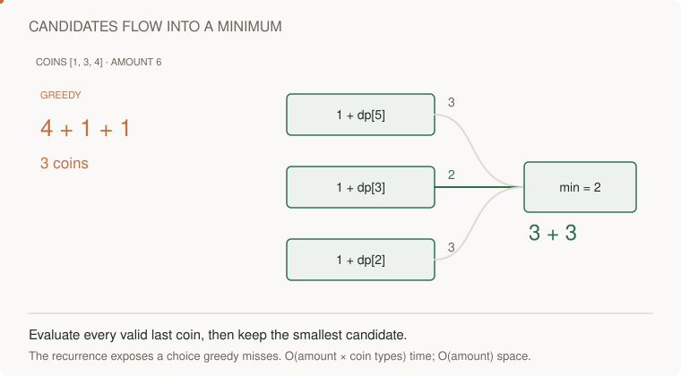

# 08 · Dynamic programming: define a smaller problem

> “Make amount 6 from reusable coins [1,3,4] using as few coins as possible. Why is taking the largest coin first insufficient?”

The answer is two 3s. Name what the answer for a smaller amount means, then list every possible final coin and the unreachable base cases.

This is a short prerequisite lesson. Attempt the complete [coin change problem](../problems/33-coin-change/README.md), then [edit distance](../problems/35-edit-distance/README.md), with their contracts, tests and changed requirements.

**Build:** Find the fewest coins for an amount with unlimited reuse. `[1,3,4], 6 → 2`.

[Static diagram](../../../../assets/learning/dp-choice-still.svg)

**The idea:** `dp[x]` is the best count for amount x. Try each possible last coin: `1 + dp[x-coin]`.

## Your 45-minute session

1. **5 min:** draw one example and a simple solution.
2. **25 min:** implement `min_coins` without the reference.
3. **10 min:** test Amount zero; impossible amount; no coins; nonpositive coin rejection; greedy counterexample.
4. **5 min:** explain the cost and answer the changed requirement.

**Cost:** Choice enumeration grows exponentially. Bottom-up DP: O(amount × coin_count) time and O(amount) space.

**Pass before moving on:** Write state, base case, transition, computation order, and impossible-state policy before code.

**Changed requirement:** Each coin may be used once. Explain why the recurrence/order must change.

After attempting: reference and explanation

Compare `min_coins` in [algorithms.py](../algorithms.py). Use [pattern notes](../pattern-notes.md) for the invariant and [contracts](../reference.md) for complexity edge cases. Reimplement tomorrow without copying.

[Previous](07-stack.md) · [Next: Search: choose, recurse, undo](09-search.md)
