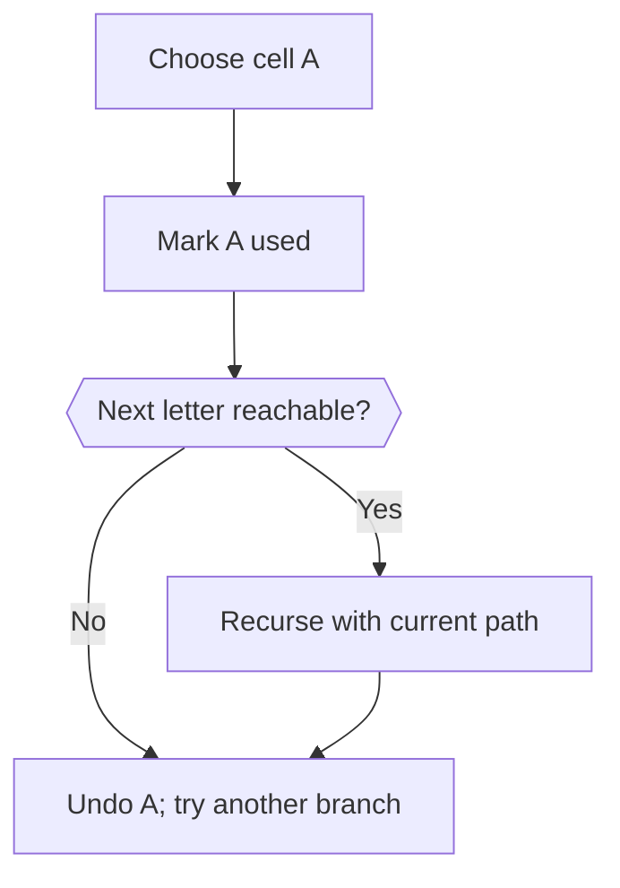

# 09 · Search: choose, recurse, undo

> “Find AB on a row [A,B]. Can ABA use the same A again? How would you store many dictionary words that share a prefix?”

AB succeeds; ABA fails under the no-cell-reuse rule. Track choices local to one path, restore them after return, and keep that state separate from a dictionary trie.

This is a short prerequisite lesson. Attempt the complete [word search problem](../problems/32-word-search/README.md), then [trie autocomplete](../problems/30-trie-autocomplete/README.md), with their contracts, tests and changed requirements.

**Build:** Find a word along neighboring cells without reuse; then implement exact word insertion and lookup.

Trie example: `a → p → p* → l → e*`. Stars mark complete words; `ap` has a path but is not a stored word.

**The idea:** Backtracking tracks the current path, then undoes it. A trie shares prefixes but marks complete words explicitly.

[Static view](../../../../assets/learning/backtracking-still.svg)

[Static view](../../../../assets/learning/trie-prefix-still.svg)

## Your 45-minute session

1. **5 min:** draw one example and a simple solution.
2. **25 min:** implement `word_exists, Trie` without the reference.
3. **10 min:** test Cell reuse; unsuccessful branch followed by success; unchanged board; prefix that is not a full word.
4. **5 min:** explain the cost and answer the changed requirement.

**Cost:** Word search: O(rows × cols × 4^L) conservative time, O(L) working space. Trie lookup: O(L).

**Pass before moving on:** Draw the state restored after a failed branch, and distinguish an end marker from a child edge.

**Changed requirement:** Search many words together. Which prefix checks can be shared?

After attempting: reference and explanation

Compare `word_exists, Trie` in [algorithms.py](../algorithms.py). Use [pattern notes](../pattern-notes.md) for the invariant and [contracts](../reference.md) for complexity edge cases. Reimplement tomorrow without copying.

[Previous](08-dp.md) · [Next: Stateful coding: design an LRU cache](10-lru.md)
