# Practical coding · make the implementation observable

These are original practice tasks. They train behaviors reported in recent interviews without presenting an exact company question bank.

## 1 · Bounded API fan-out · 35 minutes

Given inputs and an async operation, return ordered success/failure results while running at most K operations concurrently. Reject invalid K. A failure for one item must not discard others.



[Sequence](../../../assets/learning/bounded-workers-trace.svg) · [Still](../../../assets/learning/bounded-workers-still.svg)

`Promise.all(items.map(fn))` starts everything immediately. Instead, K workers share a next-index counter; claiming an index occurs synchronously before any await. Completion order can vary, so store each result at its original index. The [reference](typescript.ts) returns settled results after draining started work.

For n items: O(n) scheduling work, O(n) result space, O(min(K,n)) active operations. Wall time depends on task durations and service limits; it is not O(n/K) without further assumptions. This bounds concurrency, not requests per second. Add an explicit rate limiter for QPS.

Tests: track peak active operations, reject item 2, complete item 3 first, use empty input. Go further: add a caller AbortSignal and define whether unstarted items are skipped. A timeout wrapper alone does not cancel the underlying operation.



## 2 · Search results race · 30 minutes

A user searches “cat,” then “car.” The first request is slower and arrives last. Prevent stale results from replacing the latest search, including when the underlying loader ignores cancellation.


[Sequence](../../../assets/learning/ui-race-trace.svg) · [Still](../../../assets/learning/ui-race-still.svg)

Increment a generation number per request. Capture it in the async operation; render only if it still equals the current generation. Abort previous requests to reduce wasted work, but keep the generation check for correctness. Propagate the current request's failures to the UI. The [reference](typescript.ts) and test simulate a loader that ignores abort.

Cost: O(1) coordinator state; payload/network costs depend on the loader. A server may keep processing after a client abort. Add debouncing separately if the requirement is fewer requests, and test disposal/unmount behavior in a component.

Primary reference: [AbortController](https://developer.mozilla.org/en-US/docs/Web/API/AbortController), checked 2026-09-22.

## 3 · Bug investigation · 30 minutes

The product reports that a quantity of zero cannot be saved:

```typescript
function applyQuantity(input: { quantity?: number }, current: number) {
  return input.quantity || current;
}
```

Before editing: define whether missing, null, zero, and negative quantities mean different things. Write a failing test. Inspect the caller to see whether it validates runtime input. Then choose `input.quantity ?? current` only if null and undefined both mean “not supplied”; validate allowed quantities separately. TypeScript types do not validate HTTP JSON at runtime.

Extend the investigation: two users edit version 4; both writes succeed, losing one update. Add a conditional version check at the storage boundary. A client-side comparison alone cannot serialize concurrent writers.

Evaluation: reproduce → narrow the cause → smallest correct change → regression test → adjacent failure review. Avoid rewriting the module before finding the bug.

## 4 · Integration with pagination · 45 minutes

Read records from a paginated API, normalize required fields, deduplicate IDs, and return deterministic output. A page includes `items` and an opaque `nextCursor`. Follow the cursor until null; track seen cursors so a broken API cannot loop forever. Specify a maximum page count and per-request deadline.

First implement with local page fixtures. Then inject a repeated cursor, malformed item, duplicate ID, 429, and a 500 response. Retry transient reads within a total deadline; respect Retry-After. Do not blindly retry a non-idempotent write.

Time O(P+n) excluding I/O for P pages and n items; O(n+P) for deduplication/output and cursor tracking. A streaming result can reduce retained output but exact unbounded deduplication still consumes growing memory. Write this tradeoff down.

## 5 · AI-assisted review · 40 minutes

Use the same problem as exercise 1. Before prompting, write the concurrency invariant and three adversarial tests. Ask an assistant for an implementation. Explain every await, identify eager task creation, and fix any failure. Keep a short log of accepted/rejected suggestions and why.

Then do the exercise unaided. AI review skill and independent implementation are separate capabilities. A strong result includes a defect you caught and evidence that the fix changes behavior; it does not depend on the brand of assistant.

## Expected depth

| Junior | Senior | Staff |
|---|---|---|
| Working flow, understandable types, boundary tests | Cancellation, concurrency, partial failure, runtime validation | Resource budgets, reusable contracts, isolation, adoption and migration costs |

[Code](typescript.ts) · [Tests](typescript.test.ts) · [Coding home](README.md)
