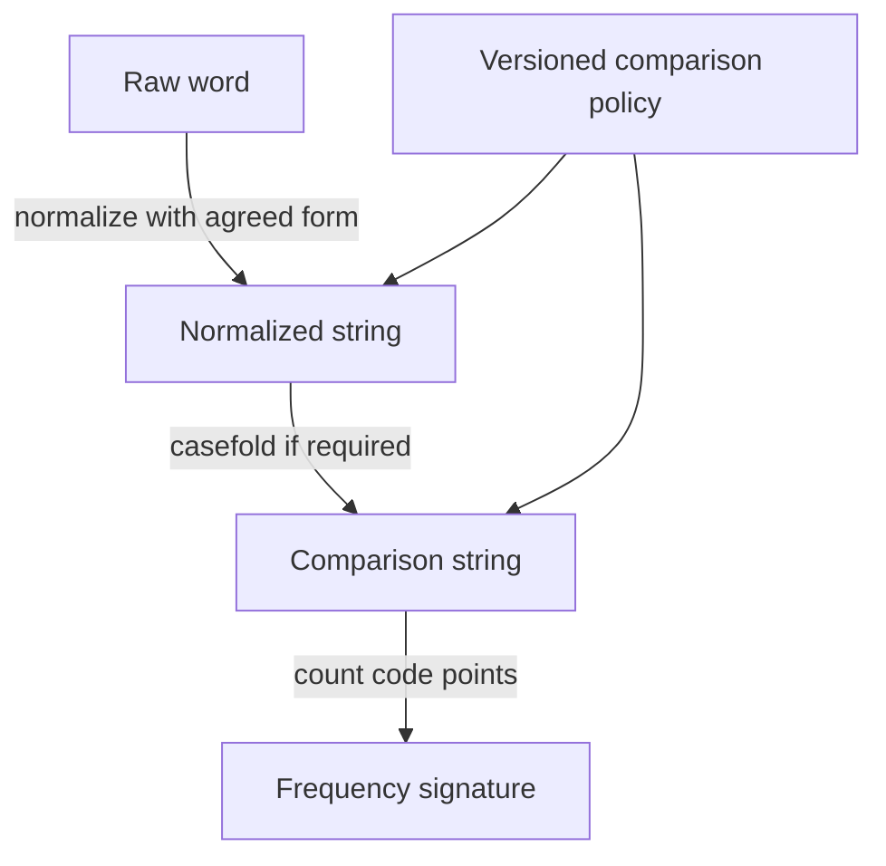

# 02 · Valid anagram: equality of multiplicities

Constructed practice problem; no company attribution. Prerequisites: [two sum](../01-two-sum/README.md).

## Candidate brief

> A word-game service checks whether two submitted strings use exactly the same characters, including repetitions. Spaces and case currently matter. Implement the check and ask whether “character” means a Unicode code point or a user-visible letter.

| Contract | Decision |
|---|---|
| Input | Two Python strings; compare Unicode code points exactly |
| Output | Boolean: each code point appears equally often |
| Boundaries | Empty strings match; case, spaces, and combining marks matter |
| Invalid input | Non-string arguments raise `ValueError` |
| Excluded | Normalization, locale collation, and visual/grapheme equivalence |

`valid_anagram("aab", "aba") is True`; `valid_anagram("aab", "abb") is False`.
`valid_anagram("é", "e\u0301") is False` despite similar rendering.
`valid_anagram(None, "")` raises `ValueError`.

Before opening the explanation, restate the contract, trace the smallest useful
example, implement a baseline, and identify the repeated work. Then implement
your improvement independently and derive tests from the contract. Say what
your state means before saying which data structure stores it.

<details>
<summary>Worked lesson, changed requirements, and reference</summary>

### Start with the meaning of equality

An anagram preserves **multiplicity**, the number of occurrences of each item.
A set answers only presence: both `aab` and `abb` become `{a, b}`, so a set is an
incorrect representation. A correct simple baseline sorts both strings and
compares the resulting sequences. That costs O(n log n + m log m) time and
O(n + m) auxiliary space in Python. Sorting solves more than required: character
order is irrelevant, so store frequencies directly.

| Character | Count in `aab` | Consume `aba` | Remaining |
|---|---:|---|---:|
| a | 2 | two `a` occurrences | 0 |
| b | 1 | one `b` occurrence | 0 |

First reject unequal lengths. Build counts from the first string, then decrement
for each code point in the second. Before consuming a position, each count equals
its frequency in the first string minus its frequency in the consumed prefix of
the second. A missing/zero count means the second requires an unavailable copy,
so rejection is final. Equal lengths plus no deficit imply every initial copy
was consumed; otherwise some other character would need a deficit. This is the
conservation argument behind returning true without a final sort.

The improved reference takes expected O(n + m) time, O(k) auxiliary space for
`k` distinct code points in the first string. The length rejection is O(1).
Dictionary hashing is expected, not a guaranteed constant-time oracle. The
strings themselves and the single boolean result are excluded from auxiliary
space. Say why a fixed 26-slot array would silently change the stated alphabet.

### Follow-up 1: normalize user-facing words

Ask the learner to predict the result for composed `é` and `e` plus a combining
acute accent. The old contract says false. A new product requirement may say
true, and case-insensitive matching may expand one input code point into several.



Specify the normalization form and transformation order before implementation;
normalization and grapheme segmentation solve different problems. Count and
length checks belong **after** the chosen transformations. The reference retains
exact code-point semantics, so changing this policy requires new test fixtures.

### Follow-up 2: compare enormous streams

Two iterators cannot promise cheap lengths or rewinding. Maintain signed
frequency differences while consuming both streams, then check zero at both
ends. Do not reject a temporary negative difference: later input can repair it.

| Event | Difference for `a` | Difference for `b` | Decision |
|---|---:|---:|---|
| left emits `a` | 1 | 0 | wait |
| right emits `b` | 1 | -1 | wait: streams incomplete |
| left emits `b`; right emits `a` | 0 | 0 | true only when both end |

A senior candidate explains why early rejection is valid only with the complete
first-string inventory. A lead candidate defines the shared text policy and
versioned compatibility across producers, plus limits for unbounded distinct
symbols. A hash fingerprint can bound memory but introduces collisions; it
cannot replace exact equality under this contract.

### Run and check

From the repository root:

```bash
cd paths/interviews/coding/problems/02-valid-anagram
python -m unittest -v test_solution.py
```

[Reference implementation](solution.py) · [Contract and oracle tests](test_solution.py).
Read the tests after your attempt. A green reference suite verifies the supplied
implementation; it does not demonstrate independent transfer. Reimplement one
follow-up with the reference closed and explain which old invariant no longer holds.

</details>

[Ordered foundation route](../foundations-index.md) · [Coding home](../../README.md)
