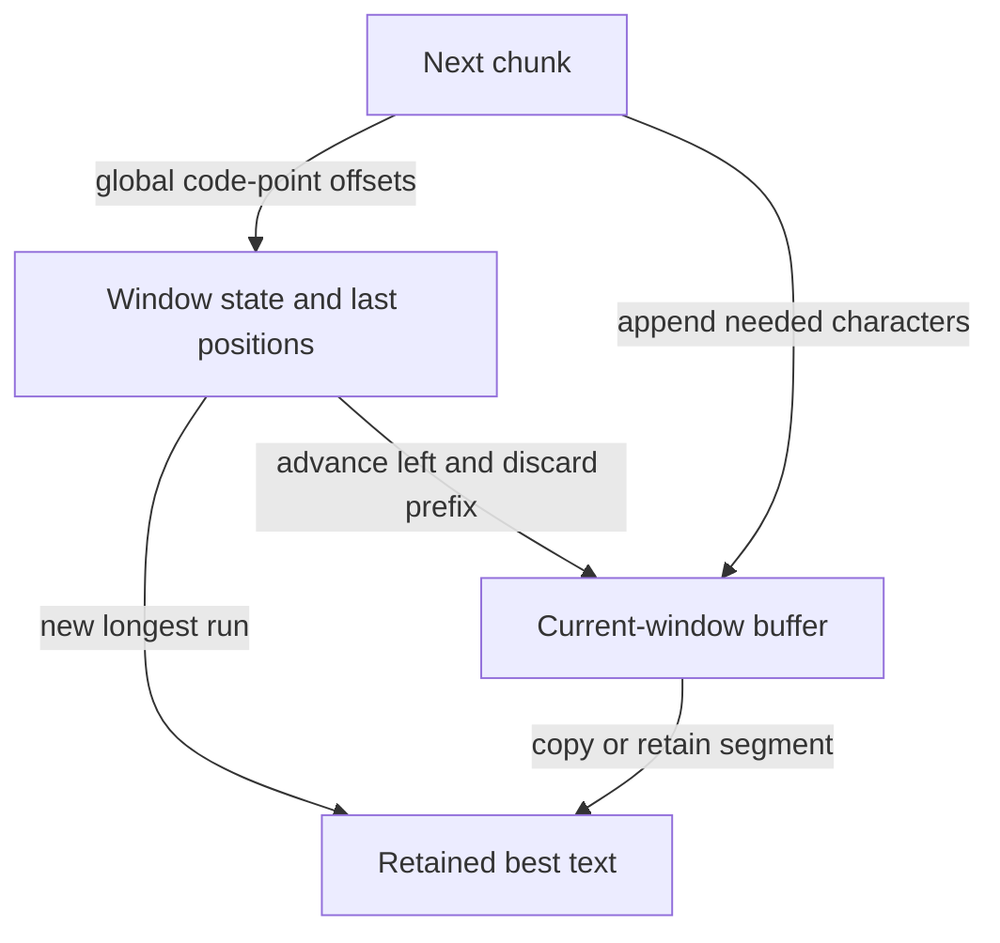

# 04 · Longest unique window: move the boundary forward

Constructed practice problem; no company attribution. Prerequisites: [maps](../01-two-sum/README.md) and [window basics](../../lessons/02-windows.md).

## Candidate brief

> A text inspection tool highlights the longest contiguous run with no repeated code point. Return positions so the interface can highlight the original string. When two runs are equally long, choose the leftmost. How would you trace “abba”?

| Contract | Decision |
|---|---|
| Input | Python string, exact code points |
| Output | Half-open `(start, end)` indices; `text[start:end]` is longest unique run |
| Boundaries | Empty string gives `(0, 0)`; ties choose smallest start |
| Invalid input | Non-string raises `ValueError` |
| Excluded | Grapheme indexing, normalization, and noncontiguous subsequences |

`longest_unique_window("abba") == (0, 2)` highlights `"ab"`.
`longest_unique_window("aaaa") == (0, 1)`; `longest_unique_window("") == (0, 0)`.
`longest_unique_window(["a"])` raises `ValueError`.

Before opening the explanation, restate the contract, trace the smallest useful
example, implement a baseline, and identify the repeated work. Then implement
your improvement independently and derive tests from the contract. Say what
your state means before saying which data structure stores it.

<details>
<summary>Worked lesson, changed requirements, and reference</summary>

### Discover why discarded starts stay discarded

A contiguous window is a slice with no skipped positions. A baseline starts at
each position, adds characters to a set, and stops at its first duplicate. It is
correct and O(n²) time in the worst case, with O(k) temporary set space. Adjacent
starts redo most of the work. To reuse state, scan the right edge once and store
the latest position of every character encountered.

| Right / character | Previous position | Left before → after | Current slice | Best |
|---|---:|---|---|---|
| 0 / a | none | 0 → 0 | a | `[0, 1)` |
| 1 / b | none | 0 → 0 | ab | `[0, 2)` |
| 2 / b | 1 | 0 → 2 | b | `[0, 2)` |
| 3 / a | 0 | 2 → 2 | ba | `[0, 2)` |

Before adding a character, the current window is unique and `last[c]` stores its
latest occurrence anywhere in the scanned prefix. If that occurrence is inside
the current window, move left just beyond it. Otherwise keep left unchanged:
`left = max(left, last[c] + 1)`. The final `a` above shows why assigning without
`max` is wrong: it would move left backward and reintroduce both `b`s.

After the update, the window is unique and is the longest valid window ending
here. Any earlier start would include the duplicate that forced the boundary;
no later right edge can make that earlier start unique again. Comparing this
candidate with the best at every right endpoint therefore covers an optimum.
Update only for a strictly longer length to retain the earliest tie. Expected
time is O(n), auxiliary space O(k) for distinct code points, and output O(1).
Returning indices avoids copying every candidate substring, which could hide
quadratic allocation behind otherwise linear pointer work.

### Follow-up 1: at most two distinct characters

Predict why a last-position jump for the newest duplicate no longer works.
Repeated copies are legal now; the violation is a third distinct character.
Maintain frequencies and shrink until at most two counts remain positive.

| Read from `eceba` | Counts before shrinking | Required shrink | Valid window |
|---|---|---|---|
| e, c, e | `{e: 2, c: 1}` | none | ece |
| b | `{e: 2, c: 1, b: 1}` | remove e, then c | eb |
| a | `{e: 1, b: 1, a: 1}` | remove e | ba |

Each position enters and leaves once, so the nested shrinking loop is O(n)
overall. A count reaching zero, not merely a removal, changes distinctness.

### Follow-up 2: consume chunks and return the text



Chunk boundaries must not reset the invariant: `ab` then `ba` is still `abba`.
If only offsets are required, no text buffer is needed; returning actual text
requires retention or replay. A senior candidate proves amortized movement and
tests a stale last occurrence. A lead candidate defines offset units, chunk
ownership, and a maximum retained text budget before offering streaming output.

### Run and check

From the repository root:

```bash
cd paths/interviews/coding/problems/04-longest-unique-window
python -m unittest -v test_solution.py
```

[Reference implementation](solution.py) · [Contract and oracle tests](test_solution.py).
Read the tests after your attempt. A green reference suite verifies the supplied
implementation; it does not demonstrate independent transfer. Reimplement one
follow-up with the reference closed and explain which old invariant no longer holds.

</details>

[Ordered foundation route](../foundations-index.md) · [Coding home](../../README.md)
