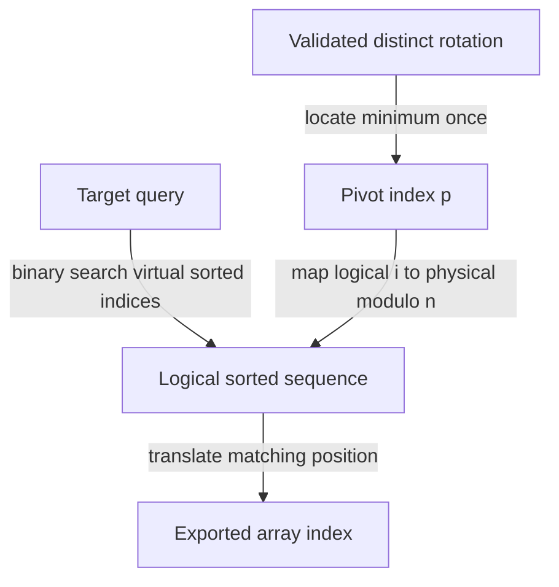

# 12 · Rotated array search: identify the ordered half

Constructed practice problem; no company attribution. Prerequisites: [binary search boundaries](../11-binary-search-boundary/README.md).

## Candidate brief

> A device stores distinct sorted sequence numbers in a circular array, then exports them starting from an arbitrary position. Find a target in that exported order. How does the midpoint tell you which half still has ordinary sorted order?

| Contract | Decision |
|---|---|
| Input | List/tuple that is a rotation of strictly increasing integers, plus integer target |
| Output | Index in the supplied array, or `-1` if absent |
| Boundaries | Empty gives -1; unrotated and singleton arrays are valid; no mutation |
| Invalid input | Invalid types, duplicates, or invalid rotation raise `ValueError` |
| Excluded | Duplicates and concurrent mutation; checked validation costs O(n) |

`rotated_search([4, 5, 7, 0, 1, 2], 1) == 4`; target 6 gives `-1`.
`rotated_search([1], 1) == 0`; `rotated_search([2, 1, 3], 1)` raises `ValueError`.
The output refers to the exported order, not the original sorted index.

Before opening the explanation, restate the contract, trace the smallest useful
example, implement a baseline, and identify the repeated work. Then implement
your improvement independently and derive tests from the contract. Say what
your state means before saying which data structure stores it.

<details>
<summary>Worked lesson, changed requirements, and reference</summary>

### Reuse ordering without reconstructing the array

A linear scan is a correct O(n) baseline using O(1) auxiliary space. Sorting a
copy would lose original indices unless carried along, and it does unnecessary
work. In a valid rotated array with distinct values, at most one descending
break occurs between adjacent positions. For any active interval, at least one
side of its midpoint is sorted. That side has an ordinary numeric range test.

| Search `[4, 5, 7, 0, 1, 2]` for 1 | lo / hi | mid / value | Ordered side and decision |
|---|---|---|---|
| first step | 0 / 5 | 2 / 7 | left `[4, 5, 7]`; 1 outside, go right |
| second step | 3 / 5 | 4 / 1 | equal; return 4 |

Maintain the invariant that a present target lies inside the inclusive interval
`[lo, hi]`. Check equality first. If `nums[lo] <= nums[mid]`, the left half is
sorted. Keep it only when `nums[lo] <= target < nums[mid]`; otherwise discard it.
When the left half is not sorted, the right half is, so retain it exactly when
`nums[mid] < target <= nums[hi]`. Distinctness makes the classification decisive.
Discarding the midpoint after failed equality makes the interval shrink. An
empty interval proves absence, not merely failure to guess the right pivot.

The core loop is O(log(n+1)) time and O(1) auxiliary space. The public reference
validates in O(n), making end-to-end time O(n), with constant auxiliary space.
For `n > 1`, count descending edges **including the wraparound edge**: a valid
strict rotation has exactly one descent and no equal adjacent circular values.
Cutting at that descent yields a strictly increasing sequence, proving the
validation rule sufficient. An unrotated sequence's descent is its wrap edge.

### Follow-up 1: duplicates become legal

Predict the ambiguity for midpoint equality. Two arrays can show the same left,
middle, and right values while hiding the smaller target on opposite sides.

| Array, target 0 | Left / middle / right | Why classification fails |
|---|---|---|
| `[1, 0, 1, 1, 1]` | 1 / 1 / 1 | target lies left of middle |
| `[1, 1, 1, 0, 1]` | 1 / 1 / 1 | target lies right of middle |

After checking equality, when all three boundary values are equal, discard one
element at each end and continue. Correctness survives but worst-case time
becomes O(n). Define whether any matching index or the first exported index is
required; the original early return does not enforce a first-index tie rule.

### Follow-up 2: many queries share an immutable rotation



Store the pivot and search logical value `nums[(p+i) % n]`; no sorted copy is
necessary if the underlying array remains stable. A senior candidate defends
the half-range comparisons and tests every rotation of small arrays. A lead
candidate defines immutable snapshot lifetime and rejects claims of logarithmic
worst-case search after allowing arbitrary duplicates or unvalidated updates.

### Run and check

From the repository root:

```bash
cd paths/interviews/coding/problems/12-rotated-array-search
python -m unittest -v test_solution.py
```

[Reference implementation](solution.py) · [Contract and oracle tests](test_solution.py).
Read the tests after your attempt. A green reference suite verifies the supplied
implementation; it does not demonstrate independent transfer. Reimplement one
follow-up with the reference closed and explain which old invariant no longer holds.

</details>

[Ordered foundation route](../foundations-index.md) · [Coding home](../../README.md)
