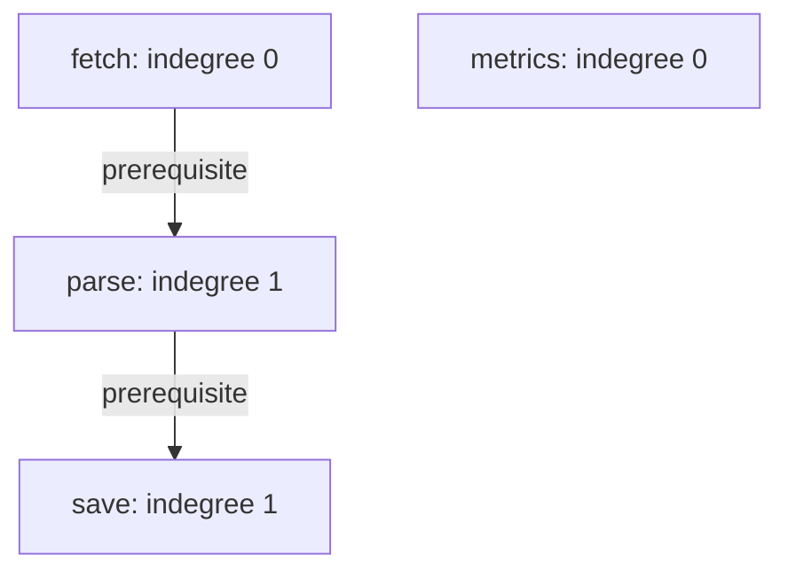
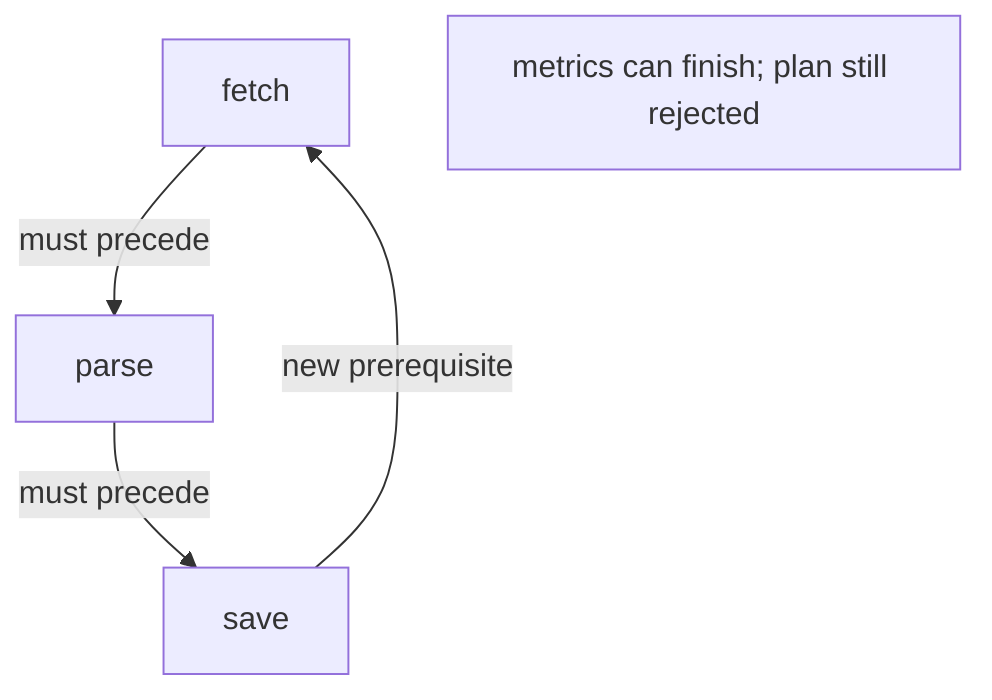

# 21 · Dependency order

> “Our build service receives named tasks and prerequisite relationships. It currently
> executes the submitted order, sometimes packaging files before compilation finishes.
> Return an order that respects every prerequisite, or reject the plan. What must we
> clarify before accepting a task graph?”

Constructed practice question; no company attribution. First solve independently.
Prerequisite: [graph traversal](../../lessons/05-graphs.md). A directed edge `a → b`
means **a must finish before b can start**. An incoming-edge count is called indegree.

| Contract | Required behavior |
|---|---|
| Input | Distinct hashable task IDs; pairs `(prerequisite, dependent)` |
| Output | Every task once in a valid order; ties follow input/edge discovery order |
| Boundaries | Empty input returns `[]`; duplicate edges count once |
| Failure | Unknown IDs, duplicate task IDs, or a cycle raise `ValueError` |
| Scope | Planning only; durations, retries, and parallel execution excluded |

For tasks `[fetch, parse, save, metrics]` and edges `fetch → parse → save`, return
`[fetch, metrics, parse, save]`. Metrics is independent and still belongs in the
answer. Adding `save → fetch` must fail, even though metrics can run. Ask whether the
caller needs *any* order, lexical order, or a cycle explanation: these change work.



Before opening the answer, predict the ready queue after fetch completes. Implement
the function and explain why isolated tasks cannot disappear.

<details>
<summary>Solution, trace, and changing requirements</summary>

A baseline repeatedly scans all unfinished tasks, searching for one whose
prerequisites are complete. A chain of V tasks can require V scans of V tasks,
plus dependency checks. Sorting the supplied names has no relationship to edge
direction; `[save, fetch]` with `fetch → save` is a direct counterexample.

Store each task's outgoing neighbors and remaining indegree. Initialize a FIFO
queue with zero-indegree tasks. Removing one represents completion: append it to
the answer, decrement each dependent once, and enqueue newly zero counts.

**Invariant:** each remaining indegree equals the number of prerequisites not yet
emitted. Consequently every queued task is safe to emit. Every edge is removed
once. If tasks remain when the queue empties, every remaining vertex has an incoming
edge; repeatedly following predecessors in a finite graph must revisit a vertex.
That establishes a cycle without confusing a cycle with a merely disconnected graph.

| Completed | Ready queue | Remaining parse/save counts |
|---|---|---|
| Nothing | fetch, metrics | 1 / 1 |
| fetch | metrics, parse | 0 / 1 |
| metrics | parse | 0 / 1 |
| parse | save | 0 / 0 |

Time is O(V + E) including duplicate-edge processing, with E counting submitted
edges. Auxiliary space is O(V + U), where U is unique edges, excluding the O(V)
returned order. No recursion stack is required. A min-heap gives lexical choices
at an additional O(V log V) cost.

**Follow-up 1 — explain the failure.** Add `save → fetch`. Predict which tasks still
emit before inspecting the changed graph. The answer is metrics only. Kahn's
remaining set identifies blocked tasks, not necessarily exactly cycle members;
DFS colors and parent edges can extract one actual cycle.



**Follow-up 2 — run tasks concurrently.** Readiness still depends on indegree, but
decrement after *successful completion*, not dispatch. A failure must block or
explicitly cancel its dependents. Draw separate ready, running, and completed sets;
worker capacity limits dispatch, while graph correctness limits eligibility.

A senior candidate proves cycle detection and tests disconnected/duplicate inputs.
Lead depth adds ownership of cancellation and incremental plan changes; this local
ordering function does not supply a distributed scheduler guarantee.

Reference: [solution.py](solution.py). Tests check edge order, duplicate normalization,
partial cycles, invalid IDs, and a long chain.

```bash
python -m unittest discover -s paths/interviews/coding/problems/21-dependency-order -p 'test_*.py'
```

</details>
