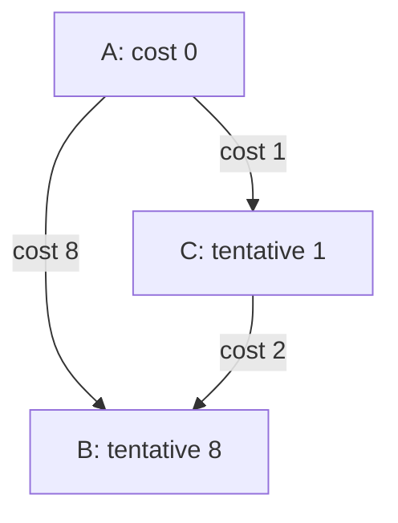
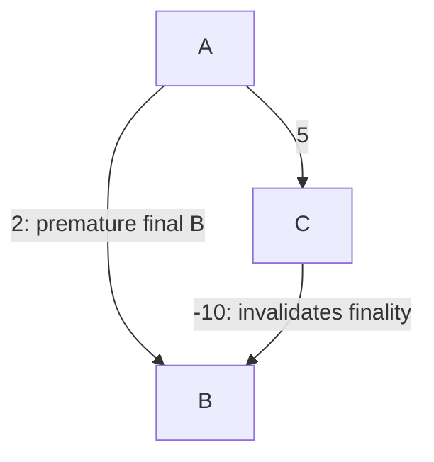

# 25 · Cheapest route with nonnegative costs

> “A delivery planner knows directed road costs. The route with the fewest roads
> can be expensive, so return minimum total cost and the route itself. All supplied
> costs are nonnegative. When is a tentative route safe to call final?”

Constructed practice question. Prerequisites: [graphs](../../lessons/05-graphs.md)
and [heaps](../../lessons/06-heaps.md). A min-heap retrieves the smallest tentative
cost; **relaxing** an edge means replacing a known cost when that edge improves it.

| Contract | Required behavior |
|---|---|
| Input | Mapping of every vertex to `(neighbor,weight)` pairs; source and target |
| Output | `(minimum_cost, endpoint-inclusive_path)`; any tied shortest path |
| Boundaries | Unreachable returns `(math.inf, [])`; source=target returns `(0,[source])` |
| Failure | Missing vertices or negative/nonfinite weights raise `ValueError` |
| Scope | Directed, static graph; numeric cost arithmetic; no negative edges |

For `A→B:8`, `A→C:1`, and `C→B:2`, return `(3,[A,C,B])`, even though B was
discovered directly first. A disconnected target returns infinity and no path.
Clarify whether edge weights represent exact integers or floating measurements;
floating-point precision can affect near ties. Inputs are not mutated.



Implement before opening the solution. Explain why returning when B is first
*inserted* is wrong, and predict what happens to B's old heap entry.

<details>
<summary>Solution, stale entries, and changed assumptions</summary>

BFS optimizes edge count, so it chooses the cost-eight direct edge here. A correct
baseline repeatedly scans all unsettled vertices for minimum tentative cost,
taking O(V² + E). Replacing that scan with a min-heap makes sparse graphs cheaper.

Start source at zero. Pop the minimum; discard it if its saved cost differs from
the current best distance. Otherwise relax outgoing edges, updating distance and
parent and pushing a fresh heap entry for each strict improvement. The heap need
not support decrease-key: obsolete entries remain until popped. A sequence number
breaks ties so vertex IDs need only be hashable, not mutually comparable.

**Invariant:** when a nonstale minimum is removed, its distance is final. Any
cheaper alternative would cross from an already finalized vertex to an unfinished
one whose tentative distance is no greater; nonnegative edges prevent later
suffixes from making that alternative cheaper. Therefore target early return is
safe on valid removal, never on first discovery.

| Pop | Best distance to B | Heap after relaxation |
|---|---:|---|
| A at 0 | 8 | C at 1; B at 8 |
| C at 1 | 3 | B at 3; B at 8 |
| B at 3 | 3 final | Old B at 8 is stale if search continues |

With lazy duplicates, heap size is O(E), not necessarily O(V). Validation is
O(V + E); total time is O(V + E log(E + 1)) and auxiliary space O(V + E), excluding
the O(P) returned path. This bound also covers parallel edges. For a simple graph,
log E = O(log V). Arithmetic and hash lookups are treated as constant-time.

**Follow-up 1 — allow a negative discount edge.** Predict the result if A→B costs
2, A→C costs 5, and C→B costs -10. Finalizing B at 2 is wrong: the true cost is -5.
Reject such inputs or choose an algorithm such as Bellman–Ford with explicit
negative-cycle semantics; removing validation does not extend Dijkstra's proof.



**Follow-up 2 — return distances to every vertex.** Remove target early return and
process all reachable entries, skipping stale ones. Keep infinity for unreachable
vertices. Repeated requests on a changing graph need a versioned snapshot; a
cached route may remain a valid path while no longer being cheapest.

Senior depth includes zero-cost cycles, stale entries, exact heap-space bounds,
and an independent relaxation oracle. Lead depth asks who owns cost freshness and
what the caller should do if a route expires during use.

Reference: [solution.py](solution.py); tests compare seeded graphs with repeated
relaxation, and cover zero cycles, incomparable IDs, invalid edges, and no route.

```bash
python -m unittest discover -s paths/interviews/coding/problems/25-weighted-shortest-path -p 'test_*.py'
```

</details>
