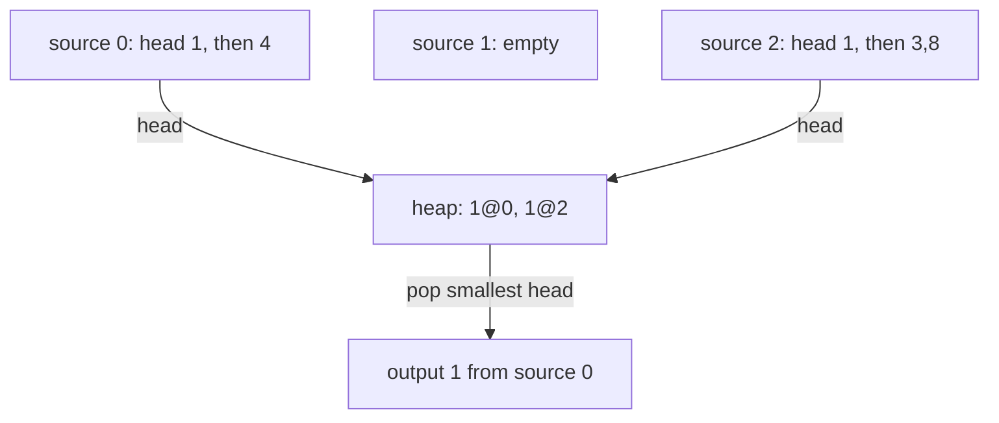
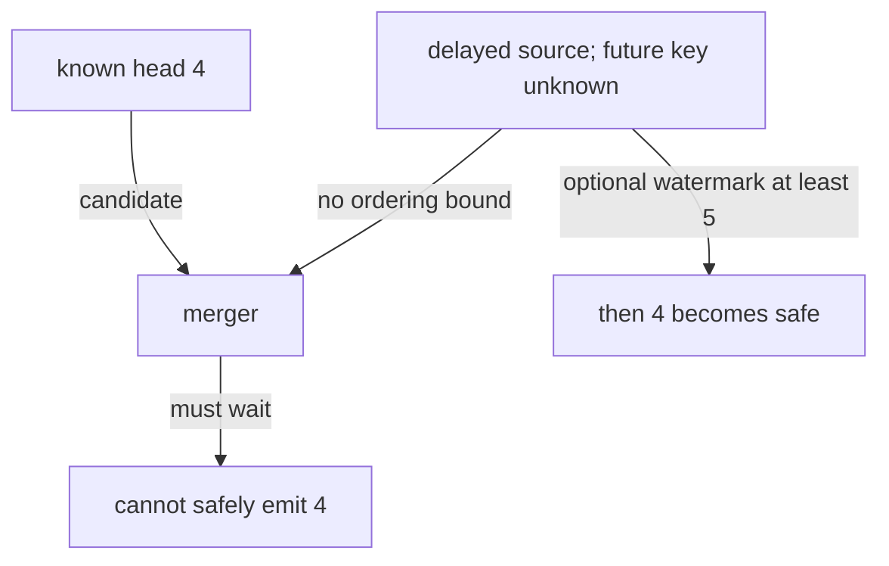

# 27 · Merge k sorted streams

> “We export records from several partitions. Each partition produces ascending
> integer keys, and the export needs one ascending stream. The files are too large
> to concatenate in memory. Return a lazy iterator and pull only enough source
> data to determine the next output.”

Constructed practice question. Prerequisite: [heaps](../../lessons/06-heaps.md).
An iterator yields one value on demand. Keeping one **head** from each nonempty
source exposes the smallest value that source could contribute next.

| Contract | Required behavior |
|---|---|
| Input | Finite collection of finite, ascending integer iterables |
| Output | Lazy ascending iterator preserving every occurrence, including ties |
| Boundaries | Empty collection/sources allowed; source index breaks equal-key ties |
| Failure | Nonsorted or noninteger values raise `ValueError` when consumed |
| Scope | Synchronous iterators; no I/O deadlines or atomic all-or-nothing export |

`[[1,4],[],[1,3,8]]` produces `[1,1,3,4,8]`. For `[[1,0]]`, the iterator yields
1 and then raises when it reads 0. Previously yielded data cannot be retracted.
Ask whether partial output is acceptable: eager validation requires reading or
spooling complete sources and changes the lazy contract.



Implement independently. Predict which source advances after the first output
and how many input items have been consumed when the consumer pauses.

<details>
<summary>Solution, frontier invariant, and follow-ups</summary>

Concatenate-and-sort costs O(N log N) time and O(N) retained values for N records.
A better baseline scans k current heads for every output, using O(k) memory and
O(Nk) comparisons. A heap replaces only this repeated minimum search; it does not
change the underlying merge reasoning.

Convert each source to an iterator, read at most one value from each, and heapify
the `(value,source_index)` pairs. Repeatedly pop and yield the smallest pair. When
the consumer resumes, advance that pair's source, check nondecreasing order, and
push its new head. Exhausted sources leave the heap permanently.

**Invariant:** at every selection point, the heap contains exactly one next
unemitted value from each active source. Every later value in that source is at
least its head. The global minimum unseen value is therefore a heap member, and
removing its minimum preserves sorted output and occurrence counts.

| Consumer request | Output | Pull triggered before next selection |
|---|---:|---|
| First | 1 from source 0 | Initial head from each source |
| Second | 1 from source 2 | Source 0 advances to 4 |
| Third | 3 from source 2 | Source 2 advances to 3 |

Initialization costs O(k). Consuming all N outputs costs O(k + N log(k + 1)) time
and O(k) auxiliary space. The caller may accumulate O(N) output, but the generator
does not. Sortedness checks are incremental and cannot discover unconsumed errors.
Closing the generator early does not consume the rest of its inputs.

**Follow-up 1 — a source is temporarily unavailable.** Predict whether the merger
may safely emit 4 while a source has no known head. It cannot: that source might
next yield 2. Distinguish permanent exhaustion from a delayed response. A watermark
(promise that future keys are at least some bound) can permit progress.



**Follow-up 2 — merge records with equal timestamps stably.** Use a tuple containing
timestamp, source priority, and per-source sequence, with the record outside the
comparison key. Define whether stability is source order or an external global
sequence; timestamp equality alone does not define a total order.

Senior depth includes pull-count tests and failure-after-partial-output semantics.
Lead depth adds cancellation/resource cleanup for real file or network iterators.

Reference: [solution.py](solution.py). Tests compare seeded streams with sorting,
verify laziness using counters, and check empty/tied/invalid inputs.

```bash
python -m unittest discover -s paths/interviews/coding/problems/27-merge-k-streams -p 'test_*.py'
```

</details>
