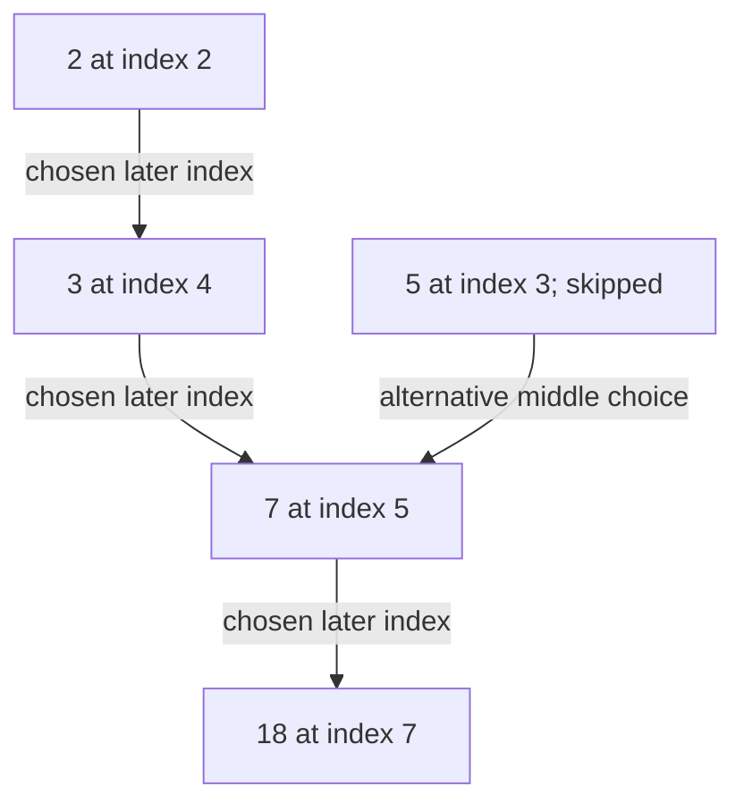
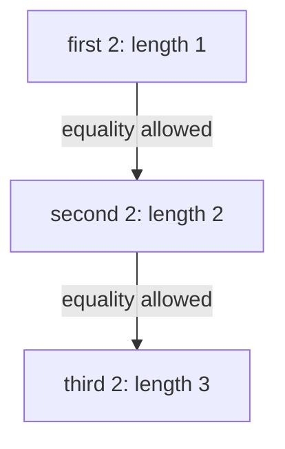

# 34 · Longest increasing subsequence

> “A telemetry analyzer receives ordered integer measurements. It may skip noisy
> measurements but cannot reorder them. Return a longest strictly increasing
> subsequence, including the chosen values. Can you summarize partial solutions
> without losing the ability to reconstruct a real sequence?”

Constructed practice question. Prerequisites: [binary search](../../lessons/04-order.md)
and [DP state](../../lessons/08-dp.md). A subsequence preserves input order but need
not be contiguous. Strict increase means equal consecutive chosen values are invalid.

| Contract | Required behavior |
|---|---|
| Input | Finite integer sequence |
| Output | Values forming any longest strictly increasing subsequence |
| Boundaries | Empty returns `[]`; equal-only nonempty input returns one value |
| Failure | Noninteger values raise `ValueError`; input is not mutated |
| Scope | One witness; no count of witnesses or streaming deletions |

`[10,9,2,5,3,7,101,18]` can return `[2,3,7,18]` of length four. `[2,2,2]` returns
`[2]`, not all three. Sorting the input would change order and solve another task.
Ask whether the caller actually means nondecreasing: equality changes which binary
search boundary is correct.



Implement an O(n²) solution first if needed. Then explain what one length-l partial
sequence can offer a future value that another sequence of the same length cannot.

<details>
<summary>Solution, dominance, and follow-ups</summary>

The quadratic DP defines `length[i]` as the best sequence ending at i, scanning
earlier j with `values[j] < values[i]`. It is correct and easy to reconstruct, but
does O(n²) comparisons. The improvement follows a dominance argument: among
subsequences of the same length, the smaller final value permits at least as many
future extensions.

Maintain `tails[l-1]`, the smallest ending value of any length-l increasing
subsequence in the processed prefix. For x, find the first tail ≥x using lower
bound. Replace it, or append if no such tail exists. Tails remain increasing.
Store the input index associated with each tail and each element's predecessor
index before replacement, then reconstruct from the final longest tail.

**Invariant:** each tail is achievable at its claimed length, and no larger tail
is needed to decide future extendability. However the tails array as a whole need
not be one subsequence: its entries may come from incompatible input positions.
Predecessor links record historical compatible choices; replacing a tail does not
rewrite already stored predecessors.

| Input prefix ending with | Tails | Meaning |
|---|---|---|
| 3,5,6 | [3,5,6] | Length three exists |
| then 2 | [2,5,6] | Better length-one end |
| then 4 | [2,4,6] | Better length-two end; not a real length-three witness |

For n values, binary searches take O(n log(n+1)) time. Tails, input copy, indices,
and predecessors use O(n) auxiliary space; returned witness uses O(L). If only
length is requested, omit predecessor history and retain O(L) tails. The provided
implementation returns a witness and therefore honestly retains linear history.

**Follow-up 1 — nondecreasing subsequence.** Predict `[2,2,2]`: length three.
Use the first tail strictly greater than x (upper bound), so equal values extend
instead of replacing. Draw how the same observations now create three lengths.



**Follow-up 2 — count longest subsequences.** A single minimal tail loses counts
and alternatives. Use quadratic DP storing `(best_length,count)` per endpoint,
or coordinate-compressed range structures that combine length and count carefully.
Define whether equal values at different indices count as different subsequences;
that decision changes the required counting semantics.

Senior depth explains the dominance proof, strict boundary, and why reconstruction
cannot simply return tails. Lead depth questions whether witness history fits a
long-running stream before promising bounded memory.

Reference: [solution.py](solution.py); tests use exhaustive subsets for small
seeded inputs and explicitly catch the “return tails” mistake.

```bash
python -m unittest discover -s paths/interviews/coding/problems/34-longest-increasing-subsequence -p 'test_*.py'
```

</details>
