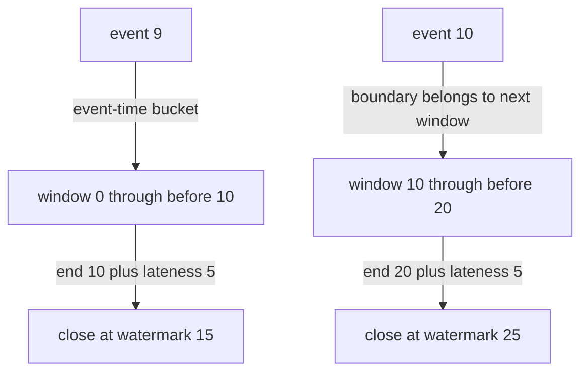
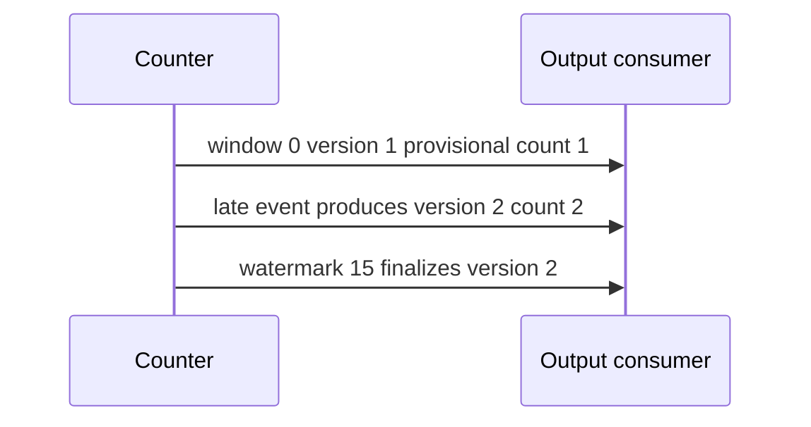

# 40 · Count event-time windows with late arrivals

> “Our event counter receives records out of order. Count events in fixed time
> windows according to when they occurred, not when they arrived. A separate source
> advances a watermark. Keep accepting late records until each window's declared
> lateness allowance expires, then emit that window exactly once.”

Constructed practice question. Prerequisites: [maps](../../lessons/01-maps.md) and
[explicit time boundaries](../29-expiring-key-value-store/README.md). Event time is
the record timestamp. A watermark is an externally supplied progress estimate;
this exercise does not infer it from local wall time or the largest event seen.

| Contract | Required behavior |
|---|---|
| Input | Positive integer width W, nonnegative lateness L, integer timestamps/watermarks |
| Window | Timestamp t belongs to `[floor(t/W)×W, start+W)`; negatives allowed |
| Add | Returns true when accepted, false when its window is already closed |
| Emit | Advancing watermark returns sorted `(start,end,count)` for nonempty newly closed windows |
| Boundary | Close when `end+L <= watermark`; equal watermarks are idempotent |
| Failure/scope | Decreasing watermark/invalid numbers raise `ValueError`; duplicates count, no retractions |

With W=10, L=5, add events 9 and 10. Advancing to 10 emits nothing; late event 2
still joins `[0,10)`. At watermark 15 emit `(0,10,2)`. Another event 9 is rejected,
while event 10 belongs to `[10,20)` and may still arrive. Ask who owns watermark
advancement: choosing it too aggressively discards legitimate delayed records.



Implement independently. Predict whether watermark 14.999 would be a valid input
(no: integer contract), and whether watermark 15 still accepts timestamp 9 (no).

<details>
<summary>Solution, finality, and follow-ups</summary>

A baseline groups by arrival time and immediately emits on the local clock's ten-unit
boundary. A delayed timestamp 2 arriving after timestamp 10 then enters the wrong
window or is lost prematurely. Another tempting baseline closes by maximum observed
event time: one far-future outlier can close valid earlier windows.

Store counts keyed by window start. On add, derive start with floor division and
compare its close deadline against the current watermark before incrementing.
On watermark advancement, validate monotonicity, find active windows whose deadline
is reached, sort them by start, return their counts, and remove them from state.
Missing/empty windows are not materialized or emitted.

**Invariant:** stored windows have not yet closed under the latest watermark, and
their counts equal accepted arrivals assigned to those exact half-open intervals.
Because the watermark never decreases, a removed window can never be recreated:
the add-time boundary test rejects it without keeping unbounded tombstones.
This is local single-run finality, not durable delivery or deduplication.

| Arrival/progress | Window 0 count | Window 10 count | Emission |
|---|---:|---:|---|
| add 9; add 10 | 1 | 1 | none |
| watermark 10; add 2 | 2 | 1 | none |
| watermark 15 | removed | 1 | (0,10,2) |
| add 9 | unchanged | 1 | rejected as too late |

Add costs expected O(1). With A active windows and F closing windows, advancement
costs O(A + F log(F+1)) time and O(F) auxiliary/output space. State is O(A), which
is not automatically bounded by lateness: arbitrary future timestamps or a stalled
watermark can retain arbitrarily many windows. A heap can reduce closure scans,
but introduces additional indexing and cleanup work.

**Follow-up 1 — emit early and accept corrections.** Predict the new output if
count 1 was emitted at watermark 10 and event 2 arrives afterward. Send a versioned
replacement count 2 or delta +1, then a final marker at 15. Consumers must know
which update model applies and deduplicate/reconcile retries.



**Follow-up 2 — multiple input partitions.** A global watermark normally depends
on each active partition's progress, often their minimum. Idle partitions need an
explicit exclusion/reactivation policy; taking the maximum closes windows ahead of
slow partitions. Future-time skew limits and backpressure can bound retained state.

Senior depth tests exact boundaries and arrival permutations. Lead depth names
watermark authority, idle-source policy, restart state, and output retry semantics.

Reference: [solution.py](solution.py); tests cover negative timestamps, event order,
late rejection, duplicate counts, empty windows, and monotonic progress.

```bash
python -m unittest discover -s paths/interviews/coding/problems/40-event-time-windows -p 'test_*.py'
```

</details>
