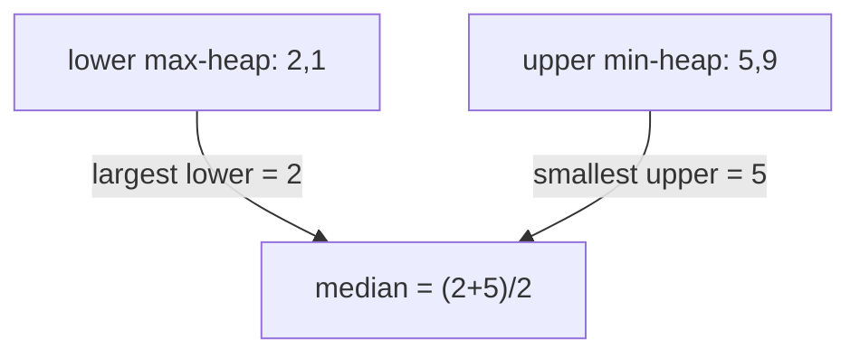
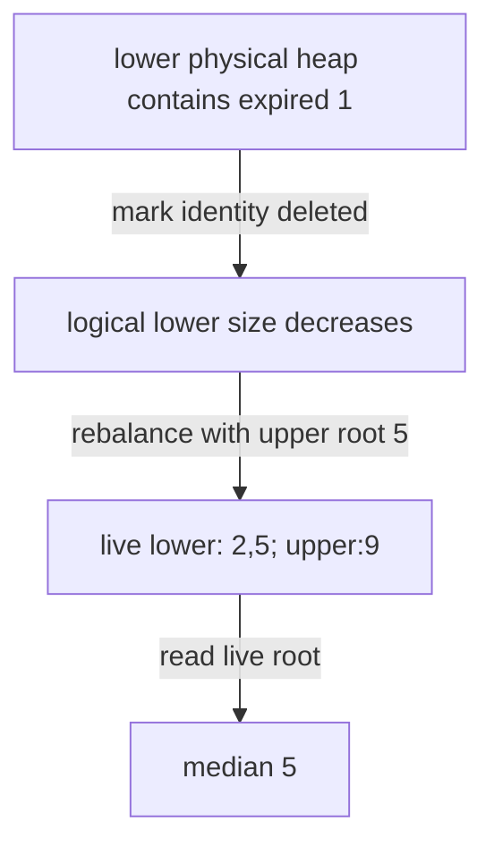

# 41 · Maintain an exact streaming median

> “A monitoring process receives integer observations and asks for the median after
> each arrival. Re-sorting all history is too expensive. Keep an exact answer,
> including the average of the middle pair when the count is even. What state
> must grow even if a query only returns one number?”

Constructed practice question. Prerequisite: [heaps](../../lessons/06-heaps.md).
The median divides ordered observations into lower and upper halves. A max-heap
exposes the largest lower-half value; Python's min-heap can represent it by negation.

| Contract | Required behavior |
|---|---|
| Input | Integer observations through `add(value)` |
| Output | `median()` returns an exact `fractions.Fraction` |
| Boundaries | Odd count uses middle value; even count averages middle pair; duplicates count |
| Failure | Empty median or noninteger observation raises `ValueError` |
| Scope | All history, append only; no window removal, approximation, or constant-memory promise |

After arrivals `[5,1,9,2]`, medians are `5`, `3`, `5`, and `7/2`. The final answer
is not one of the observed values. Negative and arbitrarily large Python integers
are accepted; conversion through a float could overflow or round. Ask whether
exact fractions are appropriate for the caller's display/API contract.



Implement independently. State both invariants: a size rule alone is insufficient,
and correctly ordered halves alone do not identify the middle if sizes drift.

<details>
<summary>Solution, balancing, and follow-ups</summary>

Appending then sorting n observations costs O(n log n) for one snapshot. Maintaining
a sorted list makes median lookup cheap but insertion O(n) because values shift.
Two heaps avoid maintaining the full order inside either half; only their boundary
values matter for median selection.

Insert into lower if it is empty or the observation is no greater than lower's
maximum; otherwise insert into upper. If lower exceeds upper by more than one,
move lower's maximum to upper. If upper becomes larger, move its minimum to lower.
For odd totals return lower's maximum; for even totals average both roots exactly.

**Invariant:** every lower value is ≤ every upper value, and lower has either the
same size as upper or exactly one extra. Insertion chooses a valid side relative
to the dividing value. Moving the appropriate extreme during rebalancing preserves
cross-half order. Thus the roots are exactly the middle one/two order statistics.

| Arrival | Lower values | Upper values | Median |
|---:|---|---|---|
| 5 | {5} | {} | 5 |
| 1 | {1} | {5} | 3 |
| 9 | {1,5} | {9} | 5 |
| 2 | {1,2} | {5,9} | 7/2 |

Each arrival performs O(log(n+1)) heap work; a query reads O(1) roots. State is
O(n) values and O(1) per-operation working slots, excluding growing heap storage.
These are word-model costs. Large integer comparisons, negation, and Fraction
construction also depend on operand bit length; exactness is preserved rather
than treating conversion to float as a harmless presentation step.

**Follow-up 1 — delete expired observations.** Predict the median after deleting
1 from the example: remaining `[2,5,9]` has median 5. A heap cannot directly remove
an arbitrary buried entry cheaply. Use indexed heaps, an ordered multiset, or lazy
deletion with unique identities, logical size counts, root pruning, and compaction.



**Follow-up 2 — merge summaries from several machines.** Averaging local medians
does not produce the global median: partition sizes and value distributions matter.
For exact arbitrary values, retain enough order information or exchange selection
queries over distributed data. For bounded memory, choose an approximate quantile
summary and define its error guarantee; the two heaps are not a compact mergeable
summary just because querying them is constant-time.

Senior depth proves both invariants and checks every prefix against sorting.
Lead depth distinguishes exact, approximate, windowed, and distributed contracts
before committing to storage and communication budgets.

Reference: [solution.py](solution.py); tests verify all cross-half values, sizes,
seeded prefix medians, empty behavior, and integers too large for floats.

```bash
python -m unittest discover -s paths/interviews/coding/problems/41-streaming-median -p 'test_*.py'
```

</details>
