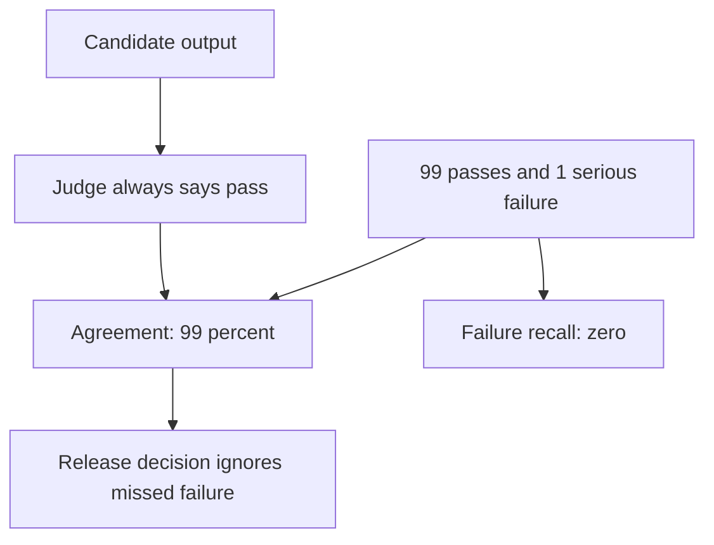
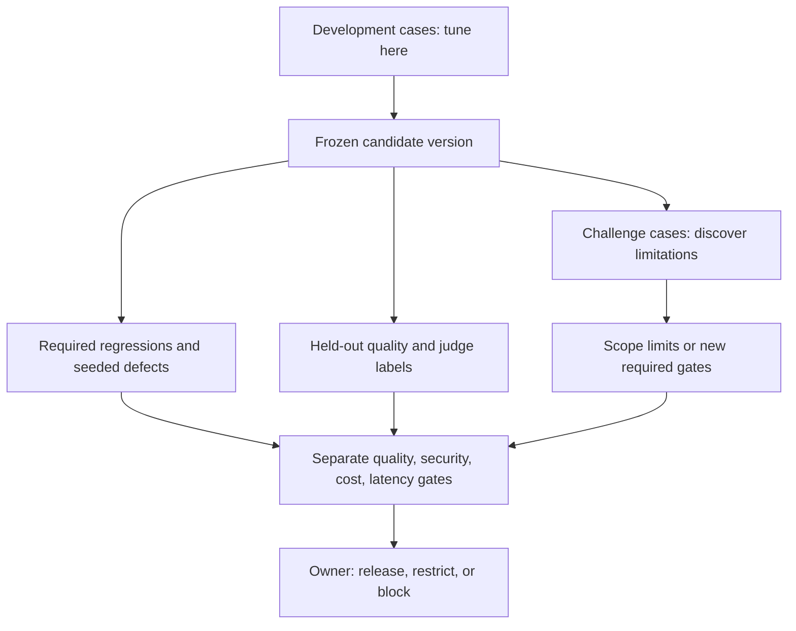
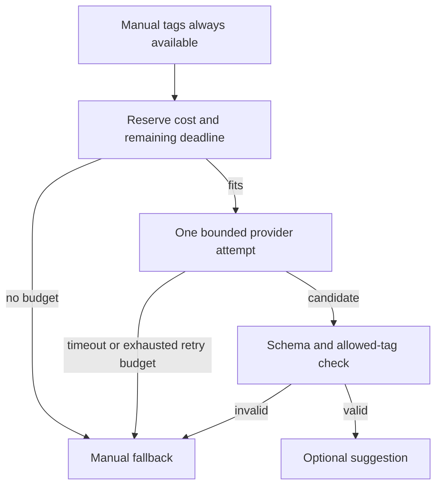

# May we ship a tagger that passes every regression?

> “Our reading-list tagger passes twenty regression cases. Its judge agrees with humans 99% of the time. Yesterday we fixed a tenant-isolation defect; today the model provider is slow. Decide what evidence permits a release, and keep the manual tagging feature useful during failure.”

Constructed optional AI-product practice, not a general senior requirement or a reported interview prompt. Start with [testing](../../../tiers/01-junior/06-testing/README.md) and [AI systems](../../../tiers/02-senior/15-ai-systems/README.md). Attempt the decision before reading [the assessor](assessor.md).

| Contract | Input | Required result |
|---|---|---|
| Deterministic stand-in | `SQL and CSS`, all three tags allowed | `['database', 'frontend']` |
| Permission | `sql`, unauthorized request | `[]`; tenant input must be authorized before model access in a real service |
| Product boundary | Provider suggests a tag outside allowlist | No suggestion published; manual UI remains |
| Cost | 10-cent task cap, each sent call costs 4 cents, including errors | At most two calls; 8 cents spent |
| Latency | Whole-task deadline 1,000 ms; attempts take 700 ms each | Second attempt times out after 300 ms; manual fallback at 1,000 ms |
| Excluded | Real model, token billing, live provider and production sampling | Local deterministic control-flow exercise only |

## Establish the oracle before measuring the score

An oracle is the rule that decides whether an output meets a requirement. For a finite allowed-tag contract, exact set equality is useful. For retrieval, recall at a specified `k` may matter; for ranked suggestions, a relevance metric may be appropriate; for writing quality, a calibrated graded rubric may be informative. Explain what action the metric enables and who chose the threshold. Keep authorization and spend limits as separate required gates.

1. State a user-visible failure and its severity. A poor synonym suggestion and a cross-tenant disclosure must not cancel each other in an average.
2. Build development cases from inspected failures. Tune there. Freeze the required regressions before comparing a change.
3. Demonstrate sensitivity: seed a named defect and show the relevant regression turns red. Restore the fix and require those regressions to pass. Current 100% is a valid result.
4. Protect held-out labels from tuning. If you inspect and optimize against them, retire them into development data and obtain a fresh evaluation sample.
5. Measure stochastic quality repeatedly on declared cohorts; record model/prompt/config versions, sample size, disagreements, latency and cost. Local fake-provider tests do not provide these measurements.

### Baseline: a majority judge hides the defect



| Human / judge | Judge fail | Judge pass |
|---|---|---|
| Human fail | TP = 0 | FN = 1 |
| Human pass | FP = 0 | TN = 99 |

Failure is the positive class. Failure recall is `TP/(TP+FN) = 0/1 = 0%`. Failure precision is undefined when there are no predicted failures; report that fact rather than inventing 100%. Agreement is `(TP+TN)/100 = 99%`. This judge has not detected a single failure.

### Follow-up: fixed implementation, distinct evidence sets

Predict whether fixing yesterday's authorization bug should make the regression suite easier to pass or force us to invent another product failure. Then redraw the release boundary.



A challenge failure is documented as a capability limit; if it violates the promised product scope, promote it into a required gate and block the release. Do not silently exclude a serious supported-use failure by renaming its dataset. The two challenge cases here are unsupported synonyms/Spanish in an explicitly keyword-only prototype. They are not secret tests and do not justify claiming multilingual quality.

## Run the supplied experiment

From the repository root, Python 3.10+, no network or dependencies:

```bash
python -m unittest discover -s paths/interviews/evaluations -p 'test_*.py' -v
```

Expected: six tests pass. All twenty reference regressions pass; bypassing authorization fails `r20`, ignoring the tag allowlist fails `r18/r19`, and a constant output fails more than ten cases. These are actual mutated implementations evaluated against the same oracle, not assertions that an unrelated Boolean is false.

`regression.json` is intentionally visible. `challenge.json` has separately documented limitations. `heldout-labels.json` is an assessor fixture: it is physically separate and unused for tuning by the reference, but public repository data cannot remain secret. A real assessment requires fresh labels retained by another reviewer. The fixture contains four actual failures, three detected, and two false alarms among sixteen passes. Calculate its matrix and severity loss before opening the key.

## Budgeted outage follow-up

The UI lets people enter tags manually. The fake provider produces either a valid suggestion, a transient error, or an invalid output. Reserve the known per-call charge before sending, include failed calls in spend, and stop at a whole-task deadline. The model is never the authority for permissions.



**Senior:** calculate 700 + 300 ms and 4 + 4 cents for the timeout fixture; explain why timing out a request may not cancel provider billing. Then replace fixed 4-cent costs with token estimates: reserve a conservative bound, reconcile actual charges, and cap output tokens. **Lead:** ten concurrent features share a daily budget. Local counters can overspend; assign an atomic reservation authority, cancellation/refund policy, gate owners and rollback access. Do not claim this local function implements those controls.

For repeated quality runs, distinguish per-input instability from aggregate uncertainty. Twenty curated regression passes are not twenty random production samples. Even zero failures in twenty independent representative trials would leave a wide upper failure-rate bound (roughly 15% by the approximate rule of three); curated cases cannot support that inference.

**Submit:** matrix, missed-severity calculation, release decision against explicit gates, evidence-set ownership, and fallback trace. Current primary engineering context: [Airbnb evaluation report, published 2026-07-28](https://medium.com/airbnb-engineering/eval-driven-development-lessons-from-evaluating-genai-at-scale-e817e5ae5788) describes programmatic, judge and human evaluation; our thresholds and fixtures are constructed, not Airbnb hiring criteria.
