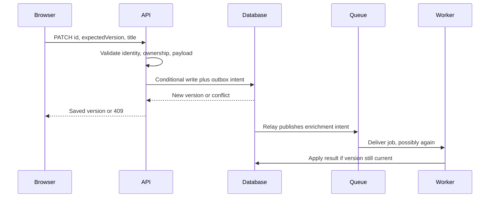
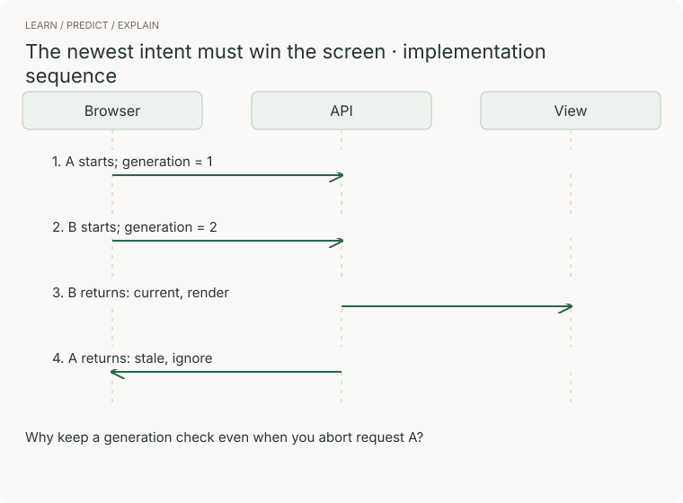

# Full stack · one user action across every boundary

Build a private bookmark editor with search and background enrichment. The interview task is to explain the user-visible contract as well as the backend. These are original exercises, not claims that every company uses this prompt.

## The complete flow



The outbox relay may publish duplicates. The worker must deduplicate and avoid applying enrichment calculated for an older bookmark version.

## Browser concepts you must be able to implement

| Concept | What it does | Failure without it | Demonstrate |
|---|---|---|---|
| State ownership | Separates draft edits, confirmed server state, and request status | A refetch overwrites unsaved input | Keep a draft until save/discard; display conflict |
| Request generation | Stops old responses replacing newer search results | Search results revert while typing | Resolve requests in reverse order |
| Optimistic updates | Shows likely success immediately | Failed writes look permanently saved | Keep rollback data; reconcile by version |
| Rendering choice | Places HTML generation and data fetching deliberately | Slow first view or hydration mismatch | Compare initial render and interactive readiness |
| Accessibility | Gives controls names, focus behavior, keyboard access, and error announcements | A task works only with a mouse or sight | Complete create/edit/error recovery with keyboard |
| Virtualization | Limits rendered elements for a large list | Main-thread work freezes scrolling | Profile before adding it; preserve focus and semantics |



[Before/after](../../../assets/learning/ui-race-compare.svg) · [Still](../../../assets/learning/ui-race-still.svg)

## Worked implementation · search coordinator

```typescript
const search = latestOnly(
  async (query, signal) => {
    const response = await fetch(`/api/bookmarks?q=${encodeURIComponent(query)}`, { signal });
    if (!response.ok) throw new Error(`Request failed: ${response.status}`);
    return response.json(); // Validate this value before rendering.
  },
  renderBookmarks,
);
```

`latestOnly` is implemented and tested in [typescript.ts](../coding/typescript.ts). Connect failures to an error state with a retry action. Add loading/empty/success states. Validate runtime JSON with a schema or explicit checks; static types alone cannot establish trust in the response. In a component, also abort/invalidate on unmount.

## Backend concepts

Use separate request validation and domain rules. Authorize on the server. Bound pagination and payload size. Return conflict when an expected version is stale. Add a request ID for diagnosis without exposing private data. Do not emit a success status before durable acceptance.

For a relational version check:

```sql
UPDATE bookmarks
SET title = :title, version = version + 1
WHERE id = :id AND owner_id = :authenticated_owner
  AND version = :expected_version;
```

Exactly one affected row means the conditional change succeeded. Zero may mean missing, unauthorized, or stale; choose a response policy that avoids leaking other users' records. Run related outbox insertion in the same transaction. Use parameters rather than string interpolation.

## 90-minute implementation exercise

1. Build a form and list from in-memory fixtures; demonstrate keyboard navigation and error states.
2. Implement GET/POST/PATCH handlers with validation and object authorization. Use a local database or the AWS lab 1 procedure.
3. Add stable pagination and conditional versions; write an owner-isolation test.
4. Inject 800 ms latency, reversed responses, a failed save, and a duplicate enrichment event.
5. Explain one measurement that would justify caching and one that would justify changing rendering strategy.

The repo supplies the coordinator snippets, SQL pattern, AWS queue implementation, and tests. The complete bookmark application is the learner's implementation exercise, not a prebuilt application claimed to exist here.

## Level expectations

| Junior | Senior | Staff |
|---|---|---|
| Functional form/API/data flow and visible errors | Concurrent edits, partial failure, pagination, performance and authorization | Shared contracts across teams, frontend/API rollout compatibility, observability and ownership |

**Go further:** measure input responsiveness, payload size, query count, and failed-save rate. A working spinner is not evidence of good UX if errors silently erase user input.

[Interview home](../README.md) · [Practical coding](../coding/practical.md)
