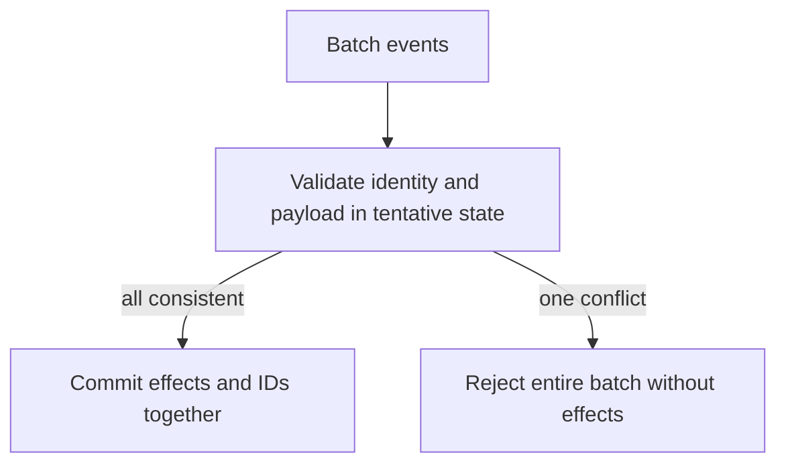
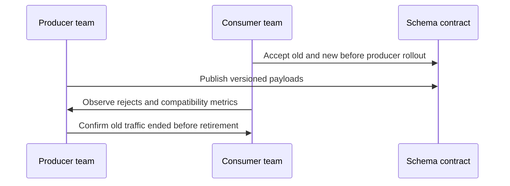

# Assessor · event consumer

Give only [the candidate brief](../candidate/coding.md). This is a constructed pack.
Release one change at a time; do not diagnose its implementation for the candidate.

| Time | Held-back change / exact fixture | Expected reasoning and output |
|---|---|---|
| 15 min | Preserve one consumer across two calls: first `[(r1,book,+5),(r2,book,-3)]`; then `[(r2,book,-3),(r3,book,+4)]`. Return a snapshot after each call. | Totals 2 then 6; retain dedup state across calls, and keep the first returned snapshot at 2 rather than aliasing mutable totals |
| 30 min | Same ID can conflict: `(r1,book,5),(r1,pen,5)` | Explicit conflict error; do not silently dedup by ID or overwrite old meaning |
| 35 min | A batch contains valid r3 followed by conflicting r1; batch must be atomic | Validate/plan complete batch before changing state, or rollback; no partial r3 effect |
| Lead | Old producer omits a new schema field; two teams deploy independently | Define schema/version compatibility, owner for rejection/quarantine, rollout and retirement checks |

| Dimension | Weak: 0–1 | Adequate: 2 | Strong: 3 |
|---|---|---|---|
| Correctness | Drops only adjacent duplicate; accepts conflicting ID | Retains identities across calls, returns stable snapshots, and detects conflicts | Proves batch atomicity with late-conflict regression |
| Implementation | Pseudocode only or cannot run | Runnable tests for empty, invalid, repeated IDs | Adapts without breaking baseline and compares against a tiny oracle |
| Reasoning | Names hash map without its invariant | Maps event ID to normalized payload; totals reflect accepted unique effects | Accounts for retained IDs and limits of bounded-memory exact dedup |
| Lead ownership | “Tell other team to fix it” | Names schema owner and compatibility contract | Sequences producer/consumer rollout, monitoring, stop condition and old-version retirement |

Failing approaches: summing then deduplicating output; keeping only last ID; silently
discarding every ID collision; mutating half a batch before discovering a conflict.
Each has a supplied fixture above. A stronger candidate may choose immutable staged
state over rollback; score the invariant and complexity, not a preferred implementation.

Debrief: [identity maps](../../coding/lessons/01-maps.md),
[importer replay and conflicts](../../coding/labs/importer/README.md),
[rubric](../README.md). On the second occasion, switch to reservation IDs with
explicit release events; recognition of this exact prompt is not transfer evidence.
