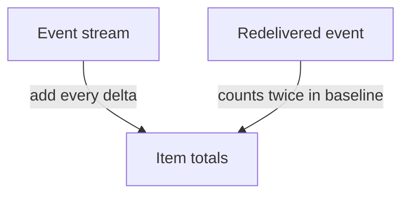
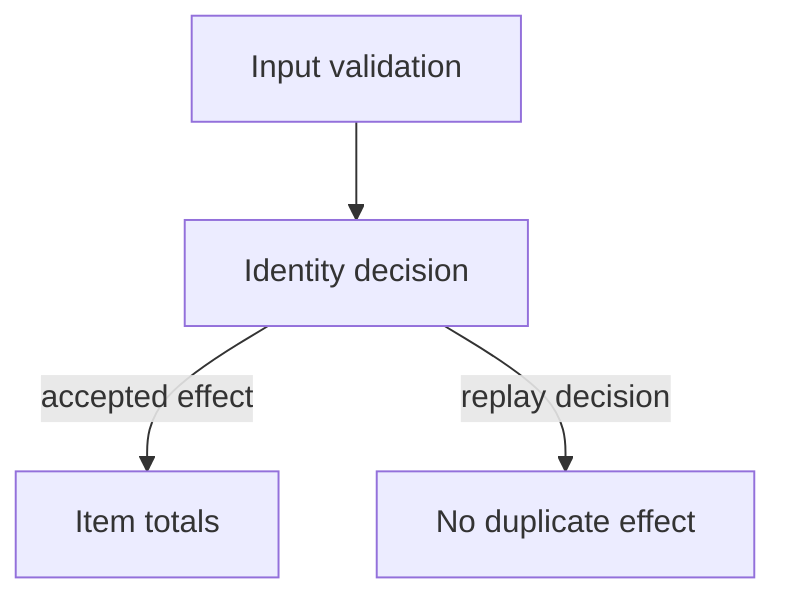

# Candidate · event consumer

> “A fulfillment dashboard receives events with `id`, `item` and integer `delta`.
> Redelivery is normal. Implement a consumer that returns item totals and never counts
> an equal event twice. Clarify which identity and ordering assumptions matter.”

Constructed 45-minute independent session. Allowed: editor, language standard library,
your own tests. Do not open assessor/reference pages. Prerequisites before session day:
[maps](../../coding/lessons/01-maps.md), [complexity](../../coding/reference.md).

| Contract | Expected behavior |
|---|---|
| Input | Finite sequence of `{id:string,item:string,delta:integer}` |
| Example | `(e1,book,+2),(e2,book,-1),(e1,book,+2)` → `{book:1}` |
| Boundary | Empty stream → `{}`; invalid field types rejected |
| Starting assumption | Repeated ID initially has equal payload; input sequence is ordered |
| Excluded | Database persistence and real-time distributed delivery |

Restate the contract, trace the example, choose identity state and one invariant, then
implement and derive tests. Explain time and retained memory. A simple correct baseline
is useful, but it must fail visibly on redelivery before you replace the representation.

At minutes 15 and 30, the assessor changes the contract. Ask what changes before
editing; give one counterexample to your previous design. At the end, run the exact
cases you created and explain unfinished work. Expected baseline evidence is the
example above, explicit duplicate behavior and a runnable empty/invalid-input check.
Senior scope requires adaptation; lead scope also defines compatibility and ownership
if events come from two producers. Feedback arrives only after the attempt.
