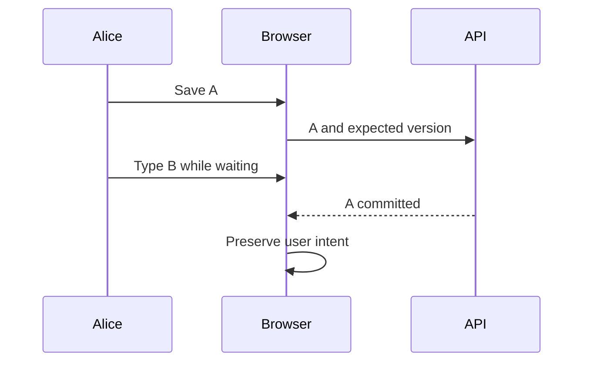
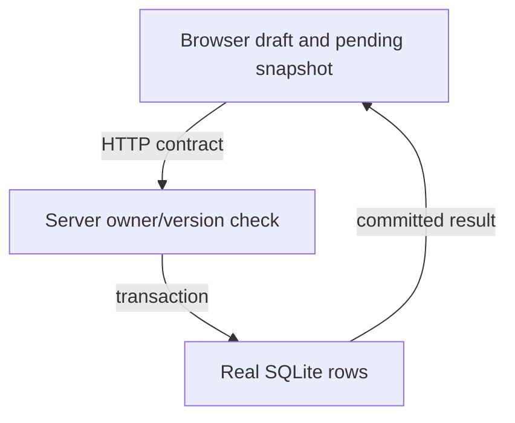

# Candidate · save without erasing the next edit

> “Alice edits a private bookmark title. Save is slow and she continues typing.
> The response overwrites her new text. Build or repair this vertical slice and show
> the browser behavior, the HTTP contract and the actual stored row.”

Constructed 90-minute product session. During an independent build use a blank local
workspace with HTML/TypeScript, a local HTTP server and SQLite; do not inspect the
[reference application](../../full-stack/bookmark-editor/README.md) or its tests.
For a repair diagnostic, the assessor supplies a copy with one guard removed and
records which file was changed. Framework choice is flexible; the repository supplies
one executable reference after the attempt. No cloud deployment is required.

| Contract | Expected example |
|---|---|
| Editor | Draft is local; confirmed record has server version |
| Save | `PATCH b {title:A,expectedVersion:1}` with mutation key → A/v2 |
| In-flight edit | Type B before that response → input stays B, confirmed becomes A/v2 |
| Ownership | Alice cannot read/write Bob's row; enforce at server boundary |
| Pagination | Descending timestamp/id with tied timestamps; no skipped equal-time rows |
| UX | Loading, empty, error, retry, named keyboard controls and conflict feedback |
| Excluded | Production login, offline queue, create/delete and enrichment |

Start with a tiny fixture and draw state ownership. Trace one interleaving before
coding, derive the server conditional write, and test the browser using controlled
response completion. Name each state separately: draft/local revision, confirmed
record, pending mutation snapshot and view/request generation. Expected baseline:
only the sent snapshot is acknowledged; unsaved B cannot be labelled “saved.”

The assessor introduces two delayed or conflicting schedules. Explain what remains
uncertain after a transport failure, and demonstrate the error/conflict recovery by
keyboard. Show one real query measurement before proposing an optimization. Senior
scope is a tested vertical path; lead scope adds old-client compatibility, observability
and ownership. Study [the prerequisite search race](../../coding/labs/search-race/README.md)
before session day, then debrief against the separate assessor sheet.
