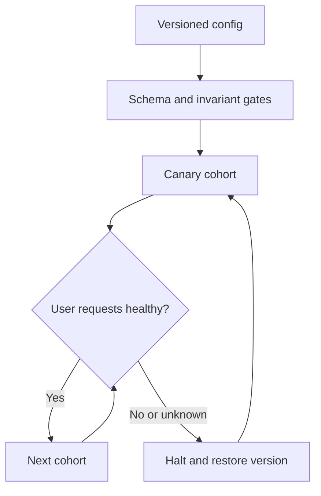

# Configuration is executable behavior

**Real event:** GitHub, July 8, 2026. An automated metadata update changed a runtime value, disrupted discovery, and emptied router backend pools. GitHub restored configuration and service registration; its reported follow-up included immutable metadata, safer rollout, and better empty-pool detection. [Primary report, published August 12](https://github.blog/news-insights/company-news/github-availability-report-july-2026/).

**Recent solution evidence:** Cloudflare's May 1, 2026 update describes progressive configuration rollout, health gates, automatic rollback, and last-good configuration handling. It reports an April 7 recovery drill. This is a recent remediation report; the outages motivating that program were in 2025, outside our recent-incident window. [Primary update](https://blog.cloudflare.com/code-orange-fail-small-complete/).

**Takeaway:** A valid config file can still break service discovery. Validate behavior and contain rollout.

[Static diagram](../../../assets/learning/config-cohorts-still.svg)

These diagrams use illustrative workloads. AWS mappings are our learning designs.

Work the example · AWS implementation · failure drill

## Worked design: a routing policy service

Suppose 20 isolated service cohorts read a routing configuration. All-at-once rollout exposes all 20 before a human can react. A one-cohort canary initially exposes 1/20 of cohorts. That is **not necessarily 5% of requests**: measure the cohort's actual traffic, tenant criticality, and shared dependencies.

Make the artifact immutable: version, schema, checksum, author, intended cohort, and timestamp. Validate nonempty backend sets, allowed destinations, and compatibility with both currently deployed parser versions. A healthy process must prove a real request through the new route. Pause promotion when health data is absent; absence of alarms is not evidence of health.

## AWS implementation exercise

Use **AWS AppConfig** for application configuration rollout, with a deployment strategy and CloudWatch alarms. Retain and validate configuration in the application before activating it. AppConfig does not automatically protect unrelated EC2 metadata mutations or arbitrary Terraform changes: those need their own staged infrastructure workflow. [AWS deployment behavior](https://docs.aws.amazon.com/appconfig/latest/userguide/appconfig-deploying.html).

Build a local parser with `schema_version`, `config_version`, and `backends`. Inject an empty list, an unsupported schema, and a well-formed but unreachable endpoint. Preserve the last-good version for ordinary routing when the replacement is unusable. Decide separately whether an authorization revocation may ever remain stale: continued access and continued availability have different consequences.

For a disposable AWS exercise: create an application, environment, hosted configuration profile, validator, deployment strategy, and an alarm monitoring actual canary failures. Give the environment a role able to read its alarm. Deploy a working version before a bad one. Record which hosts received it, when the alarm changed, whether rollback happened, and what happens if alarm data stops arriving. This is an implementation brief, not predeployed infrastructure.

## Proof, failure cases, and level expectations

| Level | Demonstrate | Above the baseline |
|---|---|---|
| Junior | Invalid config never replaces working state | Distinguish syntax, semantics, and reachability |
| Senior | Halt promotion on bad or missing telemetry; test recovery | Quantify exposure during alarm delay and long-lived connections |
| Staff | Independent recovery access, cohort ownership, audit trail | Show how correlated dependencies can defeat cohort isolation |

A rollback cannot undo already sent messages or external side effects. A last-good fallback cannot help a new instance that never had a valid configuration. Supply a tested bootstrap version or fail explicitly. Recovery tools should not depend entirely on the discovery service they repair.

**Changed requirement:** the update revokes a compromised tenant's access. Write the policy for stale configuration, expiry, and emergency revocation before implementing the fallback.

[Production casebook](README.md) · [AWS implementation](../aws/README.md)
