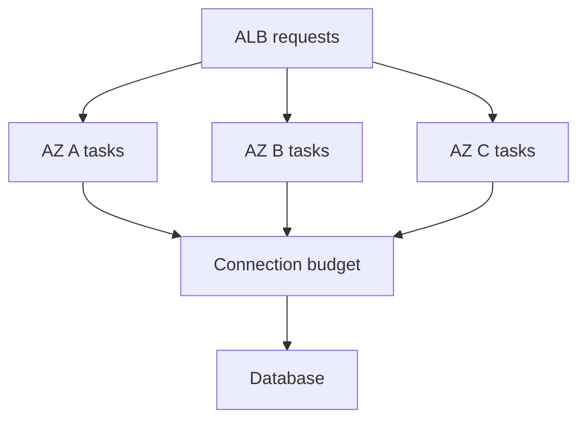

# A correct deployment can still cause an outage

**Real event:** GitHub Actions, August 6, 2026. Replacing pods during a routine deployment temporarily removed capacity. Remaining infrastructure saturated; rollback showed the code change itself was not the cause. GitHub added capacity, throttled incoming work, and repaired invalid-job retries that delayed recovery. [Primary report, published September 9](https://github.blog/news-insights/company-news/github-availability-report-august-2026/).

**Takeaway:** A deployment consumes capacity even when its code is correct. Budget for replacement and recovery.

[Static diagram](../../../assets/learning/rollout-capacity-still.svg)

These diagrams use illustrative workloads. AWS mappings are our learning designs.

Work the example · AWS implementation · failure drill

## Work the numbers

Our simplified service has 10 tasks, each sustaining 100 requests/s under the agreed latency target. Incoming traffic is 850/s. Utilization is 85%. Removing two tasks leaves 800/s of capacity: a deficit of 50/s. With an unbounded queue and no expiry, one minute accumulates 3,000 requests. At the restored capacity of 1,000/s, only 150/s is available for catch-up, so ideal drain time is `3000 / 150 = 20 seconds` while fresh arrivals continue.

Those calculations assume constant independent service capacity and no retries, cold caches, database bottleneck, or queue overhead. Measure real saturation experimentally; capacity can fall under overload.

Three equal Availability Zones need a separate failure budget. Losing one removes a third of capacity. Even without a deployment, surviving one AZ requires load no greater than two-thirds of total capacity under these assumptions. Deployment surge capacity does not establish AZ-loss tolerance.

The shared database budget is intentional: three AZ boxes are not three independent copies of every dependency.

## AWS implementation exercise

For an **ECS rolling deployment**, `minimumHealthyPercent=100` and `maximumPercent=200` permit replacement tasks to start before old tasks stop, provided placement capacity and quotas allow. These are scheduling constraints, not proof that an application is ready or that the database can absorb twice as many connections. [ECS deployment rules](https://docs.aws.amazon.com/AmazonECS/latest/developerguide/deployment-type-ecs.html).

Example: 10 tasks each own a 20-connection pool. A full surge can demand 400 database connections, compared with 200 normally. If the database's application allocation is 250, the new deployment can fail despite abundant CPU. Bound total connection demand, choose a smaller surge, or introduce and validate a suitable pooling layer. Pooling does not create database query capacity.

In a disposable ECS service, measure readiness after initialization, keep liveness independent from transient downstream slowness, handle SIGTERM, and allow in-flight requests to drain. Run a fixed-rate load during replacement and during a slow dependency. Track task/sidecar memory and CPU, ALB target health, connection usage, p99 latency, and useful completions.

## Failure drill and expectations

**First predict:** which fails first: application CPU, proxy CPU, network flows, connection pool, or database? Then collect enough telemetry to distinguish them. Do not treat more replicas as a universal fix; more replicas may open more database connections.

| Level | Demonstrate | Above the baseline |
|---|---|---|
| Junior | Explain readiness versus liveness and graceful drain | Identify a request killed during shutdown |
| Senior | Calculate rollout and failure headroom | Include warm-up, downstream limits, and queue drain |
| Staff | Set a measurable availability envelope across teams | Price spare capacity against exposure and recovery time |

**Changed requirement:** demand grows 30% while an AZ is unavailable. Recompute the capacity envelope before adjusting autoscaling; show placement capacity, quotas, and startup delay, not only desired replica count.

[Production casebook](README.md) · [AWS implementation](../aws/README.md)
