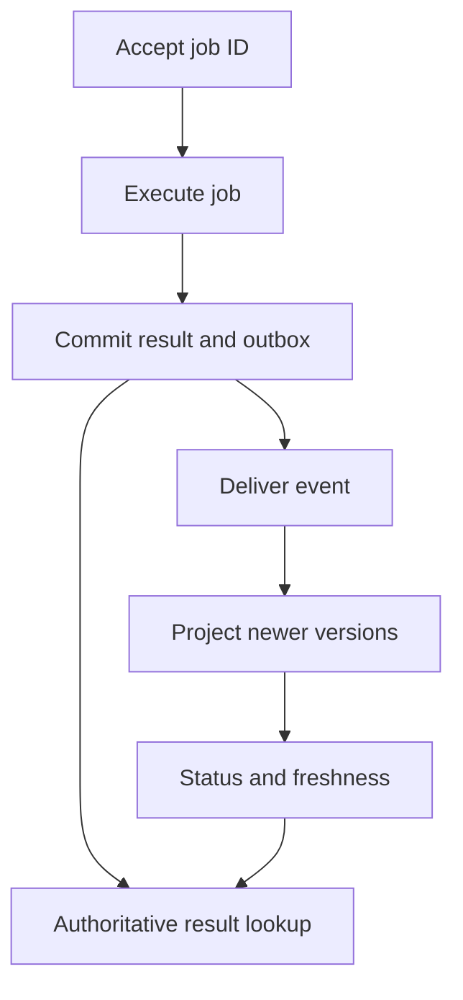

# Completed work can have a stale status view

**Real event:** GitHub Copilot cloud agent, August 20, 2026. Tasks continued completing while a regional managed-database problem delayed status updates. Fixed processing partitions and slow database failover contributed to backlog. GitHub shifted processing and added streaming capacity. [Primary report, published September 9](https://github.blog/news-insights/company-news/github-availability-report-august-2026/).

**Takeaway:** Job execution and status visibility are different guarantees. Preserve identity and event order.

[Static diagram](../../../assets/learning/version-projection-still.svg)

These diagrams use illustrative workloads. AWS mappings are our learning designs.

Work the example · AWS implementation · failure drill

## Separate acceptance, execution, and visibility

Use a stable `job_id`, a durable result, and a monotonic version for each job's state. A completion event carries `(job_id, version, status, occurred_at)`. The status projector writes only if the stored version is lower. Duplicate and reordered events then cannot turn `completed/v3` back into `running/v2`.

The version must come from an authoritative ordering mechanism. Two independent writers both inventing `v3` can disagree; reject conflicting same-version payloads or establish a single job owner. Timestamps alone do not provide that guarantee.

## Work the backlog math

Our toy projector has 20 in-flight slots. At 20 ms per write, its ideal ceiling is `20 / 0.020 = 1000 updates/s`. If writes slow to 200 ms, that ceiling becomes 100/s. With 400 updates/s arriving, backlog grows by 300/s. After 60 seconds, 18,000 updates wait. Once throughput recovers to 1,000/s, spare throughput is 600/s and ideal drain time is 30 seconds.

More partitions can increase useful concurrency only if the downstream store has headroom and the partition key permits work to spread. Otherwise scaling consumers can intensify the outage. Track processing age as well as queue count.

## AWS implementation exercise

Use DynamoDB transactions for a result plus outbox item when they belong in the same transaction scope, and relay asynchronously; or design an equivalent transaction with an Aurora outbox. Never claim an ordinary database write followed by a separate event publish is atomic. Give the relay its own checkpoint and retry strategy. Expiring an outbox before all consumers can recover loses the replay source. [DynamoDB transactions](https://docs.aws.amazon.com/amazondynamodb/latest/developerguide/transaction-apis.html).

For ordered event processing, explain the partition key and ordering scope when selecting Kinesis. A consumer must still manage duplicate processing and checkpoints; sequence numbers do not eliminate retries. [Kinesis concepts](https://docs.aws.amazon.com/streams/latest/dev/key-concepts.html).

Create a local projector. Deliver `running/v2`, `completed/v3`, `running/v2`, `completed/v3`, then conflicting `failed/v3`. Expect completed state after the stale update, a no-op duplicate, and an explicit conflict. The UI should say “status last updated…” during lag and reuse the same job identity when retrying acceptance. A silent permanent spinner gives the user no basis to decide what to do.

| Level | Demonstrate | Above the baseline |
|---|---|---|
| Junior | Show pending, failed, completed, and stale UI states | Preserve a job identity across refreshes |
| Senior | Handle duplicates, reordering, and projection replay | Prove result/event atomicity boundary and calculate drain time |
| Staff | Define recovery ownership and freshness objectives | Coordinate regional recovery, retention, and reconciliation |

**Changed requirement:** users may cancel while work completes. Define whether cancellation is a request or a guaranteed terminal state, which side effects can be undone, and who wins the race. A newer integer version cannot choose the business semantics for you.

[Production casebook](README.md) · [AWS implementation](../aws/README.md)
