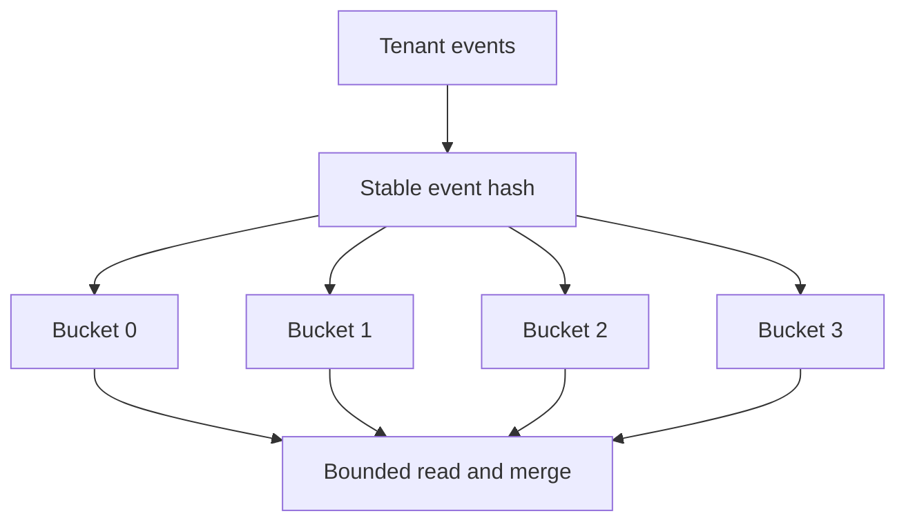

# A healthy average can hide an overloaded partition

**Real event:** GitHub Actions, July 9, 2026. A high-volume shard in its runner-provisioning backend became overloaded and could not synchronize reliably across regions. GitHub restored replication health and drained queued work; it reported further workload distribution and recovery protection work. [Primary report, published August 12](https://github.blog/news-insights/company-news/github-availability-report-july-2026/).

**Takeaway:** Fleet averages hide skew. Design for the hottest key and its ordering requirements.

[Static diagram](../../../assets/learning/partition-skew-still.svg)

These diagrams use illustrative workloads. AWS mappings are our learning designs.

Work the example · AWS implementation · failure drill

## Work a partitioned design

Our toy store has four partitions, each with capacity 100 write units/s. One tenant emits 250 units/s and maps to partition A. Total capacity is 400, yet A accumulates 150 units/s of unserved work while B–D are idle. Aggregate utilization hides the failure.

For independent events, write with `(tenant_id, bucket_id)` as the partition key and `event_id` as the item identity. Choose the bucket deterministically from the stable event ID. Four evenly loaded buckets would receive 62.5 units/s each in this toy model. Real hashing is not perfectly even, and DynamoDB's physical partition placement is managed by AWS; four logical keys do not promise four physical partitions.

## AWS implementation and its price

DynamoDB partition-key design should distribute activity. On-demand capacity and adaptive capacity do not justify ignoring a persistently hot access pattern. Check item sizes, hot items, and read/write distribution. [AWS partition-key guidance](https://docs.aws.amazon.com/amazondynamodb/latest/developerguide/bp-partition-key-design.html).

Sharding a write key moves complexity to reads. A latest-events query now reads several buckets and merges sorted results. With `k` bucket streams and `n` returned events, a heap merge costs `O(n log k)` after fetching; cursors need enough state to continue each bucket without duplicates or omissions. Bound fetch concurrency with the [TypeScript fan-out example](../coding/practical.md). Per-bucket overfetch and empty reads add cost.

Bucket-count changes require a versioned routing rule. If yesterday's retries use four buckets and today's fresh events use eight, the same event must not acquire two identities. Keep the routing version with the event and make reads cover both layouts during migration. Do not silently change a hash modulo in place.

## Ordering and fairness

A tenant-wide account balance is not a bag of independent events. Spreading concurrent balance updates across keys can break its invariant. Keep a serialized owner, use transactions within their supported boundary, or redesign the operation into mergeable facts and a reconciled aggregate.

A tenant admission limit protects neighbors before hot work reaches the shared backend. Distinguish accepted durable work from rejected work: HTTP 202 should identify an accepted job, not conceal a drop. During replay, reserve capacity for fresh work and stop raising replay concurrency when downstream latency worsens.

| Level | Demonstrate | Above the baseline |
|---|---|---|
| Junior | Explain a skewed distribution with numbers | Find why a fleet average hides the slow tenant |
| Senior | Choose keys from access patterns and implement bounded reads | Handle retries across a routing-version change |
| Staff | Define tenant isolation and migration ownership | Make ordering, fairness, cost, and recovery tradeoffs explicit |

**Changed requirement:** one customer requires strict ordering of all events. Explain why simply adding buckets is no longer a complete answer, and measure whether batching behind one ordered owner meets the throughput goal.

[Production casebook](README.md) · [AWS implementation](../aws/README.md)
