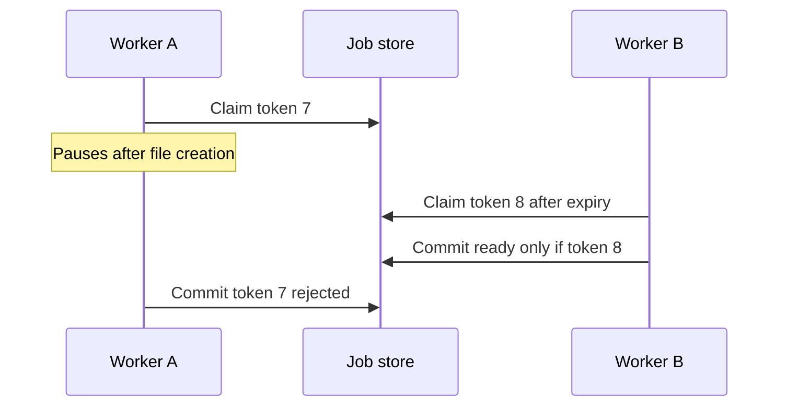
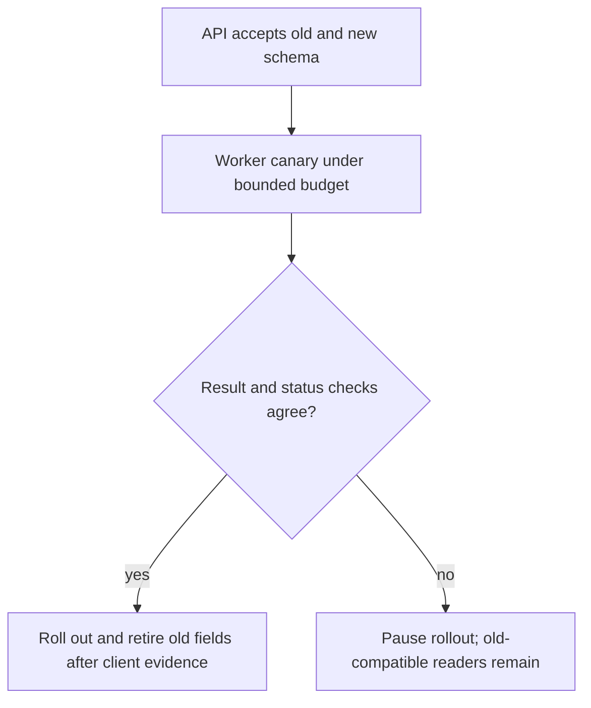

# Assessor · private export service

Withhold this sheet from [the candidate](../candidate/design.md). Release the exact
trace; ask the candidate to predict it before suggesting a mechanism.

| Release | Held-back condition | Expected answer |
|---|---|---|
| 20 min | A writes the file, pauses before status; lease expires; B becomes owner; A returns | Token/version-conditional status commit; orphan artifacts need cleanup; a lease alone cannot stop stale writes |
| 25 min | Queue duplicates delivery after lost acknowledgment | Idempotent accepted request/job identity and conditional terminal transition; physical duplicate work may occur |
| 30 min | Owner loses access while a download URL is cached | State revocation SLA and enforcement boundary; origin-only checks do not validate cache hits |
| 35 min | API team must keep old polling clients working while worker team changes schema | Expand compatible fields, new worker behind flag/canary, validation/backfill if needed, explicit old-client retirement |
| Lead | Two teams, 4 weeks, only 2 engineers each; one region; half baseline budget | Prioritize correctness/visibility, cut non-goals, bound concurrency, allocate owners, rollback triggers and testable completion |

| Dimension | Weak: 0–1 | Adequate: 2 | Strong: 3 |
|---|---|---|---|
| Architecture | Service list without durable state | Complete accepted-job, work, artifact, status path | Names invariants, crash windows, orphan cleanup and scaling bottleneck |
| Correctness/security | Says lease gives exactly-once work; signs any file ID | Conditional ownership/status and owner check on every relevant boundary | Reproduces stale-owner/cache failure and states exact revocation scope |
| Tradeoffs | “Add more workers/cache” | Quantifies workload and bounded dependency capacity | Chooses an experiment or metric that could change the plan |
| Lead delivery | Assigns teams without compatibility or finish state | Names API/worker owners, staged rollout and rollback | Four-week scope fits staffing; retirement, operational handoff and stop thresholds are explicit |

Failing answers: accept before durable storage; delete job state on client disconnect;
apply the stale worker's result unconditionally; promise exactly-once execution from
a queue; infer instantaneous revocation from a finite cache TTL. Demand a causal trace
and a mechanism at the authoritative boundary, not another service name.

Debrief: [concepts](../../curriculum/03-production/01-system-design/mechanism-reference.md), [queue narrow guarantee](../../curriculum/03-production/03-infrastructure/aws/labs/job-pipeline/README.md),
[design exercises](../../indexes/system-designs.md). A design session may leave
implementation `not assessed`; pair it with actual coding on another occasion. See
[the scored lead example](scored-examples.md). This tests a delivery plan, not past
organizational influence or a validated employer bar.
