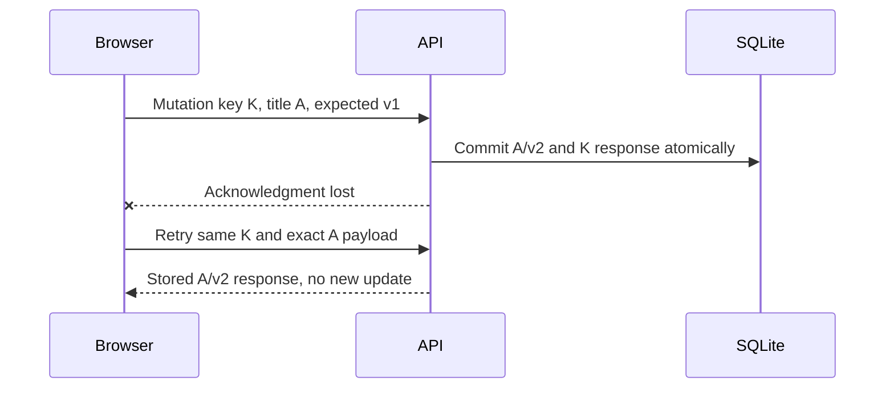
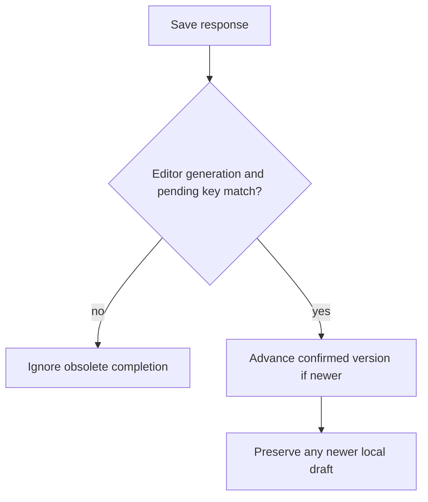

# Assessor · bookmark race schedules

Use [candidate material](../candidate/full-stack.md). Keep these schedules and
[browser fixtures](../../curriculum/02-applications/03-frontend/labs/bookmark-editor/tests/browser.mjs) closed until
release. In repair mode remove a generation guard or the `revision === mutation.revision`
condition only in a disposable candidate copy; keep an exact patch and baseline failure.
Do not change the reference repository to create the assessment.

| Release / held-back schedule | Required observation |
|---|---|
| Save `Apricot`, then type `Blueberry`, then A succeeds | Confirmed Apricot/new version; draft Blueberry remains dirty |
| Same typing schedule, concurrent writer advances server first | 409 retains Blueberry; current server copy shown; keyboard conflict action has focus |
| GET old v1 held; PATCH v2 succeeds; type C; release old GET | Neither confirmed version nor C regresses |
| Server commits A; drop response; type B; retry | Reuses identical key/payload; returns duplicate success; exactly one version increment; B retained |
| Close/select another item before old response, transport ignores abort | No stale form mutation; focus returns to opener or search |
| Search Alpha then Beta, reverse completion; empty search; 503 then retry | Latest results, explicit empty/error/retry states, no Bob row |
| Page size 1; b/a share timestamp 100 | b, a, c exactly once; cursor includes ID tie-breaker |

| Dimension | Weak: 0–1 | Adequate: 2 | Strong: 3 |
|---|---|---|---|
| State correctness | One title/version variable; B overwritten | Separates draft/confirmed/pending/generation and retains B | Survives held-back refetch, retry and ignored-abort schedules with causal tests |
| Server correctness | In-memory fake only; trusts owner from payload | Real SQLite, owner/version predicates, stable tied cursor | Atomic replay record, concurrent-writer test and malformed input checks |
| UX/testing | Mouse-only happy path, silent failures | Named controls, live feedback, keyboard conflict focus/retry | Tests actual visible state and disposal; explains screen-reader audit limits |
| Performance | Adds cache/memoization without measurement | Runs query plan and latency comparison on defined data | Equal-result before/after experiment; discusses index write cost and search limits |
| Lead contracts | Replaces every client at once | Versioned compatible API and clear client/data ownership | Staged rollout, conflict/replay metrics, retention and rollback criteria |

Failing approaches: replace draft on every response; retry 409 unchanged forever; new
key on uncertain retry; compare owner only in browser; cursor only on timestamp;
release resources merely because AbortController was called. Ask for the failing trace.

Debrief: [state table and method](../../curriculum/02-applications/03-frontend/labs/bookmark-editor/README.md),
[search generation](../../curriculum/02-applications/03-frontend/labs/search-race/README.md),
[runtime cancellation](../../curriculum/02-applications/01-backend/labs/bounded-executor/runtime.md). For the second
occasion use an editable inventory quantity with zero/null semantics and reordered
autosave responses. Never count tests copied from the reference as independent evidence.
