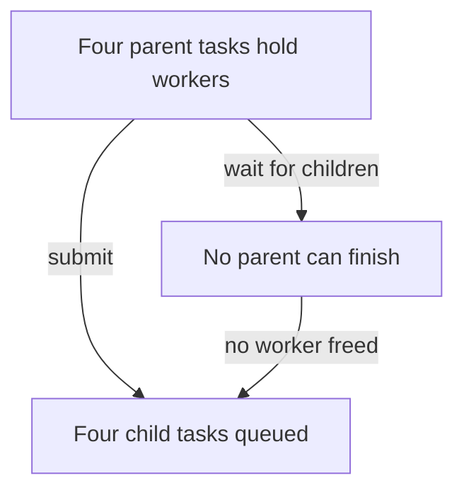
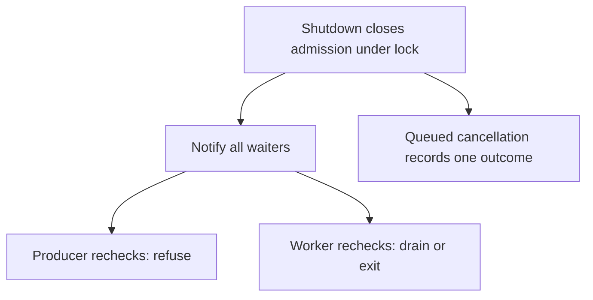

# Assessor · executor cancellation and deadlock

Give [the candidate](../candidate/infra.md) the baseline only. Test the candidate's own
implementation with controlled barriers; reference code checks are a different activity.

| Release | Held-back schedule | Expected result |
|---|---|---|
| 25 min | Four tasks held, eight queued, producer blocked; shutdown cancels queue | Producer wakes/refused; eight cancellations; four running tasks finish; accepted=completed afterward |
| 35 min | One task raises, then another is submitted | Worker/permit released in exception-safe path; next task executes |
| 45 min | All four parents submit child to same pool and wait | Demonstrate deadlock; reject same-pool submission or defend a different explicit execution policy |
| 55 min | Fake clock advances past admission deadline with full queue | Refuse admission without creating a task; no task loss or phantom completion |
| 60 min | Running callable ignores cancel; shutdown timeout expires | Cancellation request does not free its active resource; report still running |
| Lead | Twenty replicas, four workers each, dependency capacity 40 | Up to 80 active locally; allocate fleet/tenant budgets, headroom and overload policy |

| Evidence | Weak: 0–1 | Adequate: 2 | Strong: 3 |
|---|---|---|---|
| Safety | Queue overfills; duplicate/missing completion | Atomic admission, bounded active/queued, one terminal per task | Conservation invariant checked through exception/cancel/deadline paths |
| Liveness | Sleeps in tests; shutdown leaves blocked producer | Predicate loops, notify on closure/slot release, explicit assumptions | Deterministic deadlock demonstration and safe nested-work policy |
| Runtime | Equates promises with CPU parallelism; force-cancels by timeout | Distinguishes event loop/threads and cooperative cancellation | Identifies resource ownership after timeout and cross-process limitations |
| Lead scope | Multiplies replicas without budget | Calculates aggregate concurrency and tenant policy | Explains fairness tradeoffs, recovery admission and measurable overload decisions |

Failing approaches: `if` instead of predicate `while`; hold lock while calling user
code; forget `finally`; immediately mark running task complete at cancellation;
increase queue size to fix nested dependency deadlock. Compare the causal schedule,
not a preferred primitive. Debrief [executor invariants](../../curriculum/02-applications/01-backend/labs/bounded-executor/README.md)
and [runtime](../../curriculum/02-applications/01-backend/labs/bounded-executor/runtime.md). Second occasion: replace
task-count queue capacity with byte-weighted admission and mixed-size tenants.
