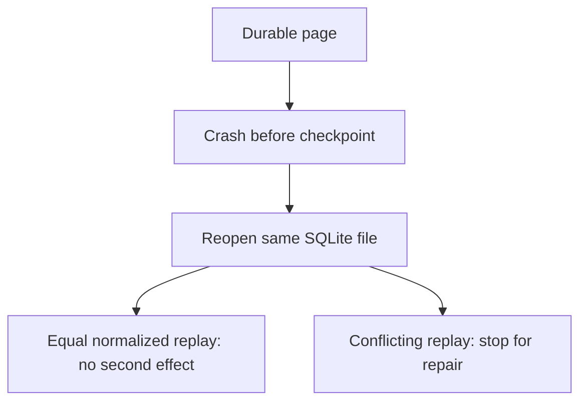
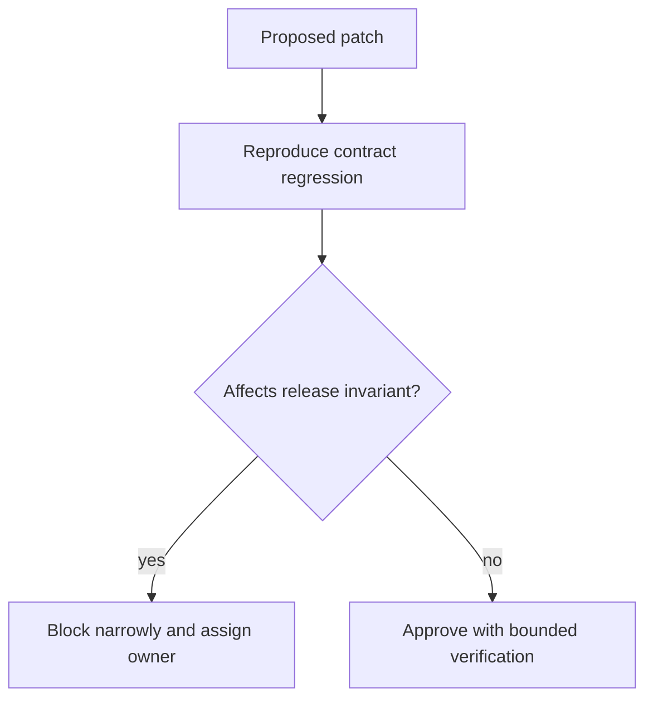

# Assessor · importer diagnosis and review

Give [candidate material](../candidate/practical-debug.md), then use the
[repair key](../../curriculum/02-applications/04-testing/labs/importer/assessor.md). Candidate-visible regressions
are not the held-back test set. Run [the additional fixtures](heldback_importer.py)
only after the candidate has repaired its baseline:

```sh
python practice/assessor/heldback_importer.py --package starter
```

| Release | Held-back evidence | Expected result |
|---|---|---|
| Core executes | `p2 → p3 → p2`, not just a self-loop | Reject cycle after 3 requests |
| 30 min | 429 at t=0.3, Retry-After 0.8, deadline t=1 | Refuse retry; no second request |
| 45 min | Crash after durable page, then reopen DB; equal decimal spellings `0.290` and `0.29` | Exact normalized replay; no duplicated cents |
| 55 min | Late malformed row following a valid new row | Entire page rejected; previous checkpoint retained |
| 60 min | [Three PRs](../../curriculum/02-applications/04-testing/labs/importer/review/README.md) | Block conflict suppression and early retry; approve bounded non-payload metadata with check |



| Evidence | Weak: 0–1 | Adequate: 2 | Strong: 3 |
|---|---|---|---|
| Debug method | Rewrites before reproducing; blames API for syntax failure | Distinguishes build, logic and integration boundaries | Uses minimal counterexamples to reject plausible competing explanations |
| Correctness | Floats/truncates cents, skips pages, hides conflicts | Exact money, bounded pagination/retry, safe restart | Tests multi-hop cycles, late page conflict rollback and normalized replays |
| Testing | Green reference tests presented as own work | Candidate code passes stated cases plus own regression | Hidden fixture survives without code rewrite; failures are explained precisely |
| Lead review | Blocks all PRs or bikesheds style | Prioritizes data correctness and assigns partner contract owner | Narrow rollback/migration plan with monitoring, ownership and completion criteria |

Failing approaches and their exact regressions are in the repair key. Do not reward
an enormous rewrite that accidentally passes without explaining checkpoint order.
For a strong result the candidate must state that fake transport timeouts only check
the transport interface; they do not prove cancellation of a real HTTP client.



Debrief: [domain identity](../../curriculum/01-code/02-data-structures-algorithms/lessons/01-maps.md),
[importer method](../../curriculum/02-applications/04-testing/labs/importer/README.md),
[runtime/budgets](../../curriculum/02-applications/01-backend/labs/bounded-executor/runtime.md). Next occasion use
inventory units and a cursor that encodes shard+offset; keep baseline requirements
unseen. See [fully scored examples](scored-examples.md).
