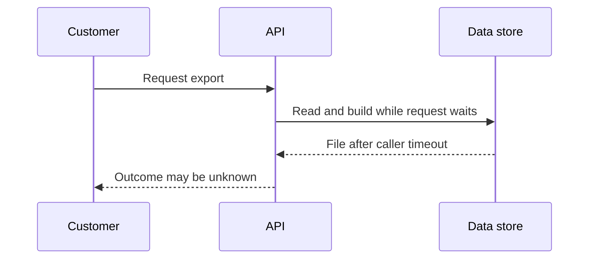
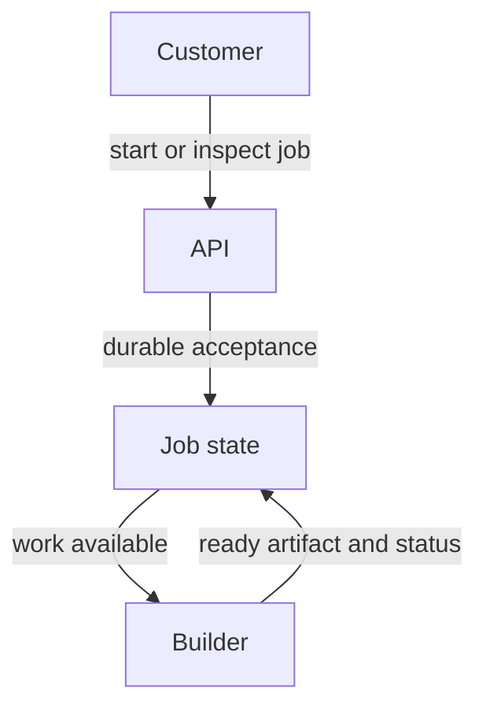

# Candidate · private export service

> “Customers export their private bookmark libraries as downloadable files. Today a
> request stays open until the file is ready and times out after 30 seconds. Design
> an asynchronous flow that reports progress and never serves another owner's file.
> Which promises should the API make when the caller disconnects?”

Constructed 50-minute design session. Prerequisites: [architecture concepts](../../curriculum/03-production/01-system-design/mechanism-reference.md)
and [queue delivery](../../curriculum/03-production/03-infrastructure/aws/labs/job-pipeline/README.md), studied before session day.
This is a build/design brief, not a claim of a supplied export application.

| Contract | Expected starting behavior |
|---|---|
| Load | 20 export starts/second; average file build 10 seconds; 10 MB typical file |
| Example | POST export → 202 plus job ID; GET job → queued/running/ready/failed |
| Durability | Acknowledged request can be found after client reconnect |
| Ownership | Only the authenticated owner can inspect job or download the artifact |
| Boundary | Duplicate start with the same request identity follows a declared policy |
| Excluded | Global active-active, paid billing and exactly-once email |

Restate the user-visible contract and assumptions, calculate a toy concurrency/storage
budget, draw baseline state ownership, and trace success plus one crash. Then replace
the boundary causing timeout; show durable acceptance, work ownership, status and
authorization. Expected baseline reasoning: 20/s × 10s implies roughly 200 concurrent
builds at that sustained arrival rate before accounting for variance/headroom; this is
not an instruction to open 200 database connections.

At minute 20 the assessor supplies a failure trace; at minute 35 the requirement changes
across teams. Ask questions before adding services. Provide schema/key choices, a state
transition condition, rejected alternative and recovery test. Senior scope is a coherent
critical path with failure/authorization semantics. Lead scope retains that floor and
adds interface owners, rollout sequence, compatibility and measurable completion criteria.
