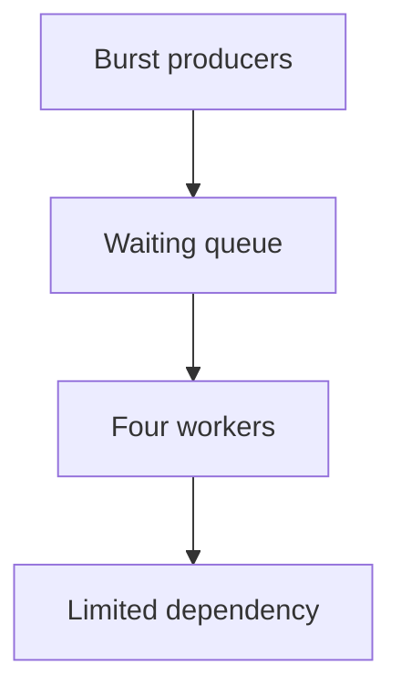
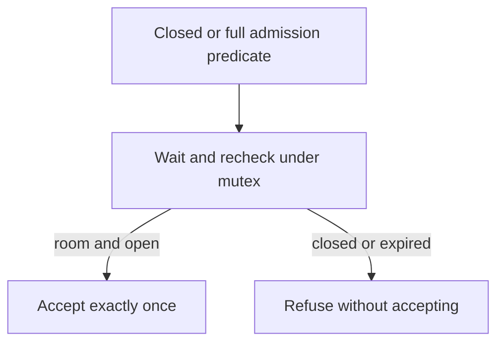

# Implement bounded report execution and shutdown

A reporting service accepts jobs that need a limited downstream resource. Four jobs may run and eight may wait. Callers need to know whether their submission was accepted, and what happens to accepted work when shutdown starts. Implement that in-process contract using the allowed threading primitives.

> “The report service starts unlimited work during a burst. Limit it to four active
> tasks and eight waiting tasks. Shutdown must wake blocked producers, and a task
> failure must not leak capacity. What promise starts when submit returns a handle?”

Constructed 70-minute backend/infra session. Standard-library threading primitives are
allowed; keep the [reference executor](../../curriculum/02-applications/01-backend/labs/bounded-executor/executor.py)
and its tests closed. Prerequisite on a previous day:
[runtime and local/fleet limits](../../curriculum/02-applications/01-backend/labs/bounded-executor/runtime.md).

| Contract | Expected behavior |
|---|---|
| Capacity | Four active + eight queued; next producer blocks |
| Handle | Each accepted task reaches exactly one terminal outcome |
| Failure | Callable exception becomes that task's outcome; workers continue |
| Shutdown | Close admission, cancel or drain queued work as specified; running work cooperates |
| Deadline | One absolute budget covers waiting admission and task execution |
| Excluded | Killing arbitrary threads, process durability and fleet coordination |

Worked expectation: hold four workers at a barrier, queue eight, start a ninth queued
submission. Before releasing workers, active=4, queued=8, accepted=12 and that producer
has no handle. Use this trace to derive your condition predicates and accounting.
Implement the minimal path, then add exception, cancellation and shutdown behavior.

At minutes 25 and 45 the assessor changes the schedule. State safety and liveness
separately; use barriers/events or a fake clock rather than sleeps as your only test.
Expected baseline evidence: bounded active/queued work, no lost accepted task and no
lock held across arbitrary user code. Senior scope includes runnable shutdown/cancel
tests. Lead scope adds fairness, tenant/dependency budgets and composition across replicas.
