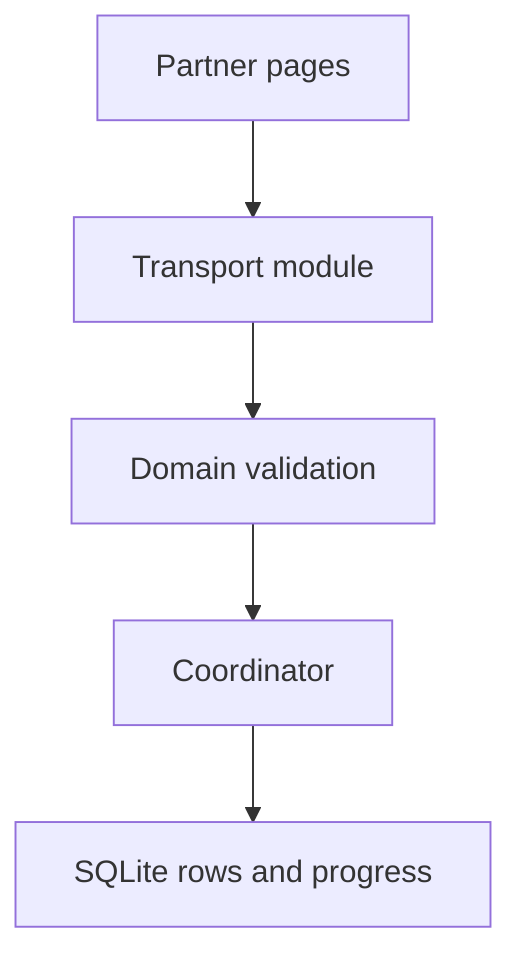
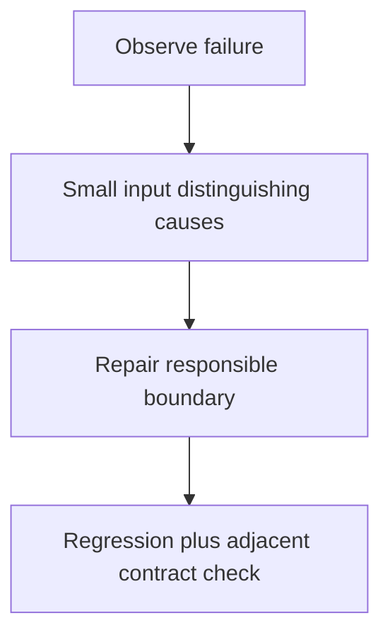

# Candidate · complete the transaction importer

> “You inherit a partner importer. The test command fails before the first request,
> and finance reports missing cents and skipped work after restart. Make one narrow
> repair at a time, then show what each change proves.”

Constructed 75-minute session. Candidate files: importer `starter/`,
`fixtures/basic.json`, `test_importer.py` and `baseline.txt` only. Do not read
`reference/`, `assessor.md` or held-back fixtures. Work in `starter/`.

| Contract | Expected behavior |
|---|---|
| Pages | `items`, opaque `nextCursor`, final null; no infinite traversal |
| Example | `a:"0.29"`, `b:"-1.10"`, repeated equal a and `c:"0.00"` → 29, -110, 0 cents |
| Money | USD decimal strings with exact integer cents; unsupported precision rejected |
| Restart | Same page may replay; equal IDs have equal effect; conflicting IDs fail |
| Budget | 100 pages, 3 attempts/page, one 5-second total retry/transport budget |
| Excluded | Concurrent importer processes, real payment execution and external network deployment |

```sh
cd curriculum/02-applications/04-testing/labs/importer
PACKAGE=starter python -m unittest test_importer -v
```



Record the first observed failure before editing. Map the call path, state a falsifiable
hypothesis, run the smallest distinguishing fixture, and add a regression. The interviewer
will release additional partner behavior after the core runs. Explain competing causes
you ruled out, not merely the final diff. Baseline expected values are in the table;
the planted failing command is intentionally not a passing implementation.



At the end, review three supplied PRs without broad rewrites. Senior evidence is
correct runnable behavior, evidence-based debugging and bounded failures. Lead scope
adds contract owners, safe rollout and the smallest release-blocking change. Afterward
use [the lab method](../../curriculum/02-applications/04-testing/labs/importer/README.md) for debrief.
