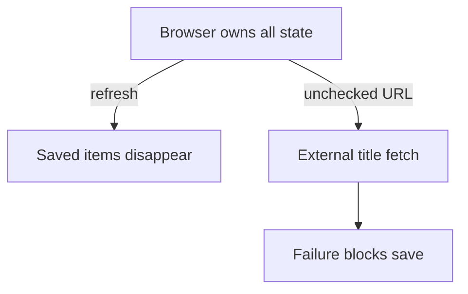
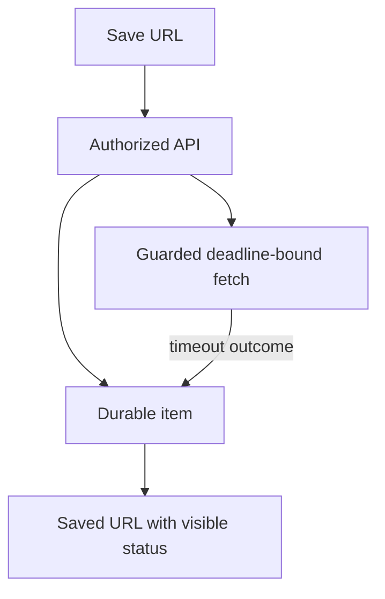
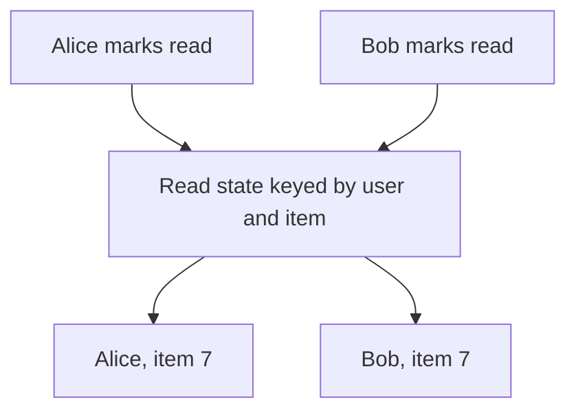
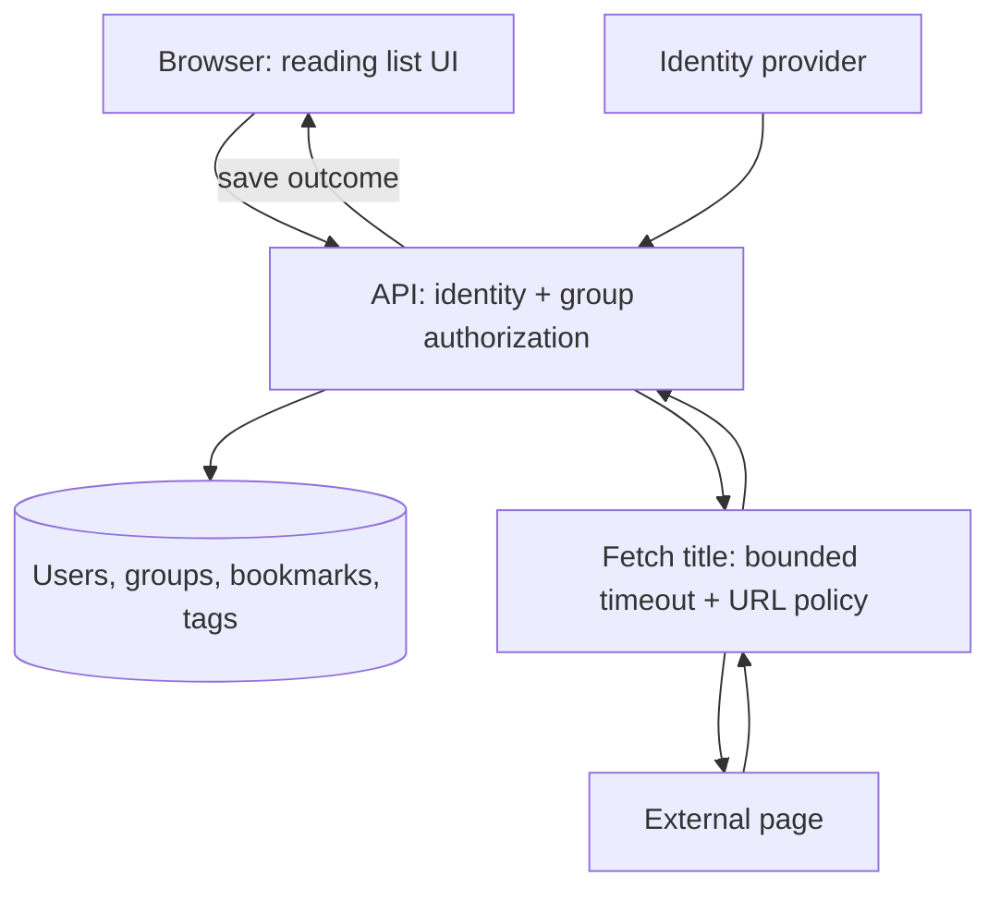

# P1 · it works

## The reviewer's brief

> A small reading group wants to save URLs, see everyone’s items, and track personal reading. A missing title must not lose the saved URL. Build this first version and explain which data the server, browser and external page each control.

This is a **constructed practice brief**, not an attributed company question.
Prerequisites: [the junior chapters](../../tiers/01-junior/01-the-change-loop/README.md). This page is a build brief; it does not ship a runnable application. The original build and prompt sequence below defines the implementation checkpoints.

| Case | Exact input or workload | Expected outcome |
|---|---|---|
| Small example | Alice adds URL U as item 7; Bob reads it; Alice marks it read. | Both members can view item 7; only Alice’s read state changes; title failure leaves U saved with a visible outcome. |
| Boundary / failure | Bob directly sends DELETE item 7, or a URL points to loopback. | Owner check refuses deletion; guarded fetch refuses the internal destination without losing the item. |
| Scope | One group, persisted data, explicit duplicate policy and accessible forms; no ranking or notifications. | Explain any additional assumption before implementing it. |

Before looking at the guidance, state the invariant in one sentence and trace the example. In interview practice, implement or sketch independently, then reveal the reasoning. On the AI path, use the prompts below and verify each checkpoint before the next request.

## Baseline and the failure to explain



The baseline loses state on refresh and makes a remote page an authority over whether local data can be saved.

<details>
<summary>Reveal the approach and decisions</summary>

First define ownership and the person-item read relation, then persist an authorized item before treating enrichment as optional. Bound and guard fetching. The invariant is durable owner-scoped data with separate personal state; UI checks must be backed by server checks.

</details>

## Follow-up 1 · The title never arrives

**Changed requirement:** A remote page hangs for sixty seconds. How does the save remain useful? Predict which boundary must change before opening the design.

<details>
<summary>Expected reasoning and changed diagram</summary>

Give the synchronous fetch a small total deadline and save a visible title-failed/pending state. A later durable queue is an explicit next stage; do not leave untracked in-process background work.



</details>

## Follow-up 2 · Two people update their read state

**Changed requirement:** Alice and Bob mark item 7 read at the same time. Which rows change? State what evidence would make you reject your first design.

<details>
<summary>Expected reasoning and changed diagram</summary>

Upsert separate `(user_id,item_id)` read-state rows. Verify group membership at the server and test that reversing either user’s action does not change the other.



</details>

## Evidence to bring to review

Build in three stops: reproduce the small case and baseline failure; implement the protected boundary; then replay both changed requirements with captured outputs. Record commands, fixtures, and observed results in your implementation README. A diagram is a prediction until those checks run.

**Senior expectation:** Run the clean-clone application, direct authorization checks and accessible main flow. **Additional lead scope:** Explain membership changes and the first operational handoff. Completion demonstrates practice evidence; it does not establish interview readiness or multi-team delivery experience.

## Supplied mechanism practice

- [Runnable browser/API/store slice](../../paths/interviews/full-stack/bookmark-editor/README.md) — includes its own run command, fixtures and validation limits.

These exercises verify specific boundaries; completing their reference tests does not implement or assess the full project.

## Build and prompt sequence

> Junior tier · fed by sections 01-07 · the question is **can you build the thing at all?**

A shared reading list. People sign in, add a URL, the system fetches the page
title, they tag it and mark it read. Everyone in the group can see what the
group is reading.

That is the whole feature set. Resist adding to it. Everything you are tempted
to add here — search, ranking, notifications, an AI summary — is an exercise in
a later project, and adding it now means doing it badly before you know why the
hard version is hard.

## What done means

Check these yourself. Each one is observable; none of them is "it feels
finished."

- [ ] A person who is not you can sign up, sign in, and sign out.
- [ ] Signed in, they can add a URL. The system fetches the page and stores the title.
- [ ] They can tag an item, mark it read, and remove one they added.
- [ ] They **cannot** delete or edit somebody else's item. You have a test that proves this, and the test fails if you remove the check.
- [ ] Refreshing the page does not lose anything. State lives in the database, not in the browser.
- [ ] A URL that 404s, times out, or returns HTML with no title still results in a saved item, with the failure visible rather than swallowed.
- [ ] The whole thing runs from a clean clone with one documented command.
- [ ] The test suite runs in under a minute and goes red when you break something on purpose.
- [ ] Nothing secret is in the repository. Not the database password, not a session key, not an API token.
- [ ] Keyboard alone gets you through the main flow, and every form field has a label.

If you finish early, the stretch is **not** more features. It is deleting code
until the same criteria still pass.

## The decisions you are being asked to make

Write down your answer to each of these before you build it, in a file in the
repo. Three sentences each. The point is that you decided rather than defaulted.

1. **Where does session state live?** A cookie with a signed session id, or a token in local storage? What does each choice cost you when a laptop is stolen, and which one can you revoke?
2. **What is your data model?** Is a tag a column, a string, or its own table? What breaks when two people tag the same item differently?
3. **What owns "read"?** Is it a property of the item or of the person-item pair? You will get this wrong if you answer it quickly.
4. **What happens when the fetch is slow?** Do you make the user wait, or accept the item and fill the title in later? Both are defensible. One of them is a queue, and you are not building a queue yet — so what is the honest version?
5. **Where do errors go?** When the fetch fails, does the user see it, does a log see it, or does nobody see it? "Nobody" is the default if you do not choose.

## Working with Claude on it

Order matters more than phrasing. This sequence works:

**1. Make it describe the thing back to you before it writes anything.**

```
I am building a shared reading list: sign-in, add a URL, fetch its title,
tag it, mark it read, see the group's list.

Before writing any code, write the data model and the list of endpoints,
and tell me the three decisions in this design most likely to be wrong.
Do not write code yet.
```

Why: the design is where the expensive mistakes live, and it is the cheapest
thing to change. Asking for the three most likely to be wrong gets you the
model's own uncertainty, which is information you cannot get any other way.

**2. Build it in slices that each end somewhere runnable.**

```
Implement just: a user can sign up and sign in. Nothing else.
Include the tests. Stop when I can run it and log in.
```

Why: a slice you can run is a slice you can check. Asking for the whole app in
one go gives you something you must either accept whole or debug whole.

**3. Make the authorisation rule explicit, and make it prove itself.**

```
Add the rule that a person can only edit or delete their own items.
Write the test for somebody else's item FIRST and show me it failing
before you add the check.
```

Why: this is the one rule in P1 whose absence is invisible. Everything else
breaks loudly.

**What to keep for yourself:** the decisions list above, and the acceptance
criteria. Do not ask Claude what "done" means for your project. If you delegate
the definition of done, you have delegated the only thing that was yours.

## How you would know it is wrong

1. **Try to break the authorisation rule by hand.** Sign in as one user, take the id of another user's item, and send the delete request directly. You should get a refusal, not a deletion. If you have only ever tested it through the UI, you have tested the button, not the rule.
2. **Turn the network off and add a URL.** The failure should be visible and the item should still be in a sane state.
3. **Grep your own repository for secrets** before every push, and know what you are grepping for.
4. **Run it from a clean clone in a fresh directory.** The number of projects that only run in the folder they were built in is very large.
5. **Put a deliberate bug in and watch the suite go red.** If it does not, the suite is decorative. See [06 · Testing](../../tiers/01-junior/06-testing/).
6. **Tab through the whole flow.** Verify add, error, conflict and focus behavior with a keyboard and the intended accessibility tools. This exercise tests usability; legal scope requires separate jurisdiction-specific review.

## Break it on purpose

Do all four. Write down what you saw.

| do this | what should happen | what it teaches |
|---|---|---|
| point it at a URL that hangs for 60 seconds | the request gives up on a timeout you chose, not one the library chose for you | every outbound call has a timeout; if you did not pick it, you inherited one |
| stop the database while the app is running | clear failure, no half-written rows, recovers when the database comes back | a dependency being down is a normal state, not an exception |
| add the same URL twice | you decide: duplicate, reject, or merge. Any is fine. Not deciding is not. | idempotency starts here, long before queues |
| restore a deleted item from your backup | you find out whether you have a backup | you almost certainly do not yet |

## What P2 will do to this

P2 takes this exact system and asks: can someone else run it, and can you fix it
at three in the morning without a screen share? You will add delivery,
infrastructure as code, and enough observability to answer "what happened?"
without guessing.

So do not skip the boring parts here. Everything you leave loose in P1 is
something P2 makes you tie down while it is moving.

## Architecture rehearsal · The smallest complete reading-list architecture



**Draw the failure:** Draw the failed-title-fetch response. A slow external page must not make every save wait forever.


[Static view](../../assets/learning/deadline-budget-still.svg)
