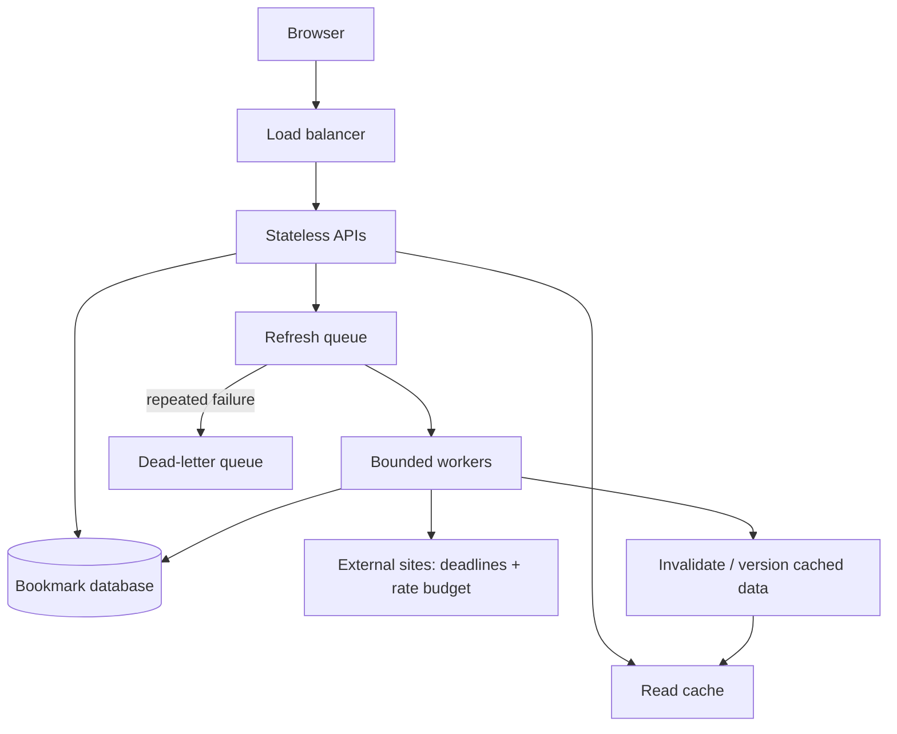

# P3 · it holds under load

> Senior tier · fed by sections 09, 13, 14 · the question is **what happens when it is busy, and when a dependency dies?**

Same reading list. Now make it behave when it is under pressure and when the
things it depends on stop working.

There is one new feature, and it exists only to create the pressure: the system
now fetches and re-checks links in the background — titles change, pages go
away, and somebody wants a weekly refresh. That gives you bursty writes, a slow
external dependency you do not control, and work that must survive being
retried. Everything else in this project is about what that does to you.

## What done means

- [ ] Link fetching happens on a queue, not in the request. The user's action returns immediately.
- [ ] The queue has a **bound**. You know what happens when it is full, because you chose it.
- [ ] Submitting the same URL twice results in one item and one fetch. You proved it by doing it.
- [ ] Every outbound call has a timeout you picked, a retry policy at exactly one layer, and jitter.
- [ ] When the external site is slow, your system stays responsive. It degrades rather than stopping.
- [ ] There is a cache, it has stampede protection, and you demonstrated the protection working.
- [ ] You measured throughput and latency under load, and you have the numbers written down.
- [ ] You know what breaks first, because you pushed it until something did.
- [ ] Rate limiting exists and returns something honest rather than dying.

## The decisions you are being asked to make

1. **What is the unit of work on the queue?** "Fetch this URL" or "refresh this item"? One of those is idempotent and one needs care. Say which and why.
2. **What happens when the queue is full?** Reject, shed, or block? Each is defensible; blocking is how a queue becomes a memory leak with a scheduler.
3. **What is your retry policy, and at which layer only?** Write the number of attempts and where jitter goes. Retrying at two layers multiplies, and three layers of three attempts is twenty-seven requests from one click.
4. **What does the user see while the fetch is pending?** This is a product decision and it is yours, not the queue's.
5. **What is stale-but-acceptable?** A cached title from an hour ago is fine. A cached authorisation decision from an hour ago is a security bug. Say where the line is.
6. **What do you shed first when you cannot serve everything?** Rank your request types before you need to.

## Working with Claude on it

**1. Make the failure modes explicit before the queue exists.**

```
I am moving link fetching out of the request and onto a queue.

List what can now go wrong that could not go wrong before. Include the
ones that are invisible: work silently lost, work done twice, work
backing up with nobody noticing.

Do not write code yet.
```

Why: a queue converts a slow synchronous failure into a fast success plus a
silent asynchronous failure. Naming that list before you build is the difference
between designing for it and discovering it.

**2. Prove the idempotency rather than asserting it.**

```
Make the fetch idempotent. Then write a test that sends the same job
twice, concurrently, and asserts the side effect happened exactly once.

Show me that test failing against the current code first.
```

Why: "it is idempotent" is a claim about a race. The only version worth
believing is one where two concurrent copies were actually run.

**3. Find the first thing to break, do not guess it.**

```
Write a load test that ramps up until something fails. Report what failed
first, at what rate, and what the failure looked like from the outside.

I want the actual limit, not a target.
```

Why: everyone assumes it will be the database. Frequently it is the connection
pool, the file descriptors, or the external API's rate limit. Guessing sends you
to optimise the wrong thing.

## How you would know it is wrong

1. **Expire a hot cache key under load** and watch what hits the database. If a hundred requests all miss and all recompute, you have a stampede and you just saw it.
2. **Stop the worker and keep submitting.** Watch the backlog. Does anything tell you it is growing? If not, that is your invisible failure.
3. **Send the same job twice, concurrently** — not sequentially, that is the easy case — and check the effect happened once.
4. **Point the fetcher at something that hangs forever.** Your timeout should fire. Time it, and compare to what you thought you configured.
5. **Count actual outbound requests during a failure**, not attempts you intended. Retry amplification is only visible from the outside.
6. **Run the load test twice and compare.** If the numbers move a lot, you are measuring your laptop's mood, not the system.
7. **Turn the external dependency off entirely.** The product should still work, minus the thing that depends on it. If everything stops, you have not degraded, you have coupled.

## Break it on purpose

| do this | what should happen | what it teaches |
|---|---|---|
| make the external site respond in 30 seconds | your timeout fires; the queue drains slower; nothing else notices | timeouts are the boundary between one slow thing and everything being slow |
| kill the worker mid-job | the job is retried and completes once, or it is visibly dead | at-least-once plus idempotent is the only combination that survives this |
| submit 10,000 items at once | the queue bounds, sheds or rejects — by your choice, loudly | an unbounded queue is not resilience, it is deferred failure |
| block the cache from being written | the system gets slower and stays correct | a cache must be an optimisation, never a correctness dependency |

## What P4 will do to this

P4 adds a model to the system — a summary, a suggestion, something that
reasons — and then makes you prove it is any good. The AI call is another slow,
expensive, unreliable external dependency, and everything you built here applies
to it directly.

The new part in P4 is that its failures are not timeouts. They are plausible
wrong answers, which nothing in this project would have caught.

## Architecture rehearsal · Separate interactive reads from refresh work



**Draw the failure:** Kill an external dependency. Draw which work continues and where the backlog becomes visible.


[Static view](../../assets/learning/backpressure-still.svg)
