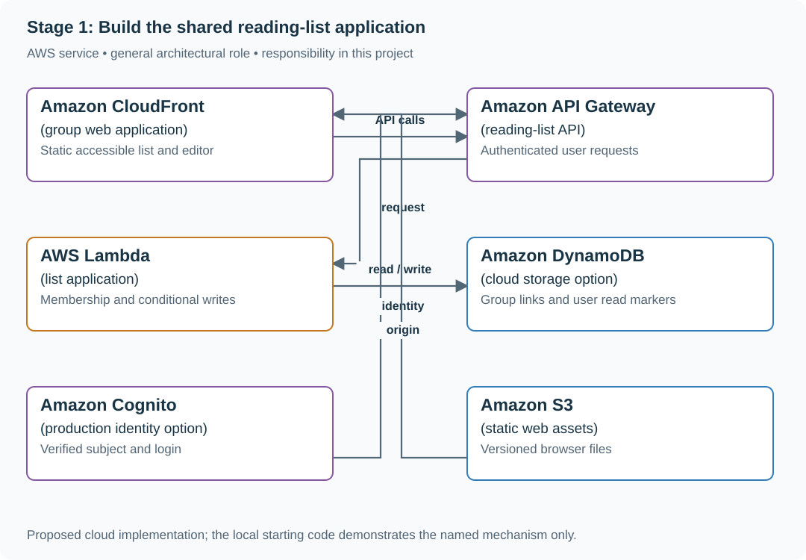

# Stage 1: Build the shared reading-list application

## Application background

Alice and Bob save documentation links for their study group. Both can browse shared URLs and notes; each has separate reading progress, and only a note's owner edits it.

This is a fictional engineering scenario. The workload figures later in the page are exercise assumptions, not measured production traffic.

## Your assignment

**Deliver:** A persisted, authorized browser-to-API reading list built from the supplied local server, with save/list/edit/read-state flows.

Build the first usable version of a reading list for Alice and Bob’s study group. They can save links, browse shared notes and track their own reading. A failed title lookup must not lose the saved URL, and one member must not edit another member’s private fields.

**Required behavior:** Complete one authenticated create→list→edit journey. Group membership controls visibility, ownership controls the chosen edit policy, and read state belongs to each user. Optional metadata failure remains visible without undoing the save.

The required first milestone is a working local implementation of the behavior above. The numbered implementation steps define the scope; the cloud architecture is a later extension, not something the starter has already provisioned.

## Get the code and run the supplied example

The code is in the public [junior-to-staff repository](https://github.com/Soulful-Iris/junior-to-staff). Install Git and Python 3.12+. No AWS account or Python packages are required for this first run. If you already have a checkout, use it and skip cloning.

```bash
git clone https://github.com/Soulful-Iris/junior-to-staff.git
cd junior-to-staff
python3 examples/architecture-starts/reading_list_it_works.py
```

**Supplied file:** [`examples/architecture-starts/reading_list_it_works.py`](https://github.com/Soulful-Iris/junior-to-staff/blob/main/examples/architecture-starts/reading_list_it_works.py). You can also [read or download the source here](../../../../examples/architecture-starts/reading_list_it_works.py).

This program is a **mechanism demonstration**: it runs the small scenario in one process and prints the result. It is not an HTTP service, a complete application, or an AWS deployment. A successful run demonstrates this mechanism only; it does not establish the workload or failure guarantees of the application you will build.

**Example output from the supplied run:**

Generated IDs and timestamps may differ; compare the state transitions and outcomes.

```text
Saved despite missing title: [(7, 'alice', 'https://example.invalid/guide', None)]
Personal progress: [('alice', 7, 1), ('bob', 7, 0)]
```

### Run the application you will extend

The [reading-list API setup guide](../../../../examples/reading-list-starter/README.md) gives you a real local HTTP server, SQLite database, save/list/edit requests and controlled title success/timeout behavior. Start it in one terminal and send the documented `curl` requests from another. Read that setup before following the implementation steps below. The demo above isolates this lesson's mechanism; the server is where you integrate it.

For a first run, start this in **terminal 1** from the repository root:

```bash
python3 examples/reading-list-starter/app.py --db /tmp/reading-list.sqlite3
```

In **terminal 2**, save one bookmark with a controlled title timeout:

```bash
curl -i http://127.0.0.1:8080/bookmarks \
  -H 'X-Demo-User: alice' -H 'Content-Type: application/json' \
  -d '{"url":"https://example.com/docs","title_mode":"timeout"}'
```

Expect **201 Created**, a bookmark `id` and `title_status: "timeout"`. The URL is persisted despite the title failure. This is the supplied baseline; the assignment adds the behavior described above. The lookup is a fixture, so no external website is contacted. For members Bob or Ben in a scenario, use the starter's second demo identity `bob`; Alice or Ana corresponds to `alice`.

Work in your own branch or copy `examples/reading-list-starter/` to `work/01-it-works/`. `app.py` exists in that directory; add the modules named below there as you separate HTTP, storage and background work. The server has demo membership, not production authentication.

## Local components and state to implement

This table names the records, interfaces or decision inputs for your deliverable. Unless a name is explicitly linked to supplied source above, it is something you create. Implement the local state transitions first, then connect the HTTP, storage or worker boundaries required by the steps.

| Record / module | Key or interface | Responsibility |
|---|---|---|
| links | group_id,link_id,owner,url,note,version | Shared list records with explicit edit ownership. |
| read_state | user_id,link_id,read_at | Personal progress. |
| title_jobs | link_id,source_version,state | Optional enrichment separate from durable save. |

## Implement the assignment

### 1. Create the smallest application layout

Put HTTP routes in app.py, database operations in store.py and the browser page in web/. Add a migration for links, membership and personal read state. Start with a local database and two seeded users; production identity is a later adapter, not a client-supplied owner field.

### 2. Implement save and list end to end

POST a URL, commit it and return its ID/version. GET the group list under verified membership. Render the saved URL even if the title is missing. Show validation errors without clearing the form and use a stable request ID for a retried save.

### 3. Add personal state and conditional edits

Mark read/unread for the current user only. Require expected version for shared note edits and preserve a losing draft. Enforce the selected owner/editor policy in the database query, not just by hiding an edit button.

### 4. Make the first release inspectable

Provide one command to start the local app and a short create/list/edit walkthrough with expected responses. Capture a failed title lookup and show the row still exists. Record the first operating limits and the next stage’s persistence/recovery needs.

## Demonstrate the completed local result

| Action | Expected visible result |
|---|---|
| Run the starting program | Link 7 exists with no title, while Alice and Bob have different read states. |
| Fail title lookup after save | The URL remains visible with pending/unavailable metadata. |
| Edit with another user’s identity field | Server-side authority ignores the forged owner. |

**Handoff:** In your implementation README, include the start command, one successful operation, the failure case above and the resulting stored state or decision. State which dependencies are simulated. Someone with a fresh checkout should be able to reproduce this without your chat history.

## Workload assumptions and capacity decisions

These are constructed exercise assumptions. The stated workload is a design target; the local demonstration does not establish that throughput. Use the [estimation constants](../../../../curriculum/01-code/01-problem-solving/estimation-constants.md) to check units before choosing capacity.

| Input or objective | Calculation / consequence |
|---|---|
| Two initial users; 200 group links | A single local relational database is sufficient for the first working application. |
| Two personal read markers per link | Up to 400 read-state rows; one shared is_read field cannot represent both users. |
| 500 ms list target assumption | Read stored data locally; remote title fetching is outside the critical list path. |

## Map the local implementation to AWS

**Deployment status: local only.** Running the supplied command creates no AWS resources and configures no cloud connections. The diagram is a proposed deployment of the completed application. Each box needs either a deployed runtime, a provisioned service or an explicitly external dependency.

Read the diagram by following the arrows from the entry point: application code accepts the request or event, the state owner commits it, and any worker produces the later result. The table ties those roles to code and adapter work. Multiple boxes do not imply multiple Python files already exist.



The AWS option maps the same application boundaries onto managed services. The first deliverable remains a working local user journey, so infrastructure work does not hide an unfinished save/list contract.

| Local responsibility | Cloud destination and role | Implementation still required |
|---|---|---|
| Local static/media delivery path | Amazon CloudFront: group web application | Configure an origin, cache policy and private-content access; distinguish cached bytes from current authorization. |
| Local HTTP boundary or the endpoint you will add | Amazon API Gateway: reading-list API | Create routes and an integration; translate requests and responses and configure identity validation. |
| Python operation or worker function | AWS Lambda: list application | Write a Lambda event adapter, package its dependencies and give its role only the required resource actions. |
| Local dictionary, SQLite records or state model | Amazon DynamoDB: cloud storage option | Design partition/sort keys and write a storage adapter with conditional updates or transactions; Python state and SQL are not uploaded as a database. |
| Local fixture identity or caller supplied to the operation | Amazon Cognito: production identity option | Configure an identity provider and validate tokens; retain resource ownership checks in application code. |
| Local file, object fixture or exported payload | Amazon S3: static web assets | Implement upload/download and metadata adapters, scoped access, object naming, retention and incomplete-upload cleanup. |

### Provision resources, then connect the application

| Resource or boundary | Initial configuration and reason |
|---|---|
| Local milestone | Complete the workflow with SQLite before substituting cloud adapters. |
| Cloud keys | Include group/owner scope and version conditions; separate personal read records. |
| Identity | Resolve trusted subjects and current membership; do not authorize from raw user IDs in request JSON. |

Use one disposable AWS environment for the cloud exercise. Put the named resources in `infra/template.yaml` or your existing IaC tool, pass resource IDs through configuration, and scope each runtime role to its own tables, buckets and queues. The diagram is a design to implement; it is not a claim that these resources have been deployed. Record the commands you used to deploy and remove the exercise resources.

For concrete provisioning commands, configuration wiring and cleanup, use the [AWS foundation guide](../../../../examples/architecture-starts/infra/README.md). It includes a deployable table/queue/object-storage foundation and explains which application and service adapters you still implement.

A provisioned queue or table does not make the local program use it. Configure resource IDs in the deployed runtime, replace the local adapter, and replay the same successful and failing operation against that runtime. Record the deployed commit and observable result, then remove the disposable resources using your infrastructure tool.

## Extend the design after the baseline works


Continue to stage 2 with the same app and data model. Identify every acknowledged operation that would disappear if the process or disk failed now.

<details>
<summary>Additional design reasoning and requirement changes</summary>

## Follow-up 1 · The title never arrives

**Changed requirement:** A remote page hangs for sixty seconds. How does the save remain useful? Predict which boundary must change before opening the design.

<details>
<summary>Expected reasoning and changed diagram</summary>

Give the synchronous fetch a small total deadline and save a visible title-failed/pending state. A later durable queue is an explicit next stage; do not leave untracked in-process background work.

</details>

## Follow-up 2 · Two people update their read state

**Changed requirement:** Alice and Bob mark item 7 read at the same time. Which rows change? State what evidence would make you reject your first design.

<details>
<summary>Expected reasoning and changed diagram</summary>

Upsert separate `(user_id,item_id)` read-state rows. Verify group membership at the server and test that reversing either user’s action does not change the other.

</details>

## Supplied mechanism practice

- [Runnable browser/API/store slice](../../../../curriculum/02-applications/03-frontend/labs/bookmark-editor/README.md) — includes its own run command, fixtures and validation limits.

These exercises verify specific boundaries; completing their reference tests does not implement or assess the full project.

</details>
